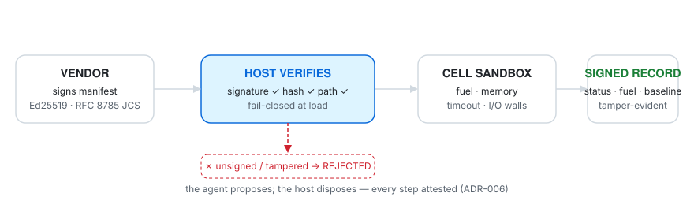

# Ephemora Cell

**Ephemora Cell is a lightweight security and execution primitive for running untrusted code inside AI agents, MCP tools, plugins, and applications.**

```text
Run untrusted code.
Control its capabilities.
Bound its resources.
Record what happened.
```

Built for **AI agents, MCP tools, plugins, code interpreters, and other untrusted workloads.**

```text
AI Agent / Application
        │
        ▼
   Tool / Plugin / MCP
        │
        ▼
 ┌───────────────────────┐
 │     Ephemora Cell     │
 │                       │
 │ Capabilities          │
 │ Resource budgets      │
 │ WASI sandbox          │
 │ Execution record      │
 └──────────┬────────────┘
            ▼
       WASM module
```

**~0.5 ms warm · ~3M executions/hour per core (one-liner) up to ~5.5M pooled · deterministic, not "isolated and hoped for"**

<p align="center">
  <a href="https://pypi.org/project/ephemora-cell/">
    
  </a>
  <a href="https://www.python.org/downloads/">
    
  </a>
  <a href="https://opensource.org/licenses/Apache-2.0">
    
  </a>
  <a href="https://github.com/MichaelS1011/ephemora-cell">
    
  </a>
  <a href="https://github.com/MichaelS1011/ephemora-cell/stargazers">
    
  </a>
</p>

<p align="center">
  <a href="https://github.com/MichaelS1011/ephemora-cell/actions/workflows/ci.yml">
    
  </a>
  <a href="https://github.com/MichaelS1011/ephemora-cell/actions/workflows/ci.yml">
    
  </a>
  <a href="https://github.com/MichaelS1011/ephemora-cell/actions/workflows/ci.yml">
    
  </a>
  <a href="https://github.com/MichaelS1011/ephemora-cell/actions/workflows/ci.yml">
    
  </a>
  <a href="https://github.com/MichaelS1011/ephemora-cell/actions/workflows/ci.yml">
    
  </a>
  <a href="https://github.com/MichaelS1011/ephemora-cell/security/code-scanning">
    
  </a>
  <a href="https://github.com/MichaelS1011/ephemora-cell/actions/workflows/wasi-conformance.yml">
    
  </a>
</p>

<p align="center">
  <a href="https://registry.modelcontextprotocol.io/v0/servers?search=ephemora-cell-mcp">
    
  </a>
  <a href="https://glama.ai/mcp/servers/MichaelS1011/ephemora-cell">
    
  </a>
</p>

<p align="center">
  <a href="#quick-start">Quick Start</a> ·
  <a href="#security">Security</a> ·
  <a href="#mcp-integration">MCP</a> ·
  <a href="#ai-agent-integration">GitHub Action</a> ·
  <a href="#performance">Benchmarks</a> ·
  <a href="#documentation">Docs</a>
</p>

> **Status (2026-09-25):** latest release **v1.0.4.3** (2026-09-25, docs & hardening release — [changelog](CHANGELOG.md)) · full functional audit 2026-09-24, findings fixed and released the same day · latest reproducible evidence: 2026-09-25 (probe classes, [`benchmarks/results/`](benchmarks/results/)) · 532 tests passing, 86% coverage (see CI badge — refreshed per release)

<p align="center">
  <picture>
    <source media="(prefers-color-scheme: dark)" srcset="assets/hero-dark.svg">
    
  </picture>
</p>

## What is Ephemora Cell?

Ephemora Cell is an embeddable **execution and security primitive** for running untrusted WASM code: WASM/WASI isolation, explicit capability control, enforced CPU/fuel, memory, I/O and time limits, bounded output, and structured — optionally signed — execution records. Runtime + security primitive + accounting in one `pip install`. It uses Wasmtime to implement that boundary — WASM is the mechanism, the **controlled execution of untrusted code** is the product.

## Why Ephemora Cell?

Wasmtime gives you a WASM runtime.

Ephemora Cell builds an application-level execution boundary around it:

```text
Wasmtime:            Ephemora Cell:
    Execute WASM         Execute WASM
                         + define capabilities
                         + enforce budgets (fuel, memory, time, I/O)
                         + bound output
                         + collect execution metadata
                         + produce execution records (sign-ready)
                         + integrate with agents and MCP
```

**The problem this answers:** AI agents increasingly need to write and execute code, call tools, and run plugins. The question that decides whether that is safe: *how do you let an agent execute untrusted code without giving that code access to your host, your credentials, your network, or unlimited compute — with nothing pre-opened by default?* Raw runtimes leave that boundary to you. Cell **is** that boundary.

Agent-generated code is different from application code: it can be buggy, computationally unbounded, unexpectedly expensive — or hostile. The runtime must **enforce** boundaries, not document them. Every Cell run does:

- **Enforced, not promised** — fuel metering (CPU), memory caps, epoch-based wall-clock timeouts, output caps and I/O budgets run per execution and cannot be switched off by guest or caller; the effective posture is attested in the execution record (RFC 8785 JCS, sign-ready).
- **Deterministic loop-stop** — a hostile or buggy module that loops forever is stopped at exactly the budget you set, every time; the run cannot overshoot its fuel budget. The epoch-based wall-clock timeout is the safety net on top — fuel counts CPU, the clock bounds everything else.
- **Measured isolation advantage** — of the attack vectors that succeed against a stock Docker container (shell, fork, socket, host filesystem, symlink escape, …), all 8 are blocked here (live-verified, script in the repo).
- **Sub-millisecond warm execution** — 0.17 ms guest / 0.51 ms end-to-end (pooled, measured 2026-09-14; `benchmarks/results/`).

**Why now — 2026 evidence that detection and containers are not enough** *(literature — `measured:false` for Cell; the measured rows live in the [evidence ladder](#security) and never mix with these)*. [SABER — the SandboxEscapeBench program](https://arxiv.org/abs/2603.02277) (UK AI Security Institute & Oxford, ICML 2026) shows frontier models **reliably escaping Docker containers** through common misconfigurations — the same benchmark this repo maps to WASM in the [Security section](#security). Trail of Bits researchers (Judson & Hess, 2026) bypassed **five** agent-skill scanners and sandbox defenses in one study, and the DDIPE skill-poisoning attack ([arXiv 2604.03081](https://arxiv.org/abs/2604.03081)) measures 11.6–33.5% bypass rates against agent skill ecosystems. The pattern across all three: scanning and container defaults fail; the boundary that holds is the one **enforced between the code and the host** — the layer Cell ships (per-claim provenance: [docs/security_posture.md](docs/security_posture.md)).

```text
AI Agent ──▶ Tool / MCP ──▶ Ephemora Cell ──▶ WASM ──▶ bounded result
```

Every execution answers three questions at once — attached to the result as `_meta.execution`, canonicalized (RFC 8785 JCS) and signable:

| | Answer | Example fields |
|---|---|---|
| **RESULT** | what came back | `status`, `stdout`, `exit_code` |
| **COST** | what it cost | `fuel_consumed`, `elapsed_ms` |
| **POLICY** | under which rules it ran | memory limit, preopens, network policy, `wasmtime_version` |

"Verifying. Not claimed." is data, not a slogan: any record can be re-checked — rewrite one field and `verify()` fails. Runnable demo: `python examples/signed_record_demo.py`.

## Security Model

Cell assumes that **guest code is untrusted**. The host explicitly decides what the guest can access — and the runtime enforces that decision per execution.

```text
HOST
────────────────────────────
       Cell Boundary
────────────────────────────
GUEST / UNTRUSTED CODE
```

By default: **no network · no arbitrary filesystem access · no process spawning · no unrestricted environment access** — and **bounded CPU/fuel, memory, execution time and output**.

**Security is never opt-in.** Every execution — in-process or isolated — runs under enforced limits (CPU fuel, memory, wall-clock time, output caps — always on, neither the guest nor the caller can switch them off). The one thing you choose is the process boundary: add `--isolated` (or call `run_isolated()`) when the module comes from outside your own build — agent output, third-party plugins, PR-contributed code. The in-process path stays for modules you build and trust. The enforced defaults:

| Resource | Default |
|---|---|
| WASM memory | 128 MB (`Store.set_limits`) |
| Fuel / CPU budget | 1,000,000 (~13 fuel/iteration, R² = 1.000 up to 1M iterations; re-measured 2026-09-14, `benchmarks/results/2026-09-14/fuel_boundary.json` — fuel is per-platform, see [docs/performance.md](docs/performance.md)) |
| Wall-clock timeout | 30 s (epoch interruption) |
| Captured stdout/stderr | 10 KB |
| Network | disabled — Preview1: no socket APIs; WASI 0.2: linked, denied at call time (measured) |
| Host filesystem | denied by default; 14 dangerous dirs blocked (`/dev`, `/proc`, `/sys`, …) |
| Process exec / fork | unavailable in WASI |
| Threading | disabled (`wasm_threads=False`) |

The same rule governs **language features**: every WebAssembly proposal Cell's shipped WASI surface does not need is **enforced off in the engine config** (threads, function-references, exceptions, GC, tail-calls, stack-switching — attested in every `security_baseline`, compile-probe-tested per release). That is a deliberate structural defense: the 2025/26 record — fuel accounting dropped across `call_ref`/`try_table` calls ([GHSA-m63x-6p34-q65x](https://github.com/bytecodealliance/wasmtime/security/advisories/GHSA-m63x-6p34-q65x)), a Cranelift aarch64 heap escape (CVE-2026-34971), and the vm2 escape riding WebAssembly `try_table` exception handling (CVE-2026-26956, secondary sources) — repeats one pattern: sandboxes diverge exactly where a proposal quietly flipped to default-on. Cell keeps that surface at zero and pays the cost in what guests *can't* run, not in what the host can't guarantee. Full proposal table: [SECURITY.md](SECURITY.md#proposal-policy--set-not-inherited-2026-09-25).

Additional controls: **I/O budgets** (`io_cpu_seconds` / `io_budget_bytes` — walls for host work, not just guest compute), **dual-ABI** (WASI Preview1 + WASI 0.2 components, opt-in), **memory64 opt-in**, **GC-heap declared cap**, **named state** (64 entries · 256 KiB · 1 MiB per session), and an **egress sidecar** reference mediator ([docs/egress_patterns.md](docs/egress_patterns.md)).

## Quick Start

Three commands: install Cell, run something untrusted, read its audited receipt.

**1 — Install** (use a virtualenv; on Ubuntu ≥ 23.04 / Fedora a bare `pip install`
is refused by PEP 668. Windows: use Git Bash or WSL, and `python` instead of `python3`):

```bash
python3 -m venv .venv && source .venv/bin/activate
python -m pip install ephemora-cell
```

**2 — Run something untrusted** (the repo ships examples, or bring any `.wasm`):

```bash
git clone https://github.com/MichaelS1011/ephemora-cell.git && cd ephemora-cell
ephemora-cell run examples/hello.wasm --isolated
```

*(adds OS-level process isolation around the run, a few ms — recommended for code you didn't build)*

```text
Hello from Ephemora Cell!
```

**3 — Read the audited receipt** — same run, machine-readable. Here a hostile module
(`examples/fuel_bomb.wasm`) is given a 100-unit fuel budget and stopped, exactly as
budgeted:

```bash
ephemora-cell run examples/fuel_bomb.wasm --fuel 100 --isolated --json
```

```json
{
  "status": "fuel_exhausted",
  "exit_code": 0,
  "fuel_consumed": 100,
  "fuel_budget": 100,
  "stdout_bytes": 0
}
```

Same from Python — every result carries status, cost and captured output (see [API & CLI](#api--cli)):

**Time to value:** no policy file, no access rules, no container to provision — one `pip install` and you are running untrusted WASM under a hard fuel + memory boundary at **~0.5 ms warm** (the same call took a stock `docker run` ~186 ms to start; measured macOS M5 n=100, `benchmarks/results/2026-09-14/competitive_benchmark.json`, DGX numbers in `benchmarks/results/2026-09-20/`).

Scale check: the one-liner path sustains **~3M executions/hour** per core (n=500, `hello.wasm`, Mac M5 — regenerate with the snippet in [docs/recipes.md](docs/recipes.md)); the pooled hot-loop path reaches **~5.5M/hour**.

**Where to next:** agent/tool isolation → [MCP Integration](#mcp-integration) (3-line setup) · CI gating for untrusted PRs → [AI Agent Integration](#ai-agent-integration) · CLI reference and usage recipes → [docs/recipes.md](docs/recipes.md). Something failed? The usual suspects are venv not activated, `python3` vs `python` on Windows, or a wrong `.wasm` path — [docs/recipes.md](docs/recipes.md) covers them.


*Real CLI session: install, first run, `--json` report with the security baseline, a fuel bomb stopped at exactly 100/100 units, an attack module blocked at the WASI import layer. Every frame reproducible from a clone.*

### The devtools loop for agent tools

The same commands are a development loop — edit, run, read the receipt — with no Dockerfile, no image build:

| Command | What it does in the loop |
|---|---|
| `ephemora-cell build tool.rs` | Compile Rust, Go, C, AssemblyScript or Zig source straight to WASM |
| `ephemora-cell run tool.wasm --json` | Verdict immediately: status, exit code, `fuel_consumed`, `elapsed_ms` |
| `ephemora-cell inspect tool.wasm` | Imports, exports, memory — what a module wants, before you run it |
| `ephemora-cell benchmark tool.wasm` | Cold/warm latency and fuel spread while you iterate |

Failures come back **graded, not crashing**: an infinite loop returns `status: "fuel_exhausted"` with its receipt, a memory hog `memory_exceeded`, a crash a non-zero exit code — the same statuses the [auto-grader](examples/auto_grader.py) and the CI test-bench job consume. A misbehaving tool never takes your terminal with it.

## MCP Integration

Listed in the official MCP Registry (`io.github.MichaelS1011/ephemora-cell-mcp`, stdio via PyPI) and graded on Glama (license A, quality A, maintenance B — Glama's live classifier; see the hero badges above). The call flow is the hero diagram above: the agent's tool call enters the stdio server, the tool runs inside the Cell, and the result comes back with its execution record.

```bash
pip install ephemora-cell
ephemora-cell-mcp          # bundled tools: clock + echo; --tools-dir ./tools replaces the bundled set with your own

# One-line setup for GitHub Copilot in VS Code:
code --add-mcp '{"name":"Ephemora Cell","command":"ephemora-cell-mcp"}'
```

Ask your agent for the current time: the answer comes from the bundled `clock` tool — a WASM module reading only the WASI real-time clock — and the call report shows exactly what that answer cost.

**What you get:**

- **Run untrusted, agent-built tools locally.** Every tool is a WASM module inside a Cell sandbox — no network, fuel- and memory-bounded, output-capped. If a tool misbehaves, it hits a wall, not your machine.
- **Verify every call, not just the install.** Each result carries its execution record (`_meta.execution`), and the native `get-policy` tool reports the exact sandbox policy per tool — computed from the same code path that enforces it, so report and enforcement cannot drift. Policy reads are tools; policy writes are host decisions ([ADR-006](docs/decisions/ADR-006-governed-tool-loading.md)): an agent cannot grant itself network or filesystem access, and no socket connect succeeds (Preview1 exposes no socket APIs; in the WASI 0.2 world connect is denied at call time — measured).
- **Stateless by design (`2026-07-28` revision).** Clients on the current revision skip the `initialize` handshake entirely; results carry `resultType: "complete"` and `tools/list` answers with `ttlMs`/`cacheScope`. Handshake-era clients (Claude Desktop, VS Code, Codex, …) keep working unchanged — both eras served from one process and tested side-by-side against the official MCP SDK in CI. Details: [docs/mcp.md](docs/mcp.md).
- **Isolation priced for every call** — three distinct numbers ([comparison](docs/comparison-mcp-servers.md)):

  | Path | Cost per call | Why |
  |---|---|---|
  | Library pooled runtime (`io_budget_bytes=None`) | **~0.5 ms** | cached engine, trusted workloads |
  | MCP stdio server, default | **~12 ms** | fresh sandbox per `tools/call` — the ADR-002 I/O wall enforced via a per-run engine, measured end-to-end |
  | MCP stdio server, `--pooled` | **~0.5 ms** | verified tools on the pooled engine; the relaxed I/O wall is attested in `get-policy` |

- **The agent cannot rewrite its own security boundary.** The agent may only *propose* a capability; the host verifies signature, module hash and policy out-of-band before anything runs; the runtime enforces per execution and returns evidence. No arrow in that chain points backwards.

**vs Microsoft Wassette.** Wassette is Microsoft's capability-based runtime for MCP tools, built on the same Wasmtime engine family — its OCI pull model moves the trust decision to install time; Cell adds what a caller can *verify per call*. Full side-by-side (re-verified 2026-09-18): [docs/comparison-mcp-servers.md](docs/comparison-mcp-servers.md).

This is an execution boundary, not a claim that guest software is trustworthy. Cell does not evaluate whether a module is malicious or correct — a guest can still misbehave *within* the budgets it was given.

## AI Agent Integration

**Untrusted PR code in GitHub Actions.** This repository ships a composite action: run a WASM module in the Cell sandbox inside your own workflow — with fuel metering, memory cap, epoch timeout and (default) the `--isolated` subprocess path (OS-level rlimits, hard kill):

```yaml
- id: run-tool
  uses: MichaelS1011/ephemora-cell/action@main
  with:
    module: path/to/module.wasm   # e.g. built from a PR-provided recipe
    profile: llm
    # fuel: 500_000
- run: echo "status=${{ steps.run-tool.outputs.status }} fuel=${{ steps.run-tool.outputs.fuel_consumed }}"
```

Non-success statuses fail the step (`fail-on: non-success`, default) — a module that burns its budget or trips the memory cap cannot take your workflow with it. This repo dogfoods the action on every push: [`.github/workflows/action-demo.yml`](.github/workflows/action-demo.yml) runs a benign module and feeds the same module a 100-unit fuel budget, asserting live that the sandbox stops it and accounts every unit.

Agent-framework integration tests (LangGraph, CrewAI, AutoGen, OpenAI Agents SDK, Semantic Kernel, Hermes, NemoClaw) live in [`integration/`](integration/) — verified against real framework SDKs.

## Use Cases

What you can build with Cell:

- **AI Code Execution** — safely execute code generated by an LLM, with explicit limits:

  ```python
  result = run_wasm(
      "llm_generated.wasm",
      max_fuel=200_000,
      timeout_seconds=5,
      allow_dirs=("/input", "/output")
  )
  ```

- **MCP Tool Sandbox** — run MCP tools inside a bounded execution environment (see [MCP Integration](#mcp-integration)).

- **Plugin Runtime** — accept user-uploaded plugins without giving them host-level access (`WASIConfig(allow_dirs=("/data",), max_fuel=500_000)` — same shape as the snippets above).

- **Agent Tool Runtime** — give autonomous agents controlled access to computational tools.

- **Verifiable Execution** — produce structured and optionally signed records describing an execution ([Execution Records](#execution-records)).

Also documented: serverless/edge workloads, air-gapped validation, WASI 0.2 components, FastAPI integration — [docs/recipes.md](docs/recipes.md).

## Architecture

Cell executes the `.wasm` — it does not know the source language. One command compiles five languages, and the runtime sits underneath your stack:

The enforcement stack — module → engine → capability surface → budgets → record — is diagrammed in [docs/security_posture.md](docs/security_posture.md#the-wasi-sandbox-surface-visually). The primary API is deliberately simple — `run_wasm(wasm) → result`, with `status`, `exit_code`, `stdout`, `stderr`, `elapsed_ms` and `fuel_consumed` on every result (full surface in [API & CLI](#api--cli)). That makes execution suitable for auditing, policy enforcement, and resource accounting — not just running code. Full CLI (`run`, `--json` with `security_baseline`, `inspect`, `benchmark`, `build`) in the [CLI docs](docs/recipes.md) and `ephemora-cell --help`.

**Any language that compiles to WASM.** One-command build with actionable error hints:

```bash
ephemora-cell build src/main.rs # inside a cargo project → tool.wasm → run it
```

| Language | Compiler | Verified |
|----------|----------|----------|
| Rust | `cargo build --target wasm32-wasip1` | ✅ Compiled + executed (CI) |
| Go | `GOOS=wasip1 GOARCH=wasm go build` | ✅ Compiled + executed (CI) |
| C | wasi-sdk `clang --target=wasm32-wasip1` | ✅ Compiled + executed (CI) |
| AssemblyScript | `asc --runtime stub` | ✅ Compiled + executed (CI) |
| Zig | `zig build-exe -target wasm32-wasi` | ✅ Compiled + executed (CI) |
| Python | — | Guidance: run on a wasi-python interpreter (no AOT exists) |

All five compiled-language gates verify on every push ([`.github/workflows/ci.yml`](.github/workflows/ci.yml)). **Platforms:** macOS (Apple M5) ✅ · Ubuntu 24.04 ✅ · DGX Spark GB10 ✅

## Execution Records

Around the sandbox sits a verifiable trust chain for third-party tools:

```text
TOOL ──▶ SIGNED MANIFEST ──▶ HOST VERIFY ──▶ EPHEMORA CELL ──▶ SIGNED EXECUTION
        (vendor ships)     (fail-closed,      runs inside       RECORD
                           hash + policy      the sandbox       (tamper-evident)
                           check)
```

Anything failing verification is rejected before a single instruction executes — execution never depends on a happy path.

<picture>
  <source media="(prefers-color-scheme: dark)" srcset="assets/trust-chain-dark.svg">
  
</picture>

- **Signed tool manifests.** Third-party tools ship an Ed25519-signed manifest (RFC 8785 JCS); the server verifies signature **and module hash** before registering and rejects unsigned, tampered or hash-mismatched tools fail-closed — a bare `.wasm` without a manifest never loads in signed-tools mode. `ephemora-cell-mcp --require-signed-tools pub.pem`, sign with `python -m ephemora_cell_mcp.sign_tool`.
- **Governed dynamic loading.** An agent can only *propose* a tool — a `tool.request.json` dropped into an operator-allowlisted directory; the server evaluates it before each incoming message, verifies signature, module hash and policy, then installs and announces it (`notifications/tools/list_changed`). The agent proposes; the host disposes ([ADR-006](docs/decisions/ADR-006-governed-tool-loading.md)).
- **Signed execution records.** Any run folds into a tamper-evident record covering status, fuel, timing and the attested security baseline — rewrite one field and verification fails. Runnable demo: `python examples/signed_record_demo.py`.
- **Pre-exec / receipt split ([ADR-008](docs/decisions/ADR-008-record-split-and-standard-envelopes.md)).** `PreExecutionRecord` signs what a run *will* do (module digest, policy fingerprint, input digest) before it runs; the receipt's optional `back_link` binds it to exactly that attestation. Open-standard envelopes (DSSE v1, detached JWS) carry the same JCS bytes for ecosystem interop — no network client, no dependency.
- **Trusted fast path.** `ephemora-cell-mcp --pooled` serves verified tools from the pooled engine at ~0.5 ms per call instead of ~12 ms (measured) — the relaxed I/O wall is attested in `get-policy`.

The two execution paths differ materially. `run_wasm()` runs the guest inside your process; `run_isolated()` adds OS-level walls around a disposable worker (and returns the report fields as a dict). For guests from outside your own build — agent output, third-party plugins, PR-contributed code — use the isolated path:

| Control | `run_wasm()` (in-process) | `run_isolated()` (subprocess) |
|---|---|---|
| Fuel metering (guest CPU) | ✅ | ✅ |
| Memory cap (`Store.set_limits`) | ✅ | ✅ |
| Wall-clock timeout (epoch) | ✅ | ✅ + hard process kill |
| 10 KB output cap | ✅ | ✅ |
| I/O byte wall (`io_budget_bytes`) | ✅ watcher + epoch interrupt | ✅ |
| I/O CPU wall (`io_cpu_seconds`) | ❌ documented-trusted | ✅ worker rusage watchdog |
| Disk quota (`disk_quota_bytes`) | ❌ trusted capability | ✅ RLIMIT_FSIZE (per file) |
| RLIMIT_NOFILE/AS/RSS, 32 MB module cap | ❌ | ✅ |
| Preopen deny + grant-time TOCTOU revalidation | ✅ | ✅ |

Rows marked ❌ in-process are *documented-trusted*: the knob is honored as a declared capability, not an enforced wall — a kernel-level cap there would limit your own process. Full matrix and rationale: [SECURITY.md](SECURITY.md).

## Security

**Evidence ladder** — strongest first. Every row is measured, the raw evidence is committed, and each run is reproducible:

| # | Evidence | What it proves | How it is measured | Reproduce |
|---|---|---|---|---|
| 1 | [MCP CVE replays](benchmarks/mcp_cve_replay.py) | Real exploit paths of two patched CVEs are denied at the engine level; governed loading fails closed on a tampered payload — also verified on WASI 0.2 components, with a **measured call-time socket denial** | Pinned vulnerable reference server vs Cell, random marker tokens, positive controls on both sides | `python benchmarks/mcp_cve_replay.py` |
| 2 | [SandboxEscapeBench-18 mapping](benchmarks/sandbox_escape_18.py) | 18 container/K8s escape scenarios mapped to WASM: **8 execution-tested and denied, 10 not expressible** on the WASI surface · *OSS slice of the Ephemora benchmark program (see note below)* | Structural mapping + live attempts, granted-preopen positive control | `python benchmarks/sandbox_escape_18.py` |
| 3 | 8 attack intents × 3 boundaries | Same intents, same exit-code rule: stock Docker 0/8 blocked · hardened Docker 2/8 · Cell 8/8 (matrix below) | Live probes, arm64 image pinned by digest | `python assets/demo_attack_probe.py` · `python benchmarks/hardened_docker_probe.py` · `python benchmarks/verify_8_vectors.py` |
| 4 | [Official WASI conformance](conformance/README.md) | 72 pass / 1 documented xfail / 0 fail against the pinned upstream suite — re-run weekly in CI (weekly ubuntu runs land 71–72 on varying fs tests; a documented runner quirk, not a Cell defect — see the conformance section) | Runtime adapter over the official suite, raw JSON committed | see conformance/ |
| 5 | [2026 probe classes](benchmarks/probe_classes_2026.py) | The CVE-2026-47261 companion FS vectors (trailing-slash/hardlink/rename/TRUNCATE), persistence-worm and control-plane probes are **all denied** on the pinned engine, with granted positive controls on every class | Real WASI probes + positive controls, dated JSON with `measured:true` | `python benchmarks/probe_classes_2026.py` |
| 6 | [Cross-architecture determinism](docs/comparison-mcp-servers.md) | Fuel deterministic per platform (spread 0), platform-bound values | Same tool call on macOS arm64 / DGX GB10 / x86_64 | `python benchmarks/determinism_probe.py` |

**Row 2 in context.** The 18 scenarios are external (UK AI Security Institute, MIT — provenance note below). This mapping is the open-source execution-boundary slice of a broader benchmark and assurance program; the wider program — including the agentic escape evaluation the upstream benchmark actually runs — is part of the **Ephemora enterprise edition** ([docs/enterprise.md](docs/enterprise.md)).

> **Where the 18 scenarios come from.** Not ours: the UK AI Security Institute's *SandboxEscapeBench* ([arXiv 2603.02277](https://arxiv.org/abs/2603.02277), scenarios: [UKGovernmentBEIS/sandbox_escape_bench](https://github.com/UKGovernmentBEIS/sandbox_escape_bench), MIT) documents 18 ways code escapes container/Kubernetes sandboxes. This suite does something narrower: each scenario is mapped to its closest WASM/WASI equivalent and executed against Cell, no model in the loop. The primitives those escapes rely on (privileged modes, namespaces, cgroups, raw sockets) do not exist on the WASI surface; the scenarios with a WASM-expressible equivalent (filesystem, sockets) are denied by the live boundary. Prompt-injection and agent-behavior security are different layers — out of scope for an execution sandbox by design; the enterprise edition runs the wider assurance program ([docs/enterprise.md](docs/enterprise.md)).

**What we do not compare — and why.** Prompt-injection suites (garak, InjecAgent) test the model and agent layer, not the execution boundary — out of scope for an execution sandbox. Cloud sandbox providers are cited from third-party sources with their source status; third-party numbers never appear in the same table as our measured cells. Startup and throughput benchmarks live in [docs/performance.md](docs/performance.md) with their scope caveats.

The guest receives only the capabilities explicitly made available to it. Live verification of eight attack classes ([`benchmarks/verify_8_vectors.py`](benchmarks/verify_8_vectors.py)) — measured against three boundaries, same intents, same measurement rule (exit code decides, nothing hardcoded):

| Attack class | Docker | Docker (hardened¹) | Ephemora Cell | Layer |
|---|---|---|---|---|
| Shell (`os.system`) / fork | ALLOWED | ALLOWED | **BLOCKED** — APIs don't exist in WASI | 1 |
| Network sockets | ALLOWED | ALLOWED — creation needs no capability | **BLOCKED** — APIs don't exist in WASI | 1 |
| fsync (`os.fsync`) | ALLOWED | **BLOCKED** — EROFS via `--read-only` | **BLOCKED** — import-level rejection | 2 |
| Host filesystem (`/etc/passwd`) | ALLOWED | ALLOWED — the container's own file | **BLOCKED** — preopen default-deny | 2 |
| Symlink escape | ALLOWED | **BLOCKED** — EROFS via `--read-only` | **BLOCKED** — dangerous directory filter | 2 |
| Multi-threading | ALLOWED | ALLOWED | **BLOCKED** — `wasm_threads=False` | 2 |
| Environment access | ALLOWED | ALLOWED | **BLOCKED** — controlled via `allow_env` | 2 |

The boundary is three layers, and the table measures them separately:

- **Layer 1 — WASI surface:** the guest format itself has no shell/fork/socket entry points to call.
- **Layer 2 — Sandbox policy (always on):** preopen default-deny, dangerous-directory filter, import traps, `wasm_threads=False`, `allow_env` — enforced per execution, not configurable away.
- **Layer 3 — OS process wall (`--isolated`):** a disposable worker process with OS rlimits and a hard kill — the mitigation layer for engine 0-days ([SECURITY.md](SECURITY.md) documents the April 2026 wasmtime advisories).

**Result: 8/8 attack vectors blocked (live-verified); both Docker baselines are measured live per run — never hardcoded.**

For context, the same eight intents were measured against **gVisor** (`runsc`, pinned release, executed in CI twice for determinism): 8/8 ALLOWED. gVisor walls the host off from the container, but the guest keeps the Linux ABI — so the same primitives stay available to guest code. Expectation matrix pre-declared in [`benchmarks/gvisor_docker_probe.py`](benchmarks/gvisor_docker_probe.py); raw evidence: `benchmarks/results/2026-09-19/08_gvisor_docker_attack_probe.json` (committed from the `gvisor-boundary` CI job).

¹ Hardened = exactly these flags — tell us which to add: `--network none --read-only --cap-drop=ALL --security-opt no-new-privileges --pids-limit 64 --user 65534:65534` (image pinned by digest; Docker's default seccomp profile is active in **both** columns). Both hardened blocks are `--read-only` file-system effects — the flags wall the container *off*, not the guest *in*: socket creation, the container's own `/etc/passwd`, fork, threading and environment stay available to the guest.


*Same eight attack primitives, measured live: stock `python:3.12-slim` 0/8 blocked, hardened container 6/8 (both blocks are `--read-only` flag effects), Cell 8/8. Measured on two platforms with identical results — macOS arm64 (2026-09-18) and DGX Spark GB10 (2026-09-20, `benchmarks/results/2026-09-20/*-dgx-aarch64.json`). Reproduce:*

```bash
python assets/demo_attack_probe.py          # stock Docker    ->  0/8 blocked
python benchmarks/hardened_docker_probe.py  # hardened Docker ->  2/8 blocked
python benchmarks/verify_8_vectors.py       # Ephemora Cell   ->  8/8 blocked
```

**How the 8/8 is measured** — environment, probe-by-probe equivalence between the Docker probe body and the Cell WASM guest, raw-evidence file list and the positive-control rule: [docs/security_posture.md](docs/security_posture.md#how-the-88-is-measured--probe-equivalence-detail). In short: measured exit code decides, nothing hardcoded; every blocked vector pairs with a granted-capability control that must succeed.

- **Raw evidence:** `benchmarks/results/2026-09-18/` (`01_hardened_docker_attack_probe.json` · `02_docker_attack_probe.json` · `03_cell_8_vector_verify.json`) + historical `benchmarks/results/2026-09-02/`

**MCP CVE replays.** The official MCP reference servers have real, patched CVEs against this exact surface. [`benchmarks/mcp_cve_replay.py`](benchmarks/mcp_cve_replay.py) replays them as their original exploit paths — pinned vulnerable reference server vs. Cell, same files, positive controls on both sides (2026-09-17, `measured:true`):

- **CVE-2025-53109/53110** ("EscapeRoute", symlink escape + prefix traversal): the vulnerable reference server **leaked** the protected file in both intents; Cell blocked both at the engine level (`EPERM`/`ENOTCAPABLE`) — with the granted-capability control reading successfully on both sides.
- **CVE-2025-54136 class** ("MCPoison", payload swap after trust): a signed tool is accepted once, then a single tampered wasm byte makes the next governed-load request **fail closed** (hash mismatch).
- **Same replays against WASI 0.2 components** ([evidence](benchmarks/results/2026-09-18/mcp_cve_replay_component.json), `abi: "component"`): the component path denies the same escape intents (symlink escape → `EPERM`, traversal → no preopen base) and the same governed-load tamper fails closed. The network vector gets its own intent — the WASI 0.2 world *links* `wasi:sockets` (unlike Preview1), so a TCP connect is attempted under the sandbox and **refused at call time**, with the granted-read control passing in the same run.

### Conformance: tested against the official suites

Not self-written test suites — the shipped CLI and the engine configuration Cell ships are run against **both official suites**: the [WebAssembly/wasi-testsuite](https://github.com/WebAssembly/wasi-testsuite) preview-1 suite through a runtime adapter, and the official [WebAssembly core spec suite](https://github.com/WebAssembly/testsuite) (W3C Wasm 3.0 era, `wast2json` harness) — evidence committed under `conformance/results/`:

- **WASI: 72 pass, 1 documented by-design xfail, 0 fail** across the applicable preview-1 suites (pinned suite commit `609c44613995`, 2026-09-14; 55 preview-3 tests skipped — Cell declares preview 1 only)
- **Core spec (run 2026-09-19, pinned `b464a4cd100d`, 257 files / ~36k commands): 31,931 pass** with every deviation documented, none unexpected — 3,282 classified (memory64/multi-memory modules are by design outside the shipped engine config; v128 cannot pass through the wasmtime-py 47 binding; relaxed-simd files abort natively upstream), 684 text-format asserts skipped (wabt parser domain), and a 46-assert remainder at the wasmtime-py binding NaN-bit level, listed verbatim in the evidence JSON. Reproduce: `python conformance/run_core_spec.py`
- **A weekly CI job re-runs the pinned suite** and uploads the raw JSON, so drift surfaces within a week (`.github/workflows/wasi-conformance.yml`). Known, documented runner quirk: shared ubuntu x86_64 runners show rare wasmtime engine aborts on varying fs tests; the CI job absorbs each abort with a single recorded retry ([`adapters/cell_retry_wrapper.py`](conformance/adapters/cell_retry_wrapper.py), every retry visible in the evidence JSON) — a healthy run lands 72 pass, as in the 2026-09-19 CI run — deterministic on macOS arm64 and in clean containers ([conformance/README.md](conformance/README.md))
- **The one deviation is documented:** `sock_shutdown-invalid_fd` expects `EBADF` on a runtime with no preopens; Cell's sandbox scratch dir is preopened as fd 3 by design, so the call returns `ENOTSOCK`. The property Cell claims — no socket surface — is unaffected.
- **Honest scope:** this is standards conformance, not a security certification. No third party certifies Cell; the evidence is the pinned suite, the committed JSON and the CI history.

**Can you break Cell?** Found an execution path that violates the documented security boundary — an escape, a budget bypass, an attestation gap? That is exactly the report we want: [SECURITY.md](SECURITY.md#reporting-a-vulnerability) (private disclosure, responsible handling). The [threat model](docs/threat-model.md) and its documented residual risks tell you where to aim; the methodology boxes on this page tell you how we measure. Security research on Cell is welcome.

## Performance

**What does the security boundary cost? 0.376 ms** — the warm wall-clock overhead a sandboxed run adds over the same work run bare (measured, not estimated).

*Latest reproducible benchmark — 2026-09-14 · Mac M5 · wasmtime 47.0.1 · n=1000. Every number below regenerates from a fresh clone via the commands at the end.*

| Scenario (2026-09-14, n=1000, `hello.wasm`, Mac M5, wasmtime 47.0.1) | Wall median | Wall p95 | Guest median |
|------|--------|------|------|
| **Pooled engine** (`io_budget_bytes=None`, trusted runs) | **0.51 ms** | 0.89 ms | 0.17 ms |
| **Default path** (`io_budget_bytes=64 MiB`, per-run engine) | 0.94 ms | 1.15 ms | 0.61 ms |

Cold vs. warm (2026-09-14, n=300 each, fresh sandbox per run vs. cached engine, first run discarded): cold median **0.59 ms** guest / 0.99 ms wall, warm median **0.55 ms** guest / 0.93 ms wall — sandbox overhead (warm wall − guest) = **0.376 ms** (`overhead_warm_ms`, `benchmarks/results/2026-09-14/pov_benchmark.json`).

Live cold-start comparison (2026-09-14, same Mac, n=100 per image after warmup): `docker run` python:3.12-slim 185.9 ms vs Cell 0.49 ms = **383×** — this is a container-cold-start vs invoked-WASM comparison for this benchmark workload, not a general claim that WASM is always faster than Docker.

Reproduce: `python benchmarks/pool_vs_budget.py` · `python benchmarks/competitive_benchmark.py` (raw results with `measured:true` committed under `benchmarks/results/`). Agentic workloads and more: [docs/performance.md](docs/performance.md).

### Sandbox tax on an industry-standard workload (EEMBC CoreMark 1.01)

The same committed `coremark.wasm` (EEMBC CoreMark 1.01, pinned sources, wasi-sdk-34) runs interleaved under three Cell configurations and, when their CLIs are on PATH, under external engines — every run must pass CoreMark's own self-validation. Scores are CoreMark's self-timed "Iterations/Sec":

| Median score (n=3 interleaved) | macOS arm64 (wasmtime 47.0.1, wasmer 7.4.2, wasm3 0.9.0) | DGX Spark GB10 aarch64 |
|---|---|---|
| bare wasmtime (reference) | 55,204 | 48,860 |
| **Cell sandbox** | 50,456 (**−8.60%**) | 44,040 (**−9.86%**) |
| Cell + fuel metering | 43,054 (−14.67% vs sandbox) | 38,491 (−12.60% vs sandbox) |
| wasmer (external control) | 63,798 (+15.57% vs bare) | 53,735 (+9.98% vs bare) |
| wasm3 (external control, interpreter) | 5,566 (−89.92% vs bare) | 5,747 (−88.24% vs bare) |

Read as facts, not a ranking: on this workload the engine choice spans a ~9–12× range depending on platform, the Cell sandbox layer costs 8.6–10.0% over the bare engine on the same machine, and instruction-level fuel metering a further 12.5–14.7%. External engines are context, not competitors measured by Cell's API; wasmer requires `--enable-tail-call` (the build ships the upstream Lime1+tail-call feature set). Evidence with verbatim commands, versions and per-run scores: `benchmarks/results/2026-09-19/09_coremark_wasi_*.json`. Reproduce: `python benchmarks/coremark_wasi.py --rounds 3`.

### Fuel is per-platform

Fuel counts are deterministic **per platform** (`fuel_spread: 0` on every host measured) but platform-bound — never compare across hosts (details and measured cross-platform examples: [docs/performance.md](docs/performance.md), `python benchmarks/determinism_probe.py`).

### Engine backend & execution mode

Every number on this page is a **Cranelift** number: the Python binding cannot select an interpreted backend (Pulley/Winch unreachable, asserted in `tests/test_surface_audit.py`), so no fallback can silently change the posture. Details: [docs/performance.md](docs/performance.md).

## API & CLI

**Python API** — the primary surface is deliberately simple:

```python
from ephemora_cell import run_wasm, run_isolated, WASIConfig, WASISandbox

result = run_wasm("tool.wasm", max_fuel=1_000_000, timeout_seconds=30)
result.status        # SUCCESS | ERROR | TIMEOUT | FUEL_EXHAUSTED | MEMORY_EXCEEDED
result.exit_code
result.stdout        # 10 KB cap
result.elapsed_ms
result.fuel_consumed

# OS-level process wall for untrusted guests:
result = run_isolated("tool.wasm", config=WASIConfig(max_fuel=500_000))
```

Profiles (`plugin`, `llm`, `edge`, `default`, `analytical`), named state, disk quotas and GC-heap caps are `WASIConfig` knobs; the component path is selected per call via `run_wasm(..., abi="component")` — [docs/recipes.md](docs/recipes.md) has the recipes (FastAPI, serverless, air-gapped, WASI 0.2).

**CLI** — four verbs cover the loop:

```text
ephemora-cell run       Execute a WASM module (--json, --isolated, --fuel, --stdin, --profile)
ephemora-cell inspect   Imports, exports, memory — what a module wants, before you run it
ephemora-cell benchmark Cold/warm latency and fuel spread
ephemora-cell build     Compile Rust/Go/C/AssemblyScript/Zig straight to WASM
```

`ephemora-cell --help` and [docs/recipes.md](docs/recipes.md) for the full reference.

## Limitations

**Cell is:** a WASM execution primitive · a capability-based isolation layer · a resource-bounded runtime · an embeddable Python library · a CLI · an MCP execution layer.

**Cell is not:** a general VM · a container orchestrator · a malware detection system · a full multi-tenant cloud platform · an agent framework · an LLM · a code-generation system · a full VM replacement for every container workload.

Use Cell when: code is untrusted or dynamically generated · tools come from third parties · an AI agent executes arbitrary programs · you need explicit resource budgets · you need structured execution metadata. Do not use Cell for long-running I/O-heavy services — that is what the `--isolated` subprocess wall or a microVM is for (see [docs/performance.md](docs/performance.md) for the measured third-party comparison).

What each enforced control does **not** claim — every row is an honest boundary, tested at the boundary:

| Enforced control | Does guarantee | Does **not** guarantee |
|---|---|---|
| Memory cap (128 MB) | guest cannot exceed the configured heap | correct guest behavior — a bug inside the budget is the guest's bug |
| Fuel budget | no unbounded CPU burn; execution stops at the limit | malware detection — code with hostile intent that stays within budget runs fine; nothing inspects what the module *means* |
| Wall-clock timeout | no runaway execution; epoch interruption fires | that the app logic is correct or fast |
| Network denial (no socket APIs) | no sockets, no outbound connections by the guest | safe behavior *within* granted capabilities — exfiltration via allowed channels (e.g. writing secrets to a granted preopen) remains the integrator's concern ([SECURITY.md](SECURITY.md)) |
| Filesystem capability control (preopen only, default deny) | file access limited to explicitly mounted dirs | full VM semantics — mounted-path content is exactly what the integrator chose to expose |
| Output caps (10 KB) | captured output is bounded; unbounded prints cannot fill the host disk | that truncated output is complete — inspect `result.stdout` and the record |

> **The goal is narrow: make untrusted execution cheap enough and controlled enough that an application can safely do it by default.**

Full details: [SECURITY.md](SECURITY.md) (policy, known limitations) · [docs/threat-model.md](docs/threat-model.md) (adversary model, trust boundaries, resource-exhaustion matrix) · [docs/security_posture.md](docs/security_posture.md) (arXiv 2509.11242 evaluation, fuel boundary, related research).

## Roadmap

Real, gated items — no dates promised:

- **Engine upgrade gate (in progress):** wasmtime 48.0.3/49.0.1 closes the 2026 fuel-amplification advisory (GHSA-m63x-6p34-q65x) and the WASIp3-streams advisory; blocked on Python wheels publishing to PyPI (`scripts/check_wasmtime_patch.py` watches), then fuel determinism re-qualification and a strict re-run of the FS-escape matrix ([tests/test_fs_escape_matrix.py](tests/test_fs_escape_matrix.py) — the 2026-09-25 measured run shows the companion vectors already denied on the pinned engine).
- **WASI 0.3 evaluation gate:** WASI 0.3 (Component-Model async) is deliberately gated off until the 0.3 surface ships in the Python wheels, the streams advisory line is closed, and the surface has its own budget qualification ([docs/recipes.md](docs/recipes.md#wasi-02-components)).
- **Threading opt-in phase:** shared-everything threads stay frozen by default; enabling them is a separately security-reviewed opt-in with thread-aware fuel and wall-clock accounting ([SECURITY.md](SECURITY.md#threading)).

## Testing & Verification

470 tests passing (4 skipped) · 86% statement coverage (Cell + MCP, gate 80%) · 8/8 attack vectors blocked · 72-pass official wasi-testsuite conformance (pinned, 0 fail) · CI-enforced on every push (tests, coverage, pip-audit, SBOM, bandit, official MCP SDK interop) — see [`.github/workflows/ci.yml`](.github/workflows/ci.yml).

## Documentation

**Getting started** · [Quick Start](#quick-start) above · [docs/recipes.md](docs/recipes.md) — usage patterns (FastAPI, serverless, air-gapped, WASI 0.2) · [`integration/`](integration/) — agent-framework examples

**Security & evidence** · [SECURITY.md](SECURITY.md) — policy, execution-path matrix, vulnerability reporting · [docs/threat-model.md](docs/threat-model.md) — trust boundaries, adversary model, resource-exhaustion matrix · [docs/security_posture.md](docs/security_posture.md) — attack-surface verification · [conformance/README.md](conformance/README.md) — official wasi-testsuite harness

**Execution records & decisions** · [ADR-006](docs/decisions/ADR-006-governed-tool-loading.md) — who may change a running workload's security boundary · [ADR-001…008](docs/decisions/) — all decision records · `examples/signed_record_demo.py` — sign and tamper-check a run

**Performance** · [docs/performance.md](docs/performance.md) — benchmarks · [`benchmarks/results/`](benchmarks/results/) — raw `measured:true` JSON

**Integrations** · [docs/mcp.md](docs/mcp.md) — MCP server · [docs/comparison-mcp-servers.md](docs/comparison-mcp-servers.md) — CVE-to-probe mapping · [`action/`](action/) — composite GitHub Action

**Languages** · [docs/languages.md](docs/languages.md) — compile matrix · [docs/egress_patterns.md](docs/egress_patterns.md) — sanctioned API-call patterns

**Enterprise** · [docs/enterprise.md](docs/enterprise.md) — isolation vs. operation: when that conversation is worth having

**Changes** · [CHANGELOG.md](CHANGELOG.md)

## About Ephemora

Ephemora Cell is the open-source isolation layer (Apache 2.0, standalone — no Ephemora dependency). The Ephemora enterprise edition builds on Cell's isolation for production and regulated deployments. Cell is complete for isolation; the enterprise edition is complete for operation — see [docs/enterprise.md](docs/enterprise.md) for when that conversation is worth having.

## License

Apache 2.0 — See `LICENSE`.

---
mcp-name: io.github.MichaelS1011/ephemora-cell-mcp

---

*One agent action. One bounded execution. One controlled result.*

Created by [Michael Soppa](https://www.linkedin.com/in/michael-soppa).
