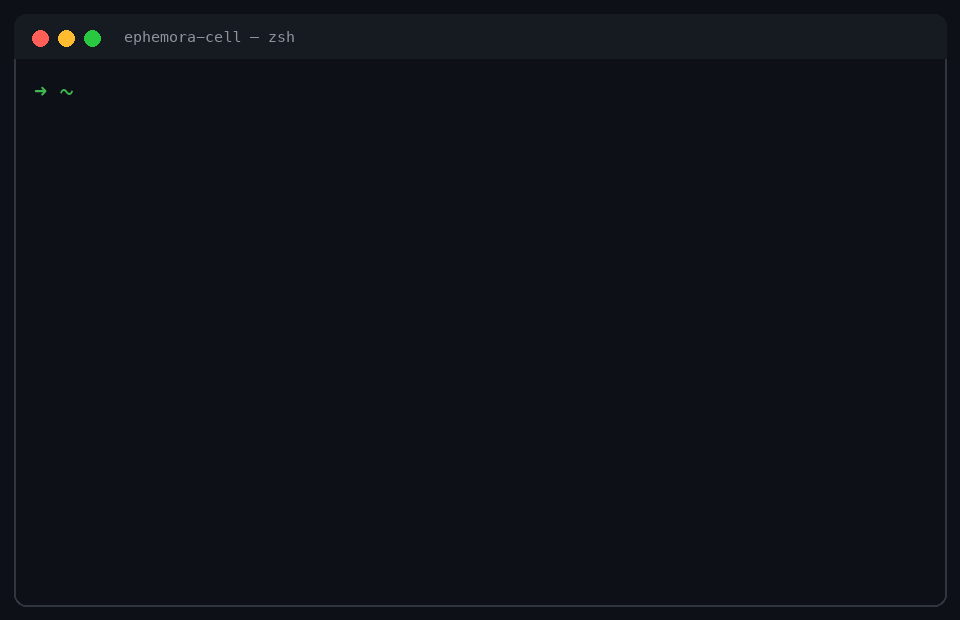
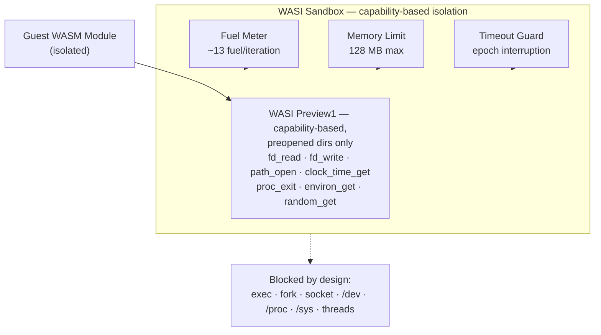

# Ephemora Cell

### Secure execution for untrusted AI-generated code.

Run AI-generated code, MCP tools and plugins inside an enforced capability boundary — explicit resource limits, auditable execution records.

**8/8 attack vectors blocked · 424 tests · sub-millisecond warm execution**

Built for **AI agents, MCP tools, plugins, code interpreters, and other untrusted workloads.**

Fast, capability-based WASM execution: CPU, memory, time, I/O and filesystem budgets enforced per execution, with sign-ready execution records (RFC 8785 JCS canonicalization + ES256 `sign()`/`verify()` primitives).

<p align="center">
  <a href="https://pypi.org/project/ephemora-cell/">
    
  </a>
  <a href="https://www.python.org/downloads/">
    
  </a>
  <a href="https://opensource.org/licenses/Apache-2.0">
    
  </a>
  <a href="https://github.com/MichaelS1011/ephemora-cell">
    
  </a>
  <a href="https://github.com/MichaelS1011/ephemora-cell/stargazers">
    
  </a>
</p>


<p align="center">
  <picture>
    <source media="(prefers-color-scheme: dark)" srcset="assets/hero-dark.svg">
    
  </picture>
</p>

## The problem

AI agents increasingly need to write and execute code, call tools, and run plugins. The question that decides whether that is safe:

**How do you let an agent execute untrusted code without giving that code access to your host, your credentials, your network, or unlimited compute?**

```text
AI Agent ──▶ Tool / MCP ──▶ Ephemora Cell ──▶ WASM ──▶ bounded result
```

**Ephemora Cell** is a small, capability-based WASM execution runtime for exactly that job: an execution primitive — not an agent framework — that sits underneath your existing agent stack, MCP server, plugin system, or application.

## Every execution leaves evidence

Every tool call answers three questions at once — attached to the result as `_meta.execution`, canonicalized (RFC 8785 JCS) and signable:

| | Answer | Example fields |
|---|---|---|
| **RESULT** | what came back | `status`, `stdout`, `exit_code` |
| **COST** | what it cost | `fuel_consumed`, `elapsed_ms` |
| **POLICY** | under which rules it ran | memory limit, preopens, network policy, `wasmtime_version` |

"Verified. Not claimed." is a data field, not a slogan. Runnable demo: `python examples/signed_record_demo.py`.

## Quick Start

Three commands: install Cell, run something untrusted, read its audited receipt.

**1 — Install** (use a virtualenv; on Ubuntu ≥ 23.04 / Fedora a bare `pip install`
is refused by PEP 668. Windows: use Git Bash or WSL, and `python` instead of `python3`):

```bash
python3 -m venv .venv && source .venv/bin/activate
python -m pip install ephemora-cell
```

**2 — Run something untrusted** (the repo ships examples, or bring any `.wasm`):

```bash
git clone https://github.com/MichaelS1011/ephemora-cell.git && cd ephemora-cell
ephemora-cell run examples/hello.wasm --isolated
```

*(adds OS-level process isolation around the run, a few ms — recommended for code you didn't build)*

```text
Hello from Ephemora Cell!
```

**3 — Read the audited receipt** — same run, machine-readable. Here a hostile module
(`examples/fuel_bomb.wasm`) is given a 100-unit fuel budget and stopped, exactly as
budgeted:

```bash
ephemora-cell run examples/fuel_bomb.wasm --fuel 100 --isolated --json
```

```json
{
  "status": "fuel_exhausted",
  "exit_code": 0,
  "fuel_consumed": 100,
  "fuel_budget": 100,
  "stdout_bytes": 0
}
```

Same from Python — every result carries status, cost and captured output:

```python
from ephemora_cell import run_wasm

result = run_wasm("examples/hello.wasm", max_fuel=1_000_000, timeout_seconds=30)
print(result.stdout)          # captured output (10 KB cap)
print(result.status.name)     # SUCCESS
print(result.elapsed_ms)      # wall time
print(result.fuel_consumed)   # compute actually used
```

**Where to next:** agent/tool isolation → [Secure MCP tool execution](#secure-mcp-tool-execution) (3-line setup) · CI gating for untrusted PRs → [GitHub Action](#untrusted-pr-code-in-github-actions) · CLI reference and usage recipes → [docs/recipes.md](docs/recipes.md). Something failed? The usual suspects are venv not activated, `python3` vs `python` on Windows, or a wrong `.wasm` path — [docs/recipes.md](docs/recipes.md) covers them.


*Real CLI session: install, first run, machine-readable `--json` report with the security baseline, a fuel bomb stopped at exactly 100/100 units, and an attack module (`exploit.wasm`) blocked at the WASI import layer. Verify every frame: the commands run as shown from a clone.*

## Why this matters

Agent-generated code is different from application code: it can be buggy, computationally unbounded, unexpectedly expensive — or hostile. The runtime must **enforce** boundaries, not document them. Every Cell run does:

- **Enforced, not promised** — fuel metering (CPU), memory caps, epoch-based wall-clock timeouts, output caps and I/O budgets are enforced per execution; the effective posture is attested in an execution record that is
  canonicalized (RFC 8785 JCS) and sign-ready (`sign()`/`verify()` shipped).
- **Measured isolation advantage** — of the attack vectors that succeed against a stock Docker container (shell, fork, socket, host filesystem, symlink escape, …), all 8 are blocked here (live-verified, script in the repo).
- **Sub-millisecond warm execution** — 0.17 ms guest / 0.51 ms end-to-end (pooled, measured 2026-09-14; `benchmarks/results/`) makes sandboxing every call affordable instead of exceptional.

## What is enforced

**Security is never opt-in.** Every execution — in-process or isolated — runs under enforced limits (CPU fuel, memory, wall-clock time, output caps) that neither the guest nor the caller can switch off. The one thing you choose is the process boundary: add `--isolated` (or call `run_isolated()`) when the module comes from outside your own build — agent output, third-party plugins, PR-contributed code. The in-process path stays for modules you build and trust. The enforced defaults:

| Resource | Default |
|---|---|
| WASM memory | 128 MB (`Store.set_limits`) |
| Fuel / CPU budget | 1,000,000 (~13 fuel/iteration, R² = 1.000; 2026-09-14 re-measured, macOS arm64 — fuel counts are per-platform, not cross-platform) |
| Wall-clock timeout | 30 s (epoch interruption) |
| Captured stdout/stderr | 10 KB |
| Network | disabled — Preview1: no socket APIs; WASI 0.2: linked, denied at call time (measured) |
| Host filesystem | denied by default; 14 dangerous dirs blocked (`/dev`, `/proc`, `/sys`, …) |
| Process exec / fork | unavailable in WASI |
| Threading | disabled (`wasm_threads=False`) |

Additional controls: **I/O budgets** (`io_cpu_seconds=2.0` / `io_budget_bytes=64 MiB` — walls for host work, not just guest compute), **dual-ABI** (WASI Preview1 + WASI 0.2 components, opt-in), **memory64 opt-in**, **GC-heap declared cap** (recorded in the security baseline; fuel remains the effective bound), **named state** (64 entries · 256 KiB · 1 MiB per session), and an **egress sidecar** reference mediator (allowlist-validated host-side API calls — [docs/egress_patterns.md](docs/egress_patterns.md)).

## Security

**Evidence ladder** — strongest first. Every row is measured, the raw evidence is committed, and each run is reproducible:

| # | Evidence | What it proves | How it is measured | Reproduce |
|---|---|---|---|---|
| 1 | [MCP CVE replays](benchmarks/mcp_cve_replay.py) | Real exploit paths of two patched CVEs are denied at the engine level; governed loading fails closed on a tampered payload — also verified on WASI 0.2 components, with a **measured call-time socket denial** | Pinned vulnerable reference server vs Cell, random marker tokens, positive controls on both sides | `python benchmarks/mcp_cve_replay.py` |
| 2 | [SandboxEscapeBench-18 mapping](benchmarks/sandbox_escape_18.py) | 18 container/K8s escape scenarios mapped to WASM: **8 execution-tested and denied, 10 not expressible** on the WASI surface · *OSS slice of the Ephemora benchmark program (see note below)* | Structural mapping + live attempts, granted-preopen positive control | `python benchmarks/sandbox_escape_18.py` |
| 3 | 8 attack intents × 3 boundaries | Same intents, same exit-code rule: stock Docker 0/8 blocked · hardened Docker 2/8 · Cell 8/8 (matrix below) | Live probes, arm64 image pinned by digest | `python assets/demo_attack_probe.py` · `python benchmarks/hardened_docker_probe.py` · `python benchmarks/verify_8_vectors.py` |
| 4 | [Official WASI conformance](conformance/README.md) | 72 pass / 1 documented xfail / 0 fail against the pinned upstream suite — re-run weekly in CI | Runtime adapter over the official suite, raw JSON committed | see conformance/ |
| 5 | [Cross-architecture determinism](docs/comparison-mcp-servers.md) | Fuel deterministic per platform (spread 0), platform-bound values | Same tool call on macOS arm64 / DGX GB10 / x86_64 | `python benchmarks/determinism_probe.py` |

**Row 2 in context.** The 18 scenarios are external (UK AI Security Institute, MIT — provenance note below). This mapping is the open-source execution-boundary slice of a broader benchmark and assurance program; the wider program — including the agentic escape evaluation the upstream benchmark actually runs — is part of the **Ephemora enterprise edition** ([docs/enterprise.md](docs/enterprise.md)).

> **Where the 18 scenarios come from.** They are not ours: the UK AI Security Institute's *SandboxEscapeBench* ([arXiv 2603.02277](https://arxiv.org/abs/2603.02277), scenarios: [UKGovernmentBEIS/sandbox_escape_bench](https://github.com/UKGovernmentBEIS/sandbox_escape_bench), MIT) documents 18 ways code escapes container/Kubernetes sandboxes. Their benchmark tests whether AI agents can escape misconfigured containers; this suite does something narrower — each container scenario is mapped to its closest WebAssembly/WASI equivalent and executed against Cell, with no model in the loop. The result is a statement about the attack surface: the primitives those container escapes rely on (privileged modes, namespaces, cgroups, kernel primitives, raw sockets) do not exist on the WASI surface, and the scenarios with a WASM-expressible equivalent (filesystem, sockets) are denied by the live boundary. This repo covers the execution-boundary slice only; prompt-injection and agent-behavior security are different layers, out of scope for an execution sandbox by design. The Ephemora enterprise edition builds on Cell's isolation and runs a broader benchmark and assurance program for regulated environments — see [docs/enterprise.md](docs/enterprise.md).

**What we do not compare — and why.** Prompt-injection suites (garak, InjecAgent) test the model and agent layer, not the execution boundary — out of scope for an execution sandbox. Cloud sandbox providers are cited from third-party sources with their source status; third-party numbers never appear in the same table as our measured cells. Startup and throughput benchmarks live in [docs/performance.md](docs/performance.md) with their scope caveats.

The guest receives only the capabilities explicitly made available to it. Live verification of eight attack classes ([`benchmarks/verify_8_vectors.py`](benchmarks/verify_8_vectors.py)) — measured against three boundaries, same intents, same measurement rule (exit code decides, nothing hardcoded):

| Attack class | Docker | Docker (hardened¹) | Ephemora Cell | Layer |
|---|---|---|---|---|
| Shell (`os.system`) / fork | ALLOWED | ALLOWED | **BLOCKED** — APIs don't exist in WASI | 1 |
| Network sockets | ALLOWED | ALLOWED — creation needs no capability | **BLOCKED** — APIs don't exist in WASI | 1 |
| fsync (`os.fsync`) | ALLOWED | **BLOCKED** — EROFS via `--read-only` | **BLOCKED** — import-level rejection | 2 |
| Host filesystem (`/etc/passwd`) | ALLOWED | ALLOWED — the container's own file | **BLOCKED** — preopen default-deny | 2 |
| Symlink escape | ALLOWED | **BLOCKED** — EROFS via `--read-only` | **BLOCKED** — dangerous directory filter | 2 |
| Multi-threading | ALLOWED | ALLOWED | **BLOCKED** — `wasm_threads=False` | 2 |
| Environment access | ALLOWED | ALLOWED | **BLOCKED** — controlled via `allow_env` | 2 |

The boundary is three layers, and the table measures them separately:

- **Layer 1 — WASI surface:** the guest format itself has no shell/fork/socket entry points to call.
- **Layer 2 — Sandbox policy (always on):** preopen default-deny, dangerous-directory filter, import traps, `wasm_threads=False`, `allow_env` — enforced per execution, not configurable away.
- **Layer 3 — OS process wall (`--isolated`):** a disposable worker process with OS rlimits and a hard kill — the mitigation layer for engine 0-days ([SECURITY.md](SECURITY.md) documents the April 2026 wasmtime advisories).

**Result: 8/8 attack vectors blocked (live-verified); both Docker baselines are measured live per run — never hardcoded.**

¹ Hardened = exactly these flags — tell us which to add: `--network none --read-only --cap-drop=ALL --security-opt no-new-privileges --pids-limit 64 --user 65534:65534` (image pinned by digest; Docker's default seccomp profile is active in **both** columns). Both hardened blocks are `--read-only` file-system effects — the flags wall the container *off*, not the guest *in*: socket creation, the container's own `/etc/passwd`, fork, threading and environment stay available to the guest.


*Same eight attack primitives, measured live (2026-09-18 refresh, arm64 image pinned by digest; positive control proving the preopen grant works): a stock `python:3.12-slim` container lets every one through (0/8 blocked), a hardened container still lets 6 of 8 through — both of its blocks are `--read-only` flag effects — and the Ephemora Cell boundary blocks all eight (8/8). Reproduce all three columns:*

```bash
python assets/demo_attack_probe.py          # stock Docker    -> 0/8 blocked
python benchmarks/hardened_docker_probe.py  # hardened Docker -> 2/8 blocked
python benchmarks/verify_8_vectors.py       # Ephemora Cell   -> 8/8 blocked
```

**How the 8/8 is measured.**

- **Environment:** MacBook Pro M5, macOS arm64, wasmtime 47.0.1, Docker 28.5.1
- **Docker probes (2026-09-18, `linux/arm64` image pinned by digest):** stock via `docker run --rm`, hardened via exactly the declared flag set — the measured exit code decides ALLOWED vs BLOCKED, nothing hardcoded. Historical stock baseline (2026-09-02, `x86_64` image under emulation): `benchmarks/results/2026-09-02/`
- **Cell probe (2026-09-18, same day):** `verify_8_vectors.py` against the live runtime — same eight attack intents, expressed natively per platform (equivalence below); verification method detailed in [`docs/security_posture.md`](docs/security_posture.md)
- **Workload:** self-contained payloads, no downloads, no credentials
- **Positive control:** each blocked vector is paired with a granted-capability control that **must succeed** on the same sandbox config (e.g. the symlink test's real target file must open errno 0) — if the control fails, the harness is broken, not the sandbox, and the run does not count

| # | Attack intent | Docker probe body (`python3 -c`) | Cell probe guest (WASM) |
|---|---|---|---|
| 1 | shell | `os.system('id …') == 0` | no exec/system entry point in the WASI import surface (live scan) |
| 2 | fork | `os.fork()` | no fork/vfork in the import surface (live scan) |
| 3 | socket | `socket.socket(…)` | no socket/sock_\* in the import surface (live scan) |
| 4 | fsync | open + write + `os.fsync` | module imports `fd_psync` → trapped by the sandbox |
| 5 | host FS | `open('/etc/passwd').read()` | `path_open('/etc/passwd')` with no preopen |
| 6 | symlink escape | `os.symlink` + `realpath` outside | `path_open` through a symlink out of a preopened dir (control: real file opens errno 0) |
| 7 | threading | `threading.Thread(…).start()` | shared-memory module rejected (`wasm_threads=False`) |
| 8 | env | `'PATH' in os.environ` | env count with `allow_env=()` must be 0 |

- **Raw evidence:** `benchmarks/results/2026-09-18/` (`01_hardened_docker_attack_probe.json` · `02_docker_attack_probe.json` · `03_cell_8_vector_verify.json`) + historical `benchmarks/results/2026-09-02/`

**MCP CVE replays.** The official MCP reference servers have real, patched CVEs against this exact surface. [`benchmarks/mcp_cve_replay.py`](benchmarks/mcp_cve_replay.py) replays them as their original exploit paths — pinned vulnerable reference server vs. Cell, same files, positive controls on both sides (2026-09-17, `measured:true`):

- **CVE-2025-53109/53110** ("EscapeRoute", symlink escape + prefix traversal): the vulnerable reference server **leaked** the protected file in both intents; Cell blocked both at the engine level (`EPERM`/`ENOTCAPABLE`) — with the granted-capability control reading successfully on both sides.
- **CVE-2025-54136 class** ("MCPoison", payload swap after trust): a signed tool is accepted once, then a single tampered wasm byte makes the next governed-load request **fail closed** (hash mismatch).
- **Same replays against WASI 0.2 components** ([evidence](benchmarks/results/2026-09-18/mcp_cve_replay_component.json), `abi: "component"`): the component path denies the same escape intents (symlink escape → `EPERM`, traversal → no preopen base) and the same governed-load tamper fails closed. The network vector gets its own intent — the WASI 0.2 world *links* `wasi:sockets` (unlike Preview1), so a TCP connect is attempted under the sandbox and **refused at call time**, with the granted-read control passing in the same run.

## Secure MCP tool execution

[](https://registry.modelcontextprotocol.io/v0/servers?search=ephemora-cell-mcp) *listed in the official MCP Registry (`io.github.MichaelS1011/ephemora-cell-mcp`, stdio via PyPI).*

Ephemora Cell ships a dependency-free MCP stdio server whose tools are WASM modules executed inside the Cell — determinism, fuel metering, output cap, no network, SEP-2787-ready signable execution records:

```bash
pip install ephemora-cell
ephemora-cell-mcp          # bundled tools: clock + echo; --tools-dir ./tools replaces the bundled set with your own

# One-line setup for GitHub Copilot in VS Code:
code --add-mcp '{"name":"Ephemora Cell","command":"ephemora-cell-mcp"}'
```

Ask your agent for the current time: the answer comes from the bundled `clock` tool — a WASM module reading only the WASI real-time clock — and the call report shows exactly what that answer cost.

Three things most MCP tool servers don't give you:

- **Isolation you can inspect.** The native `get-policy` tool returns the effective sandbox policy per tool — fuel budget, memory limit, preopens, network policy — computed from the same code path that enforces it, so the report and the enforcement cannot drift. Policy reads are tools; policy writes are host decisions ([ADR-006](docs/decisions/ADR-006-governed-tool-loading.md)): an agent cannot grant itself network or filesystem access, and no socket connect succeeds (Preview1 exposes no socket APIs; in the WASI 0.2 world connect is denied at call time — measured). Per-call evidence is measured side-by-side against the alternatives in the [comparison doc](docs/comparison-mcp-servers.md).
- **Compatibility proven, not assumed.** The shipped server is verified in CI against the official MCP Python SDK on every push (`initialize`, `tools/list`, a real `tools/call` with execution `_meta`), with per-client setup documented for Claude Desktop, VS Code, Codex, OpenCode, and Hermes.
- **Isolation priced for every call** — three numbers, don't mix them up ([comparison](docs/comparison-mcp-servers.md)):

  | Path | Cost per call | Why |
  |---|---|---|
  | Library pooled runtime (`io_budget_bytes=None`) | **~0.5 ms** | cached engine, trusted workloads |
  | MCP stdio server, default | **~12 ms** | fresh sandbox per `tools/call` — the ADR-002 I/O wall enforced via a per-run engine, measured end-to-end |
  | MCP stdio server, `--pooled` | **~0.5 ms** | verified tools on the pooled engine; the relaxed I/O wall is attested in `get-policy` |

  Sandbox *every* call becomes the default, not a trade-off.

- **The agent cannot rewrite its own security boundary.**

  ```text
  Agent (LLM) ──▶ Host policy ──▶ Cell runtime ──▶ Execution
    proposes      verifies         enforces
    capability    signature,       fuel, memory, wall time,
    request       module hash,     permissions, exit status
                  policy
  ```

  The agent may only *propose* a capability ([ADR-006](docs/decisions/ADR-006-governed-tool-loading.md)); the host verifies signature, module hash and policy out-of-band before anything runs; the runtime enforces per execution and returns evidence. No arrow in that chain points backwards — there is no tool-call path that widens a grant, and `get-policy` reports exactly what the enforcement path applies (reads are tools; writes are not).

**vs Microsoft Wassette.** Wassette is Microsoft's capability-based runtime for MCP tools, built on the same Wasmtime engine family — the architecture thesis is converging, and its OCI pull model moves the trust decision to install time. Cell adds what a caller can *verify per call*: deterministic fuel metering, I/O budgets, and a sign-ready execution record (`_meta.execution`). Current status and the full side-by-side (Wassette re-verified 2026-09-18): [docs/comparison-mcp-servers.md](docs/comparison-mcp-servers.md).

See [docs/mcp.md](docs/mcp.md) and [docs/comparison-mcp-servers.md](docs/comparison-mcp-servers.md).

This is an execution boundary, not a claim that guest software is trustworthy. Cell does not evaluate whether a module is malicious or correct — a guest can still misbehave *within* the budgets it was given.

**The two execution paths differ materially.** `run_wasm()` runs the guest inside your process; `run_isolated()` adds OS-level walls around a disposable worker (and returns the report fields as a dict). For guests from outside your own build — agent output, third-party plugins, PR-contributed code — use the isolated path:

| Control | `run_wasm()` (in-process) | `run_isolated()` (subprocess) |
|---|---|---|
| Fuel metering (guest CPU) | ✅ | ✅ |
| Memory cap (`Store.set_limits`) | ✅ | ✅ |
| Wall-clock timeout (epoch) | ✅ | ✅ + hard process kill |
| 10 KB output cap | ✅ | ✅ |
| I/O byte wall (`io_budget_bytes`) | ✅ watcher + epoch interrupt | ✅ |
| I/O CPU wall (`io_cpu_seconds`) | ❌ documented-trusted | ✅ worker rusage watchdog |
| Disk quota (`disk_quota_bytes`) | ❌ trusted capability | ✅ RLIMIT_FSIZE (per file) |
| RLIMIT_NOFILE/AS/RSS, 32 MB module cap | ❌ | ✅ |
| Preopen deny + grant-time TOCTOU revalidation | ✅ | ✅ |

Rows marked ❌ in-process are *documented-trusted*: the knob is honored as a declared capability, not an enforced wall — a kernel-level cap there would limit your own process. Full matrix and rationale: [SECURITY.md](SECURITY.md).

Full details: [SECURITY.md](SECURITY.md) (policy, known limitations) · [docs/threat-model.md](docs/threat-model.md) (adversary model, trust boundaries, residual risks) · [docs/security_posture.md](docs/security_posture.md) (arXiv 2509.11242 evaluation, fuel boundary, related research).

## Conformance: tested against the official suite

Not a self-written test suite — the shipped CLI is run against the official [WebAssembly/wasi-testsuite](https://github.com/WebAssembly/wasi-testsuite) preview-1 suite through a runtime adapter (`conformance/`, evidence committed under `conformance/results/`):

- **72 pass, 1 documented by-design xfail, 0 fail** across the applicable preview-1 suites (pinned suite commit `609c44613995`, 2026-09-14; 55 preview-3 tests skipped — Cell declares preview 1 only)
- **A weekly CI job re-runs the pinned suite** and uploads the raw JSON, so drift surfaces within a week (`.github/workflows/wasi-conformance.yml`). Known, documented runner quirk: shared ubuntu x86_64 runners show rare wasmtime engine aborts on varying fs tests (71/72 per affected run; deterministic on macOS arm64 and in clean containers — [conformance/README.md](conformance/README.md))
- **The one deviation is documented, not hidden:** `sock_shutdown-invalid_fd` expects `EBADF` on a runtime with no preopens; Cell's sandbox scratch dir is preopened as fd 3 by design, so the call returns `ENOTSOCK`. The property Cell claims — no socket surface — is unaffected. Real conformance bugs do not get an exemption entry; the two bugs the suite *did* find were fixed.
- **Honest scope:** this is standards conformance, not a security certification. No third party certifies Cell; the evidence is the pinned suite, the committed JSON and the CI history.

The first external run earned its keep immediately: it found two CLI bugs our 420+ internal tests had missed (repeated `--allow-env`/`--allow-dirs` flags silently overwrote each other; `allow_dirs` had no way to express a guest-side preopen name). Both were fixed with regression tests — see [`conformance/README.md`](conformance/README.md).

## Performance

**What does the security boundary cost? 0.376 ms** — the warm wall-clock overhead a sandboxed run adds over the same work run bare (measured, not estimated).

*Latest reproducible benchmark — 2026-09-14 · Mac M5 · wasmtime 47.0.1 · n=1000. Every number below regenerates from a fresh clone via the commands at the end.*

| Scenario (2026-09-14, n=1000, `hello.wasm`, Mac M5, wasmtime 47.0.1) | Wall median | Wall p95 | Guest median |
|------|--------|------|------|
| **Pooled engine** (`io_budget_bytes=None`, trusted runs) | **0.51 ms** | 0.89 ms | 0.17 ms |
| **Default path** (`io_budget_bytes=64 MiB`, per-run engine) | 0.94 ms | 1.15 ms | 0.61 ms |

Cold vs. warm (2026-09-14, n=300 each, fresh sandbox per run vs. cached engine, first run discarded): cold median **0.59 ms** guest / 0.99 ms wall, warm median **0.55 ms** guest / 0.93 ms wall — sandbox overhead (warm wall − guest) = **0.376 ms** (`overhead_warm_ms`, `benchmarks/results/2026-09-14/pov_benchmark.json`).

Live cold-start comparison (2026-09-14, same Mac, n=100 per image after warmup): `docker run` python:3.12-slim 185.9 ms vs Cell 0.49 ms = **383×** — this is a container-cold-start vs invoked-WASM comparison for this benchmark workload, not a general claim that WASM is always faster than Docker.

Reproduce: `python benchmarks/pool_vs_budget.py` · `python benchmarks/competitive_benchmark.py` (raw results with `measured:true` committed under `benchmarks/results/`). Agentic workloads and more: [docs/performance.md](docs/performance.md).

## Any language that compiles to WASM

Cell executes the `.wasm` — it does not know the source language. One-command build with actionable error hints from the measured friction matrix:

```bash
ephemora-cell build src/main.rs # inside a cargo project → tool.wasm → run it
```

A bare `.rs` file outside a cargo project gets actionable guidance instead of
a guess (the builder searches upward for the manifest, like cargo).

| Language | Compiler | Verified |
|----------|----------|----------|
| Rust | `cargo build --target wasm32-wasip1` | ✅ Compiled + executed (CI) |
| Go | `GOOS=wasip1 GOARCH=wasm go build` | ✅ Compiled + executed (CI) |
| C | wasi-sdk `clang --target=wasm32-wasip1` | ✅ Compiled + executed (CI) |
| AssemblyScript | `asc --runtime stub` | ✅ Compiled + executed (CI) |
| Zig | `zig build-exe -target wasm32-wasi` | ✅ Compiled + executed (CI) |
| Python | — | Guidance: run on a wasi-python interpreter (no AOT exists) |

All five compiled-language gates verify on every push ([`.github/workflows/ci.yml`](.github/workflows/ci.yml)). **Platforms:** macOS (Apple M5) ✅ · Ubuntu 24.04 ✅ · DGX Spark GB10 ✅

## Use Cases

**AI-generated code** — run agent-produced tools with explicit limits:

```python
result = run_wasm(
    "llm_generated.wasm",
    max_fuel=200_000,
    timeout_seconds=5,
    allow_dirs=("/input", "/output")
)
```

**Plugin systems** — accept user-uploaded plugins without giving them unrestricted host access:

```python
config = WASIConfig(allow_dirs=("/data",), max_fuel=500_000)
result = WASISandbox(config=config).run("user_plugin.wasm")
```

Also documented: serverless/edge workloads, air-gapped validation, WASI 0.2 components, FastAPI integration — [docs/recipes.md](docs/recipes.md). Agent-framework integration tests (LangGraph, CrewAI, AutoGen, OpenAI Agents SDK, Semantic Kernel, Hermes, NemoClaw) live in [`integration/`](integration/).

## Untrusted PR code in GitHub Actions

This repository ships a composite action: run a WASM module in the Cell sandbox inside your own workflow — with fuel metering, memory cap, epoch timeout and (default) the `--isolated` subprocess path (OS-level rlimits, hard kill):

```yaml
- id: run-tool
  uses: MichaelS1011/ephemora-cell/action@main
  with:
    module: path/to/module.wasm   # e.g. built from a PR-provided recipe
    profile: llm
    # fuel: 500_000
- run: echo "status=${{ steps.run-tool.outputs.status }} fuel=${{ steps.run-tool.outputs.fuel_consumed }}"
```

Non-success statuses fail the step (`fail-on: non-success`, default) — a module that burns its budget or trips the memory cap cannot take your workflow with it. This repo dogfoods the action on every push: [`.github/workflows/action-demo.yml`](.github/workflows/action-demo.yml) runs a benign module and feeds the same module a 100-unit fuel budget, asserting live that the sandbox stops it and accounts every unit.

## Verifying. Not claimed.

Around the sandbox sits a verifiable trust chain for third-party tools:

```text
TOOL ──▶ SIGNED MANIFEST ──▶ HOST VERIFY ──▶ EPHEMORA CELL ──▶ SIGNED EXECUTION
        (vendor ships)     (fail-closed,      runs inside       RECORD
                           hash + policy      the sandbox       (tamper-evident)
                           check)
```

Anything failing verification is rejected before a single instruction executes — execution never depends on a happy path.

<picture>
  <source media="(prefers-color-scheme: dark)" srcset="assets/trust-chain-dark.svg">
  
</picture>

- **Signed tool manifests.** Third-party tools ship an Ed25519-signed manifest (RFC 8785 JCS); the server verifies before registering and rejects unsigned, tampered or hash-mismatched tools fail-closed — a bare `.wasm` without a manifest never loads in signed-tools mode. `ephemora-cell-mcp --require-signed-tools pub.pem`, sign with `python -m ephemora_cell_mcp.sign_tool`.
- **Governed dynamic loading.** An agent can only *propose* a tool — a `tool.request.json` dropped into an operator-allowlisted directory; the host verifies signature, module hash and policy, then installs and announces it (`notifications/tools/list_changed`). The agent proposes; the host disposes ([ADR-006](docs/decisions/ADR-006-governed-tool-loading.md)).
- **Signed execution records.** Any run folds into a tamper-evident record covering status, fuel, timing and the attested security baseline — rewrite one field and verification fails. Runnable demo: `python examples/signed_record_demo.py`.
- **Trusted fast path.** `ephemora-cell-mcp --pooled` serves verified tools from the pooled engine at ~0.5 ms per call instead of ~12 ms (measured) — the relaxed I/O wall is attested in `get-policy`.



*Every frame is a verbatim capture from a real run — reproduce them from a clone. Fuel numbers are exact (budgets are enforced); see [SECURITY.md](SECURITY.md) for the platform note on fuel costs.*

## Architecture



The primary API is deliberately simple: `execute(wasm) → result`. Every execution returns structured, auditable information:

```python
result.status        # SUCCESS | ERROR | TIMEOUT | FUEL_EXHAUSTED | MEMORY_EXCEEDED
result.exit_code
result.stdout        # 10 KB cap
result.stderr
result.elapsed_ms
result.fuel_consumed
```

That makes execution suitable for auditing, policy enforcement, and resource accounting — not just running code. Full CLI (`run`, `--json` with `security_baseline`, `inspect`, `benchmark`, `build`, profiles incl. `--profile analytical`) in the [CLI docs](docs/recipes.md) and `ephemora-cell --help`.

## What Cell is — and is not

**Cell is:** a WASM execution primitive · a capability-based isolation layer · a resource-bounded runtime · an embeddable Python library · a CLI · an MCP execution layer.

**Cell is not:** an agent framework · an LLM · a code-generation system · a malware detector · a full VM · a replacement for every container workload.

What each enforced control does **not** claim — every row is an honest boundary, tested at the boundary:

| Enforced control | Does guarantee | Does **not** guarantee |
|---|---|---|
| Memory cap (128 MB) | guest cannot exceed the configured heap | correct guest behavior — a bug inside the budget is the guest's bug |
| Fuel budget | no unbounded CPU burn; execution stops at the limit | malware detection — code with hostile intent that stays within budget runs fine; nothing inspects what the module *means* |
| Wall-clock timeout | no runaway execution; epoch interruption fires | that the app logic is correct or fast |
| Network denial (no socket APIs) | no sockets, no outbound connections by the guest | safe behavior *within* granted capabilities — exfiltration via allowed channels (e.g. writing secrets to a granted preopen) remains the integrator's concern ([SECURITY.md](SECURITY.md)) |
| Filesystem capability control (preopen only, default deny) | file access limited to explicitly mounted dirs | full VM semantics — mounted-path content is exactly what the integrator chose to expose |
| Output caps (10 KB) | captured output is bounded; unbounded prints cannot fill the host disk | that truncated output is complete — inspect `result.stdout` and the record |

> **The goal is narrow: make untrusted execution cheap enough and controlled enough that an application can safely do it by default.**

## Testing & Verification

424 tests · 85% statement coverage (Cell + MCP, gate 80%) · 8/8 attack vectors blocked · 72-pass official wasi-testsuite conformance (pinned, 0 fail) · CI-enforced on every push (tests, coverage, pip-audit, SBOM, bandit, official MCP SDK interop) — see [`.github/workflows/ci.yml`](.github/workflows/ci.yml).

## Can you break Cell?

Found an execution path that violates the documented security boundary — an escape, a budget bypass, an attestation gap? That is exactly the report we want: [SECURITY.md](SECURITY.md#reporting-a-vulnerability) (private disclosure, responsible handling). The [threat model](docs/threat-model.md) and its documented residual risks tell you where to aim; the methodology boxes on this page tell you how we measure. Security research on Cell is welcome.

## Documentation

**Getting started** · [Quick Start](#quick-start) above · [docs/recipes.md](docs/recipes.md) — usage patterns (FastAPI, serverless, air-gapped, WASI 0.2) · [`integration/`](integration/) — agent-framework examples

**Security & evidence** · [SECURITY.md](SECURITY.md) — policy, execution-path matrix, vulnerability reporting · [docs/threat-model.md](docs/threat-model.md) — trust boundaries, adversary model · [docs/security_posture.md](docs/security_posture.md) — attack-surface verification · [conformance/README.md](conformance/README.md) — official wasi-testsuite harness

**Execution records & decisions** · [ADR-006](docs/decisions/ADR-006-governed-tool-loading.md) — who may change a running workload's security boundary · [ADR-001…007](docs/decisions/) — all decision records · `examples/signed_record_demo.py` — sign and tamper-check a run

**Performance** · [docs/performance.md](docs/performance.md) — benchmarks · [`benchmarks/results/`](benchmarks/results/) — raw `measured:true` JSON

**Integrations** · [docs/mcp.md](docs/mcp.md) — MCP server · [docs/comparison-mcp-servers.md](docs/comparison-mcp-servers.md) — CVE-to-probe mapping · [`action/`](action/) — composite GitHub Action

**Languages** · [docs/languages.md](docs/languages.md) — compile matrix · [docs/egress_patterns.md](docs/egress_patterns.md) — sanctioned API-call patterns

**Enterprise** · [docs/enterprise.md](docs/enterprise.md) — isolation vs. operation: when that conversation is worth having

**Changes** · [CHANGELOG.md](CHANGELOG.md)

## About Ephemora

Ephemora Cell is the open-source isolation layer (Apache 2.0, standalone — no Ephemora dependency). The Ephemora enterprise edition builds on Cell's isolation for production and regulated deployments. Cell is complete for isolation; the enterprise edition is complete for operation — see [docs/enterprise.md](docs/enterprise.md) for when that conversation is worth having.

## License

Apache 2.0 — See `LICENSE`.

---
mcp-name: io.github.MichaelS1011/ephemora-cell-mcp

---

*One agent action. One bounded execution. One controlled result.*

Created by [Michael Soppa](https://www.linkedin.com/in/michael-soppa).
