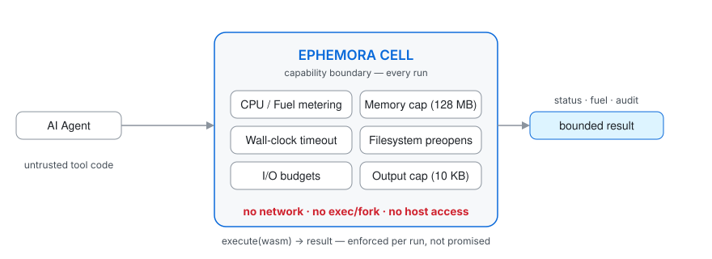
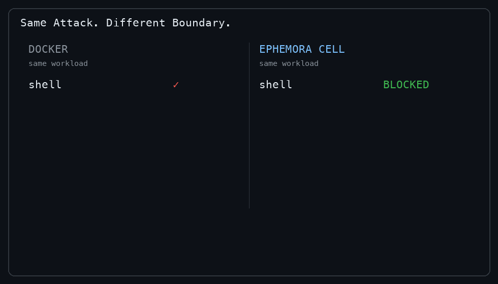
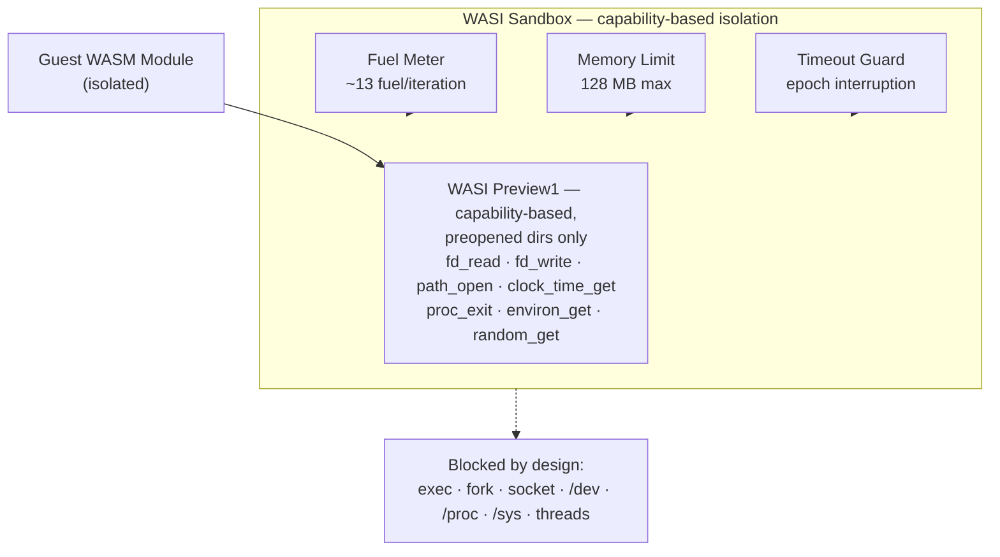

# Ephemora Cell

### The execution layer for untrusted AI-generated code.

Fast, capability-based WASM execution with explicit CPU, memory, time, I/O, and filesystem limits — **sub-millisecond warm execution with sign-ready execution records
(RFC 8785 JCS canonicalization + ES256 `sign()`/`verify()` primitives).**

Built for **AI agents, MCP tools, plugins, code interpreters, and other untrusted workloads.**

<p align="center">
  <a href="https://pypi.org/project/ephemora-cell/">
    
  </a>
  <a href="https://www.python.org/downloads/">
    
  </a>
  <a href="https://opensource.org/licenses/Apache-2.0">
    
  </a>
  <a href="https://github.com/MichaelS1011/ephemora-cell">
    
  </a>
  <a href="https://pypistats.org/packages/ephemora-cell">
    
  </a>
  <a href="https://github.com/MichaelS1011/ephemora-cell/stargazers">
    
  </a>
</p>


<p align="center">
  <picture>
    <source media="(prefers-color-scheme: dark)" srcset="assets/hero-dark.svg">
    
  </picture>
</p>

## The problem

AI agents increasingly need to write and execute code, call tools, and run plugins. The question that decides whether that is safe:

**How do you let an agent execute untrusted code without giving that code access to your host, your credentials, your network, or unlimited compute?**

```text
AI Agent ──▶ Tool / MCP ──▶ Ephemora Cell ──▶ WASM ──▶ bounded result
```

**Ephemora Cell** is a small, capability-based WASM execution runtime for exactly that job: an execution primitive — not an agent framework — that sits underneath your existing agent stack, MCP server, plugin system, or application.

## Quick Start

```bash
pip install ephemora-cell

# Run your first isolated module (grab the repo's examples, or bring any .wasm):
git clone https://github.com/MichaelS1011/ephemora-cell.git
ephemora-cell run ephemora-cell/examples/hello.wasm
```

```text
Hello from Ephemora Cell!
```

```python
from ephemora_cell import run_wasm

result = run_wasm("my_module.wasm")
print(result.stdout)          # captured output (10 KB cap)
print(result.status.name)     # SUCCESS
print(result.elapsed_ms)      # wall time
print(result.fuel_consumed)   # compute actually used
```


*Real CLI session: install, first run, machine-readable `--json` report with the security baseline, and an attack module (`exploit.wasm`) blocked at the WASI import layer. Verify every frame: the commands run as shown from a clone.*



*Same eight attack primitives, measured live in one run (2026-09-02): a stock `python:3.12-slim` container lets every one through (0/8 blocked), the Ephemora Cell boundary blocks all eight (8/8). Reproduce both columns:*

```bash
python3 assets/demo_attack_probe.py    # left column  -> 0/8 blocked (stock Docker)
python  benchmarks/verify_8_vectors.py # right column -> 8/8 blocked (Ephemora Cell)
```

## Why this matters

Agent-generated code is different from application code: it can be buggy, computationally unbounded, unexpectedly expensive — or hostile. The runtime must **enforce** boundaries, not document them. Every Cell run does:

- **Enforced, not promised** — fuel metering (CPU), memory caps, epoch-based wall-clock timeouts, output caps and I/O budgets are enforced per execution; the effective posture is attested in an execution record that is
  canonicalized (RFC 8785 JCS) and sign-ready (`sign()`/`verify()` shipped).
- **Measured isolation advantage** — of the attack vectors that succeed against a stock Docker container (shell, fork, socket, host filesystem, symlink escape, …), all 8 are blocked here (live-verified, script in the repo).
- **Sub-millisecond warm execution** — 0.16 ms guest / 0.46 ms end-to-end (pooled, measured) makes sandboxing every call affordable instead of exceptional.

## What is enforced

Every execution runs under explicit limits — no opt-in security:

| Resource | Default |
|---|---|
| WASM memory | 128 MB (`Store.set_limits`) |
| Fuel / CPU budget | 1,000,000 (~13 fuel/iteration, R² = 1.000) |
| Wall-clock timeout | 30 s (epoch interruption) |
| Captured stdout/stderr | 10 KB |
| Network | disabled — no socket APIs in WASI |
| Host filesystem | denied by default; 14 dangerous dirs blocked (`/dev`, `/proc`, `/sys`, …) |
| Process exec / fork | unavailable in WASI |
| Threading | disabled (`wasm_threads=False`) |

Additional controls: **I/O budgets** (`io_cpu_seconds=2.0` / `io_budget_bytes=64 MiB` — walls for host work, not just guest compute), **dual-ABI** (WASI Preview1 + WASI 0.2 components, opt-in), **memory64 opt-in**, **GC-heap declared cap** (recorded in the security baseline; fuel remains the effective bound), **named state** (64 entries · 256 KiB · 1 MiB per session), and an **egress sidecar** reference mediator (allowlist-validated host-side API calls — [docs/egress_patterns.md](docs/egress_patterns.md)).

## Security

The guest receives only the capabilities explicitly made available to it. Live verification of eight attack classes ([`benchmarks/verify_8_vectors.py`](benchmarks/verify_8_vectors.py)):

| Attack class | Docker | Ephemora Cell |
|---|---|---|
| Shell (`os.system`) / fork / network sockets | ALLOWED | **BLOCKED** — APIs don't exist in WASI |
| fsync (`os.fsync`) | ALLOWED | **BLOCKED** — import-level rejection |
| Host filesystem (`/etc/passwd`) | ALLOWED | **BLOCKED** — preopen default-deny |
| Symlink escape | ALLOWED | **BLOCKED** — dangerous directory filter |
| Multi-threading | ALLOWED | **BLOCKED** — `wasm_threads=False` |
| Environment access | ALLOWED | **BLOCKED** — controlled via `allow_env` |

**Result: 8/8 attack vectors blocked (live-verified); Docker baselines are measured live per run — never hardcoded.**

This is an execution boundary, not a claim that guest software is trustworthy. Cell does not evaluate whether a module is malicious or correct — a guest can still misbehave *within* the budgets it was given. Execution paths differ materially: the default runs the guest inside your process; `run_isolated()` adds OS-level walls (rlimits, disk quota, I/O CPU watchdog, hard kill).

Full details: [SECURITY.md](SECURITY.md) (policy, execution-path control matrix, known limitations) · [docs/threat-model.md](docs/threat-model.md) (adversary model, trust boundaries, residual risks) · [docs/security_posture.md](docs/security_posture.md) (arXiv 2509.11242 evaluation, fuel boundary, related research).

## Performance

**Sandbox every execution without paying container-scale startup costs.**

| Scenario (n=1000, `hello.wasm`, Mac M5, wasmtime 47.0.1) | Wall median | Wall p95 | Guest median |
|------|--------|------|------|
| **Pooled engine** (`io_budget_bytes=None`, trusted runs) | **0.46 ms** | 0.60 ms | 0.16 ms |
| **Default path** (`io_budget_bytes=64 MiB`, per-run engine) | 0.92 ms | 1.26 ms | 0.60 ms |

Live cold-start comparison (2026-08-30, same Mac): `docker run` python:3.12-slim 171 ms vs Cell 0.40 ms = **427×** — this is a container-cold-start vs invoked-WASM comparison for this benchmark workload, not a general claim that WASM is always faster than Docker.

Reproduce: `python benchmarks/pool_vs_budget.py` · `python benchmarks/competitive_benchmark.py` (raw results with `measured:true` committed under `benchmarks/results/`). Agentic workloads and more: [docs/performance.md](docs/performance.md).

## Any language that compiles to WASM

Cell executes the `.wasm` — it does not know the source language. One-command build with actionable error hints from the measured friction matrix:

```bash
ephemora-cell build tool.rs     # → tool.wasm → run it
```

| Language | Compiler | Verified |
|----------|----------|----------|
| Rust | `cargo build --target wasm32-wasip1` | ✅ Compiled + executed (CI) |
| Go | `GOOS=wasip1 GOARCH=wasm go build` | ✅ Compiled + executed (CI) |
| C | wasi-sdk `clang --target=wasm32-wasip1` | ✅ Compiled + executed (CI) |
| AssemblyScript | `asc --runtime stub` | ✅ Compiled + executed (CI) |
| Zig | `zig build-exe -target wasm32-wasi` | ✅ Compiled + executed (CI) |
| Python | — | Guidance: run on a wasi-python interpreter (no AOT exists) |

All five compiled-language gates verify on every push ([`.github/workflows/ci.yml`](.github/workflows/ci.yml)). **Platforms:** macOS (Apple M5) ✅ · Ubuntu 24.04 ✅ · DGX Spark GB10 ✅

## Use Cases

**AI-generated code** — run agent-produced tools with explicit limits:

```python
result = run_wasm(
    "llm_generated.wasm",
    max_fuel=200_000,
    timeout_seconds=5,
    allow_dirs=("/input", "/output")
)
```

**Plugin systems** — accept user-uploaded plugins without giving them unrestricted host access:

```python
config = WASIConfig(allow_dirs=("/data",), max_fuel=500_000)
result = WASISandbox(config=config).run("user_plugin.wasm")
```

Also documented: serverless/edge workloads, air-gapped validation, WASI 0.2 components, FastAPI integration — [docs/recipes.md](docs/recipes.md). Agent-framework integration tests (LangGraph, CrewAI, AutoGen, OpenAI Agents SDK, Semantic Kernel, Hermes, NemoClaw) live in [`integration/`](integration/).

### MCP Server

Ephemora Cell ships a dependency-free MCP stdio server whose tools are WASM modules executed inside the Cell — determinism, fuel metering, output cap, no network, SEP-2787-ready signable execution records:

**Every tool call answers three questions at once: what was returned, what it cost (fuel, milliseconds), and under which sandbox rules it ran** (memory limit, preopens, `wasmtime_version`) — attached to every response as `_meta.execution`. "Verified. Not claimed." is a data field, not a slogan.

```bash
pip install ephemora-cell
ephemora-cell-mcp          # bundled tools: clock + echo; register your own: --tools-dir ./tools

# One-line setup for GitHub Copilot in VS Code:
code --add-mcp '{"name":"Ephemora Cell","command":"ephemora-cell-mcp"}'
```

Ask your agent for the current time: the answer comes from the bundled `clock` tool — a WASM module reading only the WASI real-time clock — and the call report shows exactly what that answer cost.

Three things most MCP tool servers don't give you:

- **Isolation you can inspect.** The native `get-policy` tool returns the effective sandbox policy per tool — fuel budget, memory limit, preopens, network policy — computed from the same code path that enforces it, so the report and the enforcement cannot drift. Policy reads are tools; policy writes are host decisions ([ADR-006](docs/decisions/ADR-006-governed-tool-loading.md)): an agent cannot grant itself network or filesystem access, and the WASI surface does not even expose sockets to try.
- **Compatibility proven, not assumed.** The shipped server is verified in CI against the official MCP Python SDK on every push (`initialize`, `tools/list`, a real `tools/call` with execution `_meta`), with per-client setup documented for Claude Desktop, VS Code, Codex, OpenCode, and Hermes.
- **Isolation priced for every call.** ~0.89 ms per warm tool call (measured; [comparison](docs/comparison-mcp-servers.md)) — sandboxing *every* call becomes the default, not a trade-off.

See [docs/mcp.md](docs/mcp.md) and [docs/comparison-mcp-servers.md](docs/comparison-mcp-servers.md).

## Architecture



The primary API is deliberately simple: `execute(wasm) → result`. Every execution returns structured, auditable information:

```python
result.status        # SUCCESS | ERROR | TIMEOUT | FUEL_EXHAUSTED | MEMORY_EXCEEDED
result.exit_code
result.stdout        # 10 KB cap
result.stderr
result.elapsed_ms
result.fuel_consumed
```

That makes execution suitable for auditing, policy enforcement, and resource accounting — not just running code. Full CLI (`run`, `--json` with `security_baseline`, `inspect`, `benchmark`, `build`, profiles incl. `--profile analytical`) in the [CLI docs](docs/recipes.md) and `ephemora-cell --help`.

## What Cell is — and is not

**Cell is:** a WASM execution primitive · a capability-based isolation layer · a resource-bounded runtime · an embeddable Python library · a CLI · an MCP execution layer.

**Cell is not:** an agent framework · an LLM · a code-generation system · a malware detector · a full VM · a replacement for every container workload.

> **The goal is narrow: make untrusted execution cheap enough and controlled enough that an application can safely do it by default.**

## Testing & Verification

386 tests · 85% statement coverage (Cell + MCP, gate 80%) · 8/8 attack vectors blocked · CI-enforced on every push (tests, coverage, pip-audit, SBOM, bandit, official MCP SDK interop) — see [`.github/workflows/ci.yml`](.github/workflows/ci.yml).

## Documentation

[SECURITY.md](SECURITY.md) — security policy and controls · [docs/threat-model.md](docs/threat-model.md) — trust boundaries · [docs/security_posture.md](docs/security_posture.md) — attack-surface verification · [docs/performance.md](docs/performance.md) — benchmarks · [docs/mcp.md](docs/mcp.md) — MCP server · [docs/recipes.md](docs/recipes.md) — usage patterns · [docs/languages.md](docs/languages.md) — language support · [CHANGELOG.md](CHANGELOG.md) — changes

## About Ephemora

Ephemora Cell is the open-source isolation layer (Apache 2.0, standalone — no Ephemora dependency). The Ephemora enterprise edition builds on Cell's isolation for production and regulated deployments. Cell is complete for isolation; the enterprise edition is complete for operation — see [docs/enterprise.md](docs/enterprise.md) for when that conversation is worth having.

## License

Apache 2.0 — See `LICENSE`.

---

*One agent action. One bounded execution. One controlled result.*

Created by [Michael Soppa](https://www.linkedin.com/in/michael-soppa).
