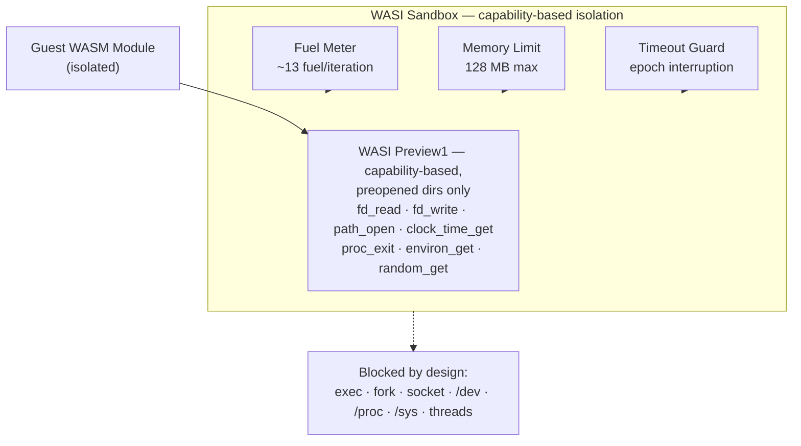

# Ephemora Cell

**Isolated WASM sandbox for untrusted code — sub-millisecond, capability-based. No network, no filesystem, no host access; capped at 128 MB memory / 1 M fuel / 30 s by default.**

<p align="center">
  <a href="https://pypi.org/project/ephemora-cell/">
    
  </a>
  <a href="https://www.python.org/downloads/">
    
  </a>
  <a href="https://opensource.org/licenses/Apache-2.0">
    
  </a>
  <a href="https://github.com/MichaelS1011/ephemora-cell">
    
  </a>
</p>

## Quick Start

```bash
pip install ephemora-cell

# Run your first isolated module (grab the repo's examples, or bring any .wasm):
git clone https://github.com/MichaelS1011/ephemora-cell.git
ephemora-cell run ephemora-cell/examples/hello.wasm
```

```text
Hello from Ephemora Cell!
```

```python
from ephemora_cell import run_wasm

result = run_wasm("examples/hello.wasm")
print(result.stdout)        # Hello from Ephemora Cell!
print(result.status.name)   # SUCCESS
```

## Why Cell

- **AI agents and MCP tools execute untrusted code** — Docker, shells and system Python give no isolation guarantees at agent scale. Cell sandboxes every execution.
- **Enforced, not promised** — fuel metering (CPU), memory caps, epoch-based wall-clock timeouts, output caps and I/O budgets are enforced per run, with the effective posture attested in a signed execution record.
- **Sub-millisecond warm execution** — 0.16 ms guest / 0.46 ms end-to-end (pooled, measured) enables plugin and edge scale.

## Features

- ⚡ **Fuel metering** — CPU limits per execution; catches infinite loops (~13 fuel/iteration, R² = 1.000)
- 🧠 **Memory limits** — 128 MB WASM memory max via `Store.set_limits`
- ⏱️ **Timeout** — 30 s wall-clock default (epoch interruption)
- 🔒 **Preopen deny** — 14 dangerous directories blocked by default (`/dev`, `/proc`, `/sys`, …)
- 🚫 **No network, no host access** — no socket, exec or fork APIs in WASI Preview1; imports rejected at instantiate
- 📦 **Output capping** — stdout/stderr capped at 10 KB (prevents buffer bloat)
- 🧬 **Dual-ABI** — WASI Preview1 (default) and WASI 0.2 components (opt-in via `abi="component"` or auto-detection)
- 🧱 **I/O budgets** — walls for host work, not just guest compute: `WASIConfig(io_cpu_seconds=…, io_budget_bytes=…)` (defaults 2.0 s / 64 MiB; `None` = unlimited for trusted runs; measured attack basis in `benchmarks/io_dos/`)

Also included: **memory64 opt-in** (`memory64=True` / `--memory64`, off by default), **GC-heap declared cap** (`max_gc_heap_mb`, recorded in the security baseline — wasmtime-py 47 binds no GC-heap limiter, fuel remains the effective bound), **named state** (`state_set`/`state_get` host imports, capped at 64 entries · 256 KiB · 1 MiB per session), and an **egress sidecar** reference mediator (allowlist-validated host-side API calls, no guest sockets — [docs/egress_patterns.md](docs/egress_patterns.md)).

## Performance

| Scenario (n=1000, `examples/hello.wasm`, Mac M5, wasmtime 47.0.1) | Wall median | Wall p95 | Guest median |
|------|--------|------|------|
| **Pooled engine** (`io_budget_bytes=None`, trusted runs) | **0.46 ms** | 0.60 ms | 0.16 ms |
| **Default path** (`io_budget_bytes=64 MiB`, per-run engine) | 0.92 ms | 1.26 ms | 0.60 ms |

*Measured 2026-08-29, reproducible: `python benchmarks/pool_vs_budget.py` (raw: `benchmarks/results/2026-08-29/pool_vs_budget.json`, `measured:true`). Budgeted runs force a per-run engine (ADR-002).*

Docker comparison (2026-08-30, live, same Mac): `docker run` python:3.12-slim 171 ms vs Cell 0.40 ms cold = **427×** — reproducible: `python benchmarks/competitive_benchmark.py` (raw: `benchmarks/results/2026-08-30/competitive_benchmark.json`, `docker_measured:true`). Agentic workloads (50 tool-calls, n=500 pooled): 0.24–0.26 ms median, p95 0.29 ms — detail in [docs/performance.md](docs/performance.md).

## Architecture



## Security

Ephemora Cell blocks attack vectors that are fully allowed in Docker (verified on DGX Spark GB10):

| Attack Vector | Docker | Ephemora Cell |
|---|---|---|
| Shell access (`os.system`) | ALLOWED | **BLOCKED** — no exec/system in WASI Preview1 |
| Fork (`os.fork`) | ALLOWED | **BLOCKED** — no fork() in WASI Preview1 |
| Network (`socket`) | ALLOWED | **BLOCKED** — no socket() in WASI Preview1 |
| fsync (`os.fsync`) | ALLOWED | **BLOCKED** — import-level rejection at instantiate |
| Host FS (`/etc/passwd`) | ALLOWED | **BLOCKED** — preopen default-deny |
| Symlink escape | ALLOWED | **BLOCKED** — dangerous directory filter |
| Multi-threading | ALLOWED | **BLOCKED** — `wasm_threads=False` enforced |
| Env access | ALLOWED | **BLOCKED** — controlled via `allow_env` |

**Result: 8/8 attack vectors blocked (live-verified** via [`benchmarks/verify_8_vectors.py`](benchmarks/verify_8_vectors.py)**).** Docker attacks are measured live per run via [`benchmarks/competitive_benchmark.py`](benchmarks/competitive_benchmark.py) — never hardcoded.

Full details: [SECURITY.md](SECURITY.md) (policy, execution-path control matrix, known limitations) · [docs/threat-model.md](docs/threat-model.md) (adversary model, trust boundaries, residual risks) · [docs/security_posture.md](docs/security_posture.md) (arXiv 2509.11242 evaluation, fuel boundary, related research).

## Compatibility & Integrations

Ephemora Cell is a WASM execution primitive, not a framework library — drop it into any agent framework, use it with any LLM, compile from any language that targets WASM. Integration tests live in [`integration/`](integration/): Hermes, NemoClaw, LangGraph, CrewAI, AutoGen, OpenAI Agents SDK, Semantic Kernel, and model independence (tested live against Ollama). The pattern is always the same: **`execute(wasm_path)` → isolated result.**

### MCP Server

Ephemora Cell ships a dependency-free MCP stdio server whose tools are WASM modules executed inside the Cell — determinism, fuel metering, 10 KB output cap, no network, SEP-2787-ready signed execution records:

```bash
pip install ephemora-cell
ephemora-cell-mcp          # bundled echo tool included; register your own: --tools-dir ./tools
```

See [docs/mcp.md](docs/mcp.md) and [docs/comparison-mcp-servers.md](docs/comparison-mcp-servers.md).

### Programming Languages (WASM Universal)

Any language that compiles to WASM works — Cell executes the `.wasm`, it does not know the source language. One-command build: `ephemora-cell build <source>` detects the toolchain and maps failed builds to actionable hints from the measured friction matrix (`benchmarks/build_friction/`).

| Language | Compiler | Verified |
|----------|----------|----------|
| Rust | `cargo build --target wasm32-wasip1` | ✅ Compiled + executed (CI) |
| Go | `GOOS=wasip1 GOARCH=wasm go build` | ✅ Compiled + executed (CI) |
| C | wasi-sdk `clang --target=wasm32-wasip1` | ✅ Compiled + executed (CI) |
| AssemblyScript | `asc --runtime stub` | ✅ Compiled + executed (CI) |
| Zig | `zig build-exe -target wasm32-wasi` | ✅ Compiled + executed (CI) |
| Python | — | Guidance: run on a wasi-python interpreter (no AOT exists) |

All five compiled-language gates verify on every push: the CI `build-recipes` job installs each toolchain and runs a real build + sandbox execution per language ([`.github/workflows/ci.yml`](.github/workflows/ci.yml)).

**Platforms:** macOS (Apple M5, ARM64) ✅ · Ubuntu 24.04 (x86_64, CI) ✅ · DGX Spark GB10 (Grace ARM64) ✅

## Configuration

```python
from ephemora_cell import WASISandbox, WASIConfig

config = WASIConfig(
    max_memory_mb=64,        # 64 MB WASM memory
    max_fuel=500_000,        # CPU fuel (None = unlimited)
    timeout_seconds=10,      # Wall-clock timeout
    allow_dirs=("/data",),   # Only /data pre-opened
)

sandbox = WASISandbox(config=config)
result = sandbox.run("examples/hello.wasm", args=["--input", "file.txt"])
```

`result` contains: `status` (`ExecutionStatus.SUCCESS | ERROR | TIMEOUT | FUEL_EXHAUSTED | MEMORY_EXCEEDED`), `exit_code`, `stdout`/`stderr` (capped at 10 KB), `elapsed_ms`, `fuel_consumed`.

```bash
ephemora-cell run examples/hello.wasm              # execute
ephemora-cell run examples/hello.wasm --json       # JSON on stdout, guest output on stderr
ephemora-cell run examples/hello.wasm --profile analytical
ephemora-cell inspect examples/hello.wasm          # module metadata
ephemora-cell benchmark examples/hello.wasm --n 300
```

Explicit CLI flags override the selected `--profile`; profiles add nothing you did not ask for. `--profile analytical` runs data-analysis workloads beyond the 128 MB wall (64-bit memories, 4.5 GiB linear memory, 50 M fuel, 120 s timeout — measured guarantees in `benchmarks/analytical_breakpoint/`, design in [docs/decisions/ADR-003](docs/decisions/ADR-003-analytical-profile.md)). In `--json` mode the payload includes `security_baseline` and `stdin_capped`; piped stdin beyond 9,216 B is refused (wasmtime host cap) — use a preopened file for bigger inputs.

## Use Cases

### Plugin Systems

Run user-uploaded plugins in isolation — even if they are malicious:

```python
from ephemora_cell import WASISandbox, WASIConfig

# Only /data is accessible — no /etc, no network, no shell
config = WASIConfig(allow_dirs=("/data",), max_fuel=500_000)
sandbox = WASISandbox(config=config)
result = sandbox.run("user_plugin.wasm")
```

### AI Agent Code Execution

Sandbox LLM-generated code — prevent credential theft, infinite loops, and network exfiltration:

```python
result = run_wasm(
    "llm_generated.wasm",
    max_fuel=200_000,
    timeout_seconds=5,
    allow_dirs=("/input", "/output")
)
# Output capped at 10KB — no buffer bloat
csv_analysis = result.stdout
```

More recipes — serverless functions, air-gapped validation, WASI 0.2 components, FastAPI integration — in [docs/recipes.md](docs/recipes.md).

## Limitations

**What Ephemora Cell guarantees:** host isolation (the guest cannot access host filesystem, network, or processes outside preopened directories) and resource limits (CPU via fuel, memory, wall-clock time).

**What Ephemora Cell does NOT guarantee:** it does not evaluate whether guest code is *good* (a well-crafted module can still produce unexpected output within its budget); I/O system calls run on the host and cost minimal fuel (the 10 KB output budget caps captured output; see the fuel boundary analysis in [docs/security_posture.md](docs/security_posture.md)); and it does not provide multi-tenant isolation between concurrent modules sharing the same host process.

Execution paths differ materially: the default runs the guest **inside your process**; `run_isolated()` adds OS-level walls (rlimits, disk quota, I/O CPU watchdog, hard kill). The full control matrix is in [SECURITY.md](SECURITY.md).

Language-interpreter guidance (CPython-WASI, custom interpreters) is in [docs/languages.md](docs/languages.md).

## Testing & Verification

357 tests · 74% statement coverage · 8/8 attack vectors blocked · CI-enforced on every push (tests, coverage, pip-audit, SBOM) — see [`.github/workflows/ci.yml`](.github/workflows/ci.yml) and the verification commands in [docs/security_posture.md](docs/security_posture.md).

## Relationship to Ephemora

Ephemora Cell is the open-source isolation layer (Apache 2.0, standalone — no Ephemora dependency). The Ephemora enterprise edition builds on Cell's isolation for production and regulated deployments. Cell is complete for isolation; the enterprise edition is complete for operation — see [docs/enterprise.md](docs/enterprise.md) for when that conversation is worth having.

## License

Apache 2.0 — See `LICENSE`.

---

*Isolated. Limited. Deterministic.*

Created by [Michael Soppa](https://www.linkedin.com/in/michael-soppa).
