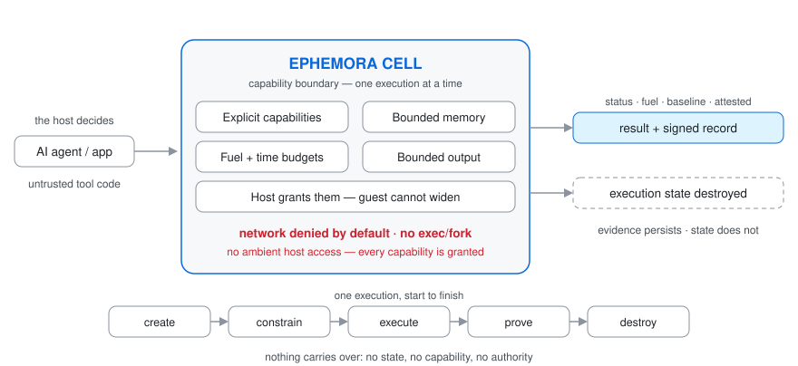
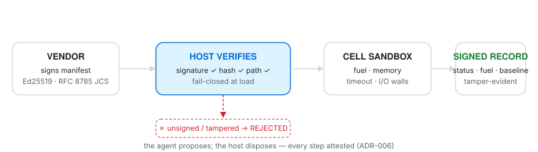

# Ephemora-cell

**Ephemora-cell is an ephemeral, stateless, capability-bound execution boundary for untrusted AI and agent-generated code.**

```text
create → constrain → execute → prove → destroy
```

Every execution starts from a clean state, runs under limits the host granted — fuel,
memory, time, I/O, output size, filesystem and network capability — can produce signed
evidence of what happened, and ends without carrying execution state into the next run.

> **The evidence persists. The execution state does not.**

**Ephemeral. Stateless. Capability-bound. Verifiable.**

No execution state or authority is inherited implicitly. Explicit, bounded, host-managed
named state is a separate capability the host configures on purpose — a per-session
convenience with its own entry and byte caps, not execution persistence and not storage.

Built for **AI agents, MCP tools, plugins, code interpreters, and other untrusted workloads** — the integration path is `AI Agent / Application → Tool / Plugin / MCP → Ephemora-cell → WASM module`. The picture below draws one execution of it: what the boundary grants, what it denies by default, and what survives.

<p align="center">
  <a href="https://pypi.org/project/ephemora-cell/"></a>
  <a href="https://www.python.org/downloads/"></a>
  <a href="LICENSE"></a>
  <a href="https://github.com/MichaelS1011/ephemora-cell"></a>
  <a href="https://github.com/MichaelS1011/ephemora-cell/stargazers"></a>
</p>

<p align="center">
  <a href="https://github.com/MichaelS1011/ephemora-cell/actions/workflows/ci.yml"></a>
  <a href="https://github.com/MichaelS1011/ephemora-cell/actions/workflows/ci.yml"></a>
  <a href="https://github.com/MichaelS1011/ephemora-cell/actions/workflows/ci.yml"></a>
  <a href="https://github.com/MichaelS1011/ephemora-cell/actions/workflows/ci.yml"></a>
  <a href="https://github.com/MichaelS1011/ephemora-cell/actions/workflows/ci.yml"></a>
  <a href="https://github.com/MichaelS1011/ephemora-cell/security/code-scanning"></a>
  <a href="https://github.com/MichaelS1011/ephemora-cell/actions/workflows/wasi-conformance.yml"></a>
</p>

<p align="center">
  <a href="https://registry.modelcontextprotocol.io/v0/servers?search=ephemora-cell-mcp"></a>
  <a href="https://glama.ai/mcp/servers/MichaelS1011/ephemora-cell"></a>
</p>

<p align="center">
  <a href="#quick-start">Quick Start</a> ·
  <a href="#security">Security</a> ·
  <a href="#mcp-integration">MCP</a> ·
  <a href="#ai-agent-integration">GitHub Action</a> ·
  <a href="#performance">Benchmarks</a> ·
  <a href="#documentation">Docs</a>
</p>

**Latest release: [v1.1.0](https://github.com/MichaelS1011/ephemora-cell/releases/tag/v1.1.0) · [PyPI](https://pypi.org/project/ephemora-cell/) · [signed GitHub release](https://github.com/MichaelS1011/ephemora-cell/releases) · BUSL-1.1.** Release notes: [CHANGELOG.md](CHANGELOG.md) · supported versions and the 2026-09-24 wasmtime advisory wave, triaged with measured evidence: [SECURITY.md](SECURITY.md) · latest reproducible measurement: 2026-10-02 interpreter-guest run, [`benchmarks/results/`](benchmarks/results/) · measured counts per installation state: [docs/release_assurance.md](docs/release_assurance.md).

<p align="center">
  <picture>
    <source media="(prefers-color-scheme: dark)" srcset="assets/hero-dark.svg">
    
  </picture>
</p>

## What is Ephemora-cell?

Ephemora-cell is an embeddable **execution boundary** for running untrusted, often AI-generated code: WASM/WASI isolation, explicit capability control, enforced CPU/fuel, memory, I/O and time limits, bounded output, and structured — optionally signed — execution records. Runtime + security boundary + accounting in one `pip install`. It uses Wasmtime to implement that boundary — WASM is the mechanism, the **controlled execution of untrusted code** is the product.

What the boundary enforces today, each of it behind a named test — the detail is in the
sections below, and claims with their limits in [SECURITY.md](SECURITY.md):

* **Capability, not convention.** A run sees only what it was granted: preopens are revalidated
  at grant time, no guest network connection succeeds by default (Preview1 exposes no socket API;
  on the WASI 0.2 path `connect` is denied at call time), and the host does not follow
  guest-writable names — host-side artifact reads use `O_NOFOLLOW` plus descriptor-level
  regular-file validation, and shared-path publication is atomic.
* **Authenticated grants with real limits.** Egress is host-mediated after the run, each grant a
  DSSE envelope signed against an operator trust root kept outside the grants directory, with
  window, cap and revocation enforced per request **and per redirect hop** — the tighter resource
  cap wins ([Execution records](#execution-records), [ADR-013](docs/decisions/ADR-013-egress-host-mediation-and-grant-form.md)).
* **Resolved addresses pinned.** A name answering with loopback, RFC1918, CGNAT, link-local or
  metadata space is refused at resolve time, and the vetted address is the one connected to —
  classified by Cell's own address registry, not by `ipaddress.is_private`.
* **Signed, one-of-one evidence.** Receipts sign the exact canonical bytes shown to the caller and
  carry a fresh `report_id` plus issue time; the verifier, outside Cell, decides whether it has
  been seen before.
* **Fail-closed as a default posture.** A broken grant set, an unreadable ledger, an empty
  authority directory or a malformed request produces an audited refusal, not a silent pass — and
  refuses at startup where startup is the safe moment.
* **Nothing carried between runs.** No sandbox directory, no engine reuse of a previous run's
  state, no inherited authority — measured, with the numbers and the gate per word in
  [MCP Integration](#mcp-integration).

## Why Ephemora-cell?

Wasmtime gives you a WASM runtime. Ephemora-cell builds an application-level execution
boundary around it:

```text
Wasmtime:            Ephemora-cell:
    Execute WASM         Execute WASM
                         + define capabilities
                         + enforce budgets (fuel, memory, time, I/O)
                         + bound output
                         + collect execution metadata
                         + produce execution records (sign-ready)
                         + integrate with agents and MCP
```

Ephemora-cell is not trying to replace general-purpose containers or full development VMs.
It targets a narrower execution path: high-frequency, untrusted agent and MCP workloads
that benefit from a small capability surface and explicit resource accounting. For agent
infrastructure that means Cell can act as a lightweight execution backend beneath an
existing harness rather than requiring a new agent framework. The trade-off is explicit:
less generality than a full Linux sandbox, in exchange for a smaller execution surface,
tighter capability control, and lower per-call overhead — the measured cost of each path
is in [Performance](#performance).

**The problem this answers:** AI agents increasingly need to write and execute code, call
tools, and run plugins. The question that decides whether that is safe: *how do you let an
agent execute untrusted code without giving that code ambient access by default to your
host, your credentials, your network or unlimited compute?* Raw runtimes leave that
boundary to you. Cell **is** that boundary — an operator can still grant a capability
explicitly, and every grant shows up in the run's own record.

Agent-generated code is different from application code: it can be buggy, computationally
unbounded, unexpectedly expensive — or hostile. The runtime must **enforce** boundaries,
not document them — enforced budgets and deterministic loop-stop are specified in the
[Security model](#security-model) and measured in [Security](#security). And a Cell result is
not just a return value: every execution answers three questions at once, attached to it as
`_meta.execution`, canonicalized (RFC 8785 JCS) and signable:

| | Answer | Example fields |
|---|---|---|
| **RESULT** | what came back | `status`, `stdout`, `exit_code` |
| **COST** | what it cost | `fuel_consumed`, `elapsed_ms` |
| **POLICY** | under which rules it ran | memory limit, preopens, network policy, `wasmtime_version` |

"Verifying. Not claimed." is data, not a slogan: any record can be re-checked — rewrite one field and `verify()` fails. Runnable demo: `python examples/signed_record_demo.py`.

## Quick Start

Three commands: install Cell, run something untrusted, read its audited receipt.

**1 — Install** (use a virtualenv; on Ubuntu ≥ 23.04 / Fedora a bare `pip install`
is refused by PEP 668. Windows: use Git Bash or WSL, and `python` instead of `python3`):

```bash
python3 -m venv .venv && source .venv/bin/activate
python -m pip install ephemora-cell
```

**2 — Run something untrusted** (the repo ships examples, or bring any `.wasm`):

```bash
git clone https://github.com/MichaelS1011/ephemora-cell.git && cd ephemora-cell
ephemora-cell run examples/hello.wasm --isolated
```

*(adds OS-level process isolation around the run — recommended for code you didn't build;
the cost of each path is measured in [Performance](#performance))*

```text
Hello from Ephemora Cell!
```

**3 — Read the audited receipt** — same run, machine-readable. Here a hostile module
(`examples/fuel_bomb.wasm`) is given a 100-unit fuel budget and stopped, exactly as
budgeted:

```bash
ephemora-cell run examples/fuel_bomb.wasm --fuel 100 --isolated --json
```

```json
{
  "status": "fuel_exhausted",
  "exit_code": 0,
  "fuel_consumed": 100,
  "fuel_budget": 100,
  "stdout_bytes": 0
}
```

Same from Python — every result carries status, cost and captured output (see [API & CLI](#api--cli)):

```python
from ephemora_cell import run_wasm

result = run_wasm("examples/fuel_bomb.wasm", max_fuel=100)
result.status           # <ExecutionStatus.FUEL_EXHAUSTED: 'fuel_exhausted'>
result.fuel_consumed    # 100 — the budget, not an estimate
result.stdout           # '' — captured output, capped at 10 KB
```

**Where to next:** agent/tool isolation → [MCP Integration](#mcp-integration) (3-line setup) · CI gating for untrusted PRs → [AI Agent Integration](#ai-agent-integration) · CLI reference and usage recipes → [docs/recipes.md](docs/recipes.md). Something failed? The usual suspects are venv not activated, `python3` vs `python` on Windows, or a wrong `.wasm` path — [docs/recipes.md](docs/recipes.md) covers them.


*Real CLI session — every line is verbatim output of the command printed above it. Install is the 1.1.0 wheel from PyPI; the `examples/` and `benchmarks/` paths are a clone of the repo, and the last scene needs the optional `tools-signing` extra installed just before it. The arc is what one execution is today: fresh run → the boundary it got (fuel, memory limit, preopens, `allow_fsync: false`) → a runaway module stopped at exactly 100 of 100 units → capability and access denials measured against the live runtime, positive controls included → signed evidence that detects a single rewritten field. Wall-clock and throughput are deliberately not in the frames: they are platform-dependent, and a demo that shows them ages into a false claim.*

### The devtools loop for agent tools

The same commands are a development loop — edit, run, read the receipt — with no Dockerfile, no image build:

| Command | What it does in the loop |
|---|---|
| `ephemora-cell build tool.rs` | Compile Rust, Go, C, AssemblyScript or Zig source straight to WASM |
| `ephemora-cell run tool.wasm --json` | Verdict immediately: status, exit code, `fuel_consumed`, `elapsed_ms` |
| `ephemora-cell inspect tool.wasm` | Imports, exports, memory — what a module wants, before you run it |
| `ephemora-cell benchmark tool.wasm` | Cold/warm latency and fuel spread while you iterate |

Failures come back **graded, not crashing**: an infinite loop returns `status: "fuel_exhausted"` with its receipt, a memory hog `memory_exceeded`, a crash a non-zero exit code — the same statuses the [auto-grader](examples/auto_grader.py) and the CI test-bench job consume. For untrusted guests, use the isolated path: execution failures stay contained to a disposable worker with OS-level limits and a hard termination.

## Security model

Cell assumes that **guest code is untrusted**. The host explicitly decides what the guest can access — and the runtime enforces that decision per execution.

```text
HOST
────────────────────────────
       Cell Boundary
────────────────────────────
GUEST / UNTRUSTED CODE
```

By default the guest gets **no ambient access**: no network, no arbitrary filesystem, no
process spawning, no unrestricted environment — and **bounded CPU/fuel, memory, execution
time and output**. Granting any of those is an explicit, recorded host decision.

**Security is never opt-in.** Every execution — in-process or isolated — runs under
enforced limits (fuel, memory, wall-clock, output caps: always on; the guest cannot reach
them off and the caller sets their size, not their existence). Two deliberate exceptions
exist and are named wherever they matter: `max_wasm_bytes` (how big a module a run may load
— 32 MiB everywhere except the `interpreter` profile, which raises it to 512 MiB for
bring-your-own guests) and `allow_fsync` (whether WASI sync calls are permitted — no shipped
profile turns it on; only an explicit `--allow-fsync` does). Both are attested in the signed
baseline, so a widened run never reads like a default one. The one thing you choose is the
process boundary: add `--isolated` (or call `run_isolated()`) when the module comes from
outside your own build — agent output, third-party plugins, PR-contributed code. The enforced
defaults:

| Resource | Default |
|---|---|
| WASM memory | 128 MB (`Store.set_limits`) |
| Fuel / CPU budget | 1,000,000 (~13 fuel/iteration, R² = 1.000 up to 1M iterations; re-measured 2026-09-14, `benchmarks/results/2026-09-14/fuel_boundary.json` — fuel is per-platform, see [docs/performance.md](docs/performance.md)). A module that loops forever is stopped at exactly the budget it was given: a run cannot overshoot its fuel, and the epoch wall-clock timeout is the net under everything fuel does not count |
| Wall-clock timeout | 30 s (epoch interruption) |
| Captured stdout/stderr | 10 KB |
| Network | disabled by default — Preview1: no socket APIs; WASI 0.2: linked, denied at call time (measured) |
| Host filesystem | denied by default; 14 dangerous dirs blocked (`/dev`, `/proc`, `/sys`, …) |
| Process exec / fork | unavailable in WASI |
| Threading | disabled (`wasm_threads=False`) |

The same rule governs **language features**: every WebAssembly proposal Cell's shipped WASI surface
does not need is **enforced off in the engine config** (threads, function-references, exceptions,
GC, tail-calls, stack-switching — attested in every `security_baseline`, compile-probe-tested per
release). That is structural, not caution for its own sake: the 2025/26 advisory record — fuel
accounting dropped across `call_ref`/`try_table`
([GHSA-m63x-6p34-q65x](https://github.com/bytecodealliance/wasmtime/security/advisories/GHSA-m63x-6p34-q65x)),
a Cranelift aarch64 heap escape (CVE-2026-34971), the vm2 escape riding `try_table` exception
handling (CVE-2026-26956, secondary sources) — repeats one pattern: sandboxes diverge where a
proposal quietly flipped to default-on. Cell keeps that surface at zero and pays in what guests
*can't* run, not in what the host can't guarantee. Full proposal table and per-advisory triage:
[SECURITY.md](SECURITY.md#proposal-policy--set-not-inherited-2026-09-25).

Additional controls — I/O budgets (`io_cpu_seconds` / `io_budget_bytes`: walls for host work, not
just guest compute), dual-ABI (Preview1 + WASI 0.2 components, opt-in), memory64 opt-in, GC-heap
declared cap, bounded named state (a host-supplied `StateStore`: 64 entries · 256 KiB per value ·
1 MiB total, [ADR-004](docs/decisions/ADR-004-named-state.md)) and host-mediated egress — are
documented per control in [SECURITY.md](SECURITY.md) and
[docs/egress_patterns.md](docs/egress_patterns.md).

## Execution records

Around the sandbox sits a verifiable trust chain for third-party tools:

<picture>
  <source media="(prefers-color-scheme: dark)" srcset="assets/trust-chain-dark.svg">
  
</picture>

Anything failing verification is rejected before a single instruction executes — execution never depends on a happy path.

- **Signed tool manifests, governed loading.** Third-party tools ship an Ed25519-signed manifest
  (RFC 8785 JCS); the server verifies signature **and module hash** before registering, and a bare
  `.wasm` without a valid manifest never loads in signed-tools mode
  (`--require-signed-tools pub.pem`). An agent can only *propose* a tool — a `tool.request.json` in
  an operator-allowlisted directory, verified before it installs and announces it. The agent
  proposes; the host disposes ([ADR-006](docs/decisions/ADR-006-governed-tool-loading.md)).
- **Signed execution records.** Any run folds into a tamper-evident record covering status, fuel,
  timing and the attested security baseline — rewrite one field and verification fails
  (`python examples/signed_record_demo.py`). What is signed is exactly `canonical_bytes(record)`
  inside a DSSE v1 PAE, so a signer cannot sign one object and present another; signers are always
  operator-anchored, and a valid signature proves that a trusted signer attests **these exact
  bytes** — not that the execution was safe, and not authority unless the audience matches: a
  receipt is not a grant and a grant is not a receipt. Pre-exec/receipt split, `back_link`,
  DSSE/JWS: [ADR-008](docs/decisions/ADR-008-record-split-and-standard-envelopes.md).
- **Host-mediated egress, authenticated before enforced.** Default: no socket surface, nothing to
  mediate. `--egress-allow URL` lets the engine act as the real caller for a guest's request
  artifact and report the decision under `_meta.egress`; `--egress-grants-dir` +
  `--grant-ledger` enforce a per-tool grant's window, cap and revocation, and `--egress-trust`
  refuses startup unless that grant is a DSSE envelope signed by a key in a root kept **outside**
  the grants directory — a key delivered with the artefact proves nothing about it. A grant
  **narrows** the operator allowlist rather than replacing it, per URL, per redirect hop and per
  resource cap; `--egress-grants-required` removes the fallback. Flags and file names:
  [`grant_ledger.py`](ephemora_cell/grant_ledger.py),
  [`grant_trust.py`](ephemora_cell/grant_trust.py); runbook:
  [docs/egress_patterns.md](docs/egress_patterns.md);
  semantics: [ADR-013](docs/decisions/ADR-013-egress-host-mediation-and-grant-form.md).
- **Evidence that survives the run.** Each run's pre-exec record and receipt can be sealed into a
  signed `LedgerEntry` JSONL chain (`sequence` + `prev_hash`) — continuous and ordered, verifiable
  without a key, authorship only with one, and blind to a chain truncated at its end, which is
  stated and tested ([ADR-011](docs/decisions/ADR-011-execution-ledger-chain.md);
  `ephemora-cell ledger <path>`). Cumulative tenant budgets (`--tenant`, `--tenant-book`,
  `--tenant-max-runs`) reserve a ceiling before the run, settle what it consumed and refuse the
  next one over cap with a receipt naming the account — a billing identity, not an isolation
  boundary, and with no mid-run kill
  ([ADR-012](docs/decisions/ADR-012-tenant-attribution-and-cumulative-budgets.md)).

The two execution paths differ materially. `run_wasm()` runs the guest inside your process; `run_isolated()` adds OS-level walls around a disposable worker (and returns the report fields as a dict). For guests from outside your own build — agent output, third-party plugins, PR-contributed code — use the isolated path:

| Control | `run_wasm()` (in-process) | `run_isolated()` (subprocess) |
|---|---|---|
| Fuel metering (guest CPU) | ✅ | ✅ |
| Memory cap (`Store.set_limits`) | ✅ | ✅ |
| Wall-clock timeout (epoch) | ✅ | ✅ + hard process kill |
| 10 KB output cap | ✅ | ✅ |
| I/O byte wall (`io_budget_bytes`) | ✅ watcher + epoch interrupt | ✅ |
| I/O CPU wall (`io_cpu_seconds`) | ❌ documented-trusted | ✅ worker rusage watchdog |
| Disk quota (`disk_quota_bytes`) | ❌ trusted capability | ✅ RLIMIT_FSIZE (per file) |
| RLIMIT_NOFILE/AS/RSS, 32 MB module cap | ❌ | ✅ |
| Preopen deny + grant-time TOCTOU revalidation | ✅ | ✅ |

Rows marked ❌ in-process are *documented-trusted*: the knob is honored as a declared capability, not an enforced wall — a kernel-level cap there would limit your own process. Full matrix and rationale: [SECURITY.md](SECURITY.md).

## MCP Integration

Listed in the official MCP Registry as `io.github.MichaelS1011/ephemora-cell-mcp` (stdio via PyPI). The registry's newest published entry is **1.0.4.3**: the 1.1.0 metadata is prepared in [`server.json`](server.json) and validated, and publishing it still waits on publisher authorization (the registry login is an interactive device flow). Glama indexes the same server — its grade is a live classification, so read it from the badge above rather than from a sentence here. The call flow is the hero diagram above: the agent's tool call enters the stdio server, the tool runs inside the Cell, and the result comes back with its execution record.

```bash
pip install ephemora-cell
ephemora-cell-mcp          # bundled tools: clock + echo; --tools-dir ./tools replaces the bundled set with your own

# One-line setup for GitHub Copilot in VS Code:
code --add-mcp '{"name":"Ephemora Cell","command":"ephemora-cell-mcp"}'
```

Ask your agent for the current time: the answer comes from the bundled `clock` tool — a WASM module reading only the WASI real-time clock — and the call report shows exactly what that answer cost.

**Runs entirely on your machine — with any MCP client and any model, including local ones.** The MCP server is a plain stdio process installed from PyPI: Ephemora-cell itself requires no API key and no cloud account, and tools execute offline inside the WASM sandbox (no network unless you explicitly allow it host-side). Requirements of the selected MCP client or model provider are independent of Cell. Point Claude Desktop, VS Code/Copilot, Codex, LM Studio or your local-model stack of choice at it — the sandbox side never leaves your hardware. How much the agent gets out of the tools then depends on your client and model's tool-calling ability; the sandbox itself adds no requirements beyond a local machine.

**What you get:**

- **Untrusted tools, locally.** Every tool is a WASM module inside a Cell sandbox — no ambient
  network, fuel- and memory-bounded, output-capped. A tool that misbehaves hits the sandbox wall,
  not your host.
- **Every call verifiable, not just the install.** Each result carries its execution record
  (`_meta.execution`); the native `get-policy` tool reports the exact per-tool policy computed
  from the same code path that enforces it, so report and enforcement cannot drift. The protocol
  does not verify `_meta`, so `--receipt-signing-key` adds a DSSE signature (`_meta.attestation`)
  over the same bytes, verifiable out-of-band with the operator's public key, and
  `max_age_seconds` lets a caller refuse a stale receipt. Policy reads are tools, policy writes
  are host decisions ([ADR-006](docs/decisions/ADR-006-governed-tool-loading.md)): an agent
  cannot grant itself network or filesystem access.
- **Stateless by design (`2026-07-28` revision), as a deployment shape.** Current-revision
  clients skip the `initialize` handshake; handshake-era clients (Claude Desktop, VS Code, Codex,
  …) keep working unchanged, both eras served from one process and tested against the official SDK
  in CI — including the ordering rule that legacy traffic arriving before `initialize` is refused
  with `-32600` before any WASM runs. The point of the split: **an MCP server may be long-lived
  while every execution inside it is fresh** — each `tools/call` starts a new sandbox and inherits
  nothing. Revision handling, `ttlMs`/`cacheScope` and the exemption rule:
  [docs/mcp.md](docs/mcp.md).
- **The promise is four words, and each is a named gate.** *Ephemeral, stateless,
  capability-bound, verifiable* — one test per word in
  [`tests/test_execution_invariants.py`](tests/test_execution_invariants.py): nothing left to
  reuse after a run (`cleanup()` returns the residue, so a surviving directory is a failed
  assertion); run B reads nothing run A left; no operation carries ungranted authority, and the
  run attests exactly which preopens it got; the receipt verifies over the exact bytes shown to
  the caller, with a foreign key and an edited field both refused. The claim to test us on:
  **no execution state survives into the next execution** — 1 000 / 300 / 40 consecutive run-pairs
  on the engine-pool, per-run-engine and isolated-subprocess paths, 0 leaks on each, plus 40 audits
  whose writer was SIGKILLed mid-append ([`benchmarks/statelessness_probe.py`](benchmarks/statelessness_probe.py),
  result in [`benchmarks/results/2026-10-05/`](benchmarks/results/2026-10-05/statelessness_invariants.json)).
  The default I/O budget forces a per-run engine, so the probe lifts it and tests the pooled path
  too — a statelessness test that never did would be testing the wrong path.

Per-call cost of each MCP path: [Performance](#performance). **vs Microsoft Wassette:** Wassette is
Microsoft's capability-based runtime for MCP tools on the same Wasmtime family — its OCI pull model
moves the trust decision to install time; Cell adds what a caller can *verify per call*
([docs/comparison-mcp-servers.md](docs/comparison-mcp-servers.md), re-verified 2026-09-18).

This is an execution boundary, not a claim that guest software is trustworthy. Cell does not evaluate whether a module is malicious or correct — a guest can still misbehave *within* the budgets it was given.

## AI Agent Integration

**Untrusted PR code in GitHub Actions.** This repository ships a composite action: run a WASM module in the Cell sandbox inside your own workflow — with fuel metering, memory cap, epoch timeout and (default) the `--isolated` subprocess path (OS-level rlimits, hard kill):

```yaml
- id: run-tool
  uses: MichaelS1011/ephemora-cell/action@main
  with:
    module: path/to/module.wasm   # e.g. built from a PR-provided recipe
    profile: llm
    # fuel: 500_000
- run: echo "status=${{ steps.run-tool.outputs.status }} fuel=${{ steps.run-tool.outputs.fuel_consumed }}"
```

Non-success statuses fail the step (`fail-on: non-success`, default) — a module that burns its budget or trips the memory cap cannot take your workflow with it. This repo dogfoods the action on every push: [`.github/workflows/action-demo.yml`](.github/workflows/action-demo.yml) runs a benign module and feeds the same module a 100-unit fuel budget, asserting live that the sandbox stops it and accounts every unit.

CI runs two framework-adjacent integration suites against real SDKs — `integration/test_hermes_subagent.py` and `integration/test_nemoclaw_isolation.py`. The other scripts in [`integration/`](integration/) (LangGraph, CrewAI, AutoGen, OpenAI Agents SDK, Semantic Kernel) are examples that need their own SDK install and are not CI-gated; nothing in this README claims otherwise.

## Use Cases

What you can build with Cell — all of it the same `run_wasm` / `run_isolated` / MCP surface:

- **AI Code Execution** — run LLM-generated code under explicit limits:
  `run_wasm("llm_generated.wasm", max_fuel=200_000, timeout_seconds=5, allow_dirs=("/input", "/output"))`
- **MCP Tool Sandbox** — run MCP tools inside a bounded execution environment ([MCP Integration](#mcp-integration)).
- **Plugin Runtime** — accept user-uploaded plugins without host-level access: `WASIConfig(allow_dirs=("/data",), max_fuel=500_000)`.
- **Agent Tool Runtime** — give autonomous agents controlled access to computational tools.
- **Verifiable Execution** — structured, optionally signed records of an execution ([Execution Records](#execution-records)).

Also documented: serverless/edge workloads, air-gapped validation, WASI 0.2 components, FastAPI integration — [docs/recipes.md](docs/recipes.md).

## Architecture

Cell executes the `.wasm` — it does not know the source language. The enforcement stack — module → engine → capability surface → budgets → record — is diagrammed in [docs/security_posture.md](docs/security_posture.md#the-wasi-sandbox-surface-visually). The primary API is deliberately simple — `run_wasm(wasm) → result`, with `status`, `exit_code`, `stdout`, `stderr`, `elapsed_ms` and `fuel_consumed` on every result (full surface in [API & CLI](#api--cli)). That makes execution suitable for auditing, policy enforcement, and resource accounting — not just running code.

### Any language that compiles to WASM

One-command build with actionable error hints:

```bash
ephemora-cell build src/main.rs # inside a cargo project → tool.wasm → run it
```

| Language | Compiler | Verified |
|----------|----------|----------|
| Rust | `cargo build --target wasm32-wasip1` | ✅ Compiled + executed (CI) |
| Go | `GOOS=wasip1 GOARCH=wasm go build` | ✅ Compiled + executed (CI) |
| C | wasi-sdk `clang --target=wasm32-wasip1` | ✅ Compiled + executed (CI) |
| AssemblyScript | `asc --runtime stub` | ✅ Compiled + executed (CI) |
| Zig | `zig build-exe -target wasm32-wasi` | ✅ Compiled + executed (CI) |
| Python | no AOT-to-WASM compiler exists | Guidance for the compile step. Running Python is measured as a bring-your-own guest: pinned `wasi-python 3.10` (`8e40bfb5…`, 22 363 477 B) under `--profile interpreter`, 25 in-process and 15 isolated boots plus print/stdlib/compute sweeps, every run `success`. Not a CI gate — the guest binary is not committed (ADR-009 D2) |

**What does *not* run:** native Python, Node.js/npm packages, or Linux/ELF binaries — Cell executes WASM modules and WASI 0.2 components, nothing else. Scripting languages run only as interpreter binaries *you* compile to WASM (or componentize, e.g. `componentize-py`, jco/StarlingMonkey) and bring yourself — Cell ships no interpreters, and GC/threads-based ports (Kotlin, Dart, …) stay locked until the GC-heap gate in [SECURITY.md](SECURITY.md) opens. Support matrix and recipes: [docs/languages.md](docs/languages.md), [docs/recipes.md](docs/recipes.md).

All five compiled-language gates verify on every push ([`.github/workflows/ci.yml`](.github/workflows/ci.yml)). **Platforms:** macOS (Apple M5) ✅ · Ubuntu 24.04 ✅ · DGX Spark GB10 ✅

Profiles (`plugin`, `llm`, `edge`, `default`, `analytical`, `interpreter`) are budget presets. `interpreter` is the preset for running a bring-your-own interpreter *as the guest* (CPython-WASI and friends): a larger module cap, more memory, more fuel, a longer clock, and the host-CPU wall an isolated worker needs to compile a 22 MB guest first. It ships no interpreter, opens no sync exception and grants no filesystem or environment access — the language posture stays [ADR-009](docs/decisions/ADR-009-language-support.md), and [docs/languages.md](docs/languages.md) carries the measured numbers.

## Security

**Evidence ladder** — strongest first, every row measured, raw evidence committed, each run
reproducible: **MCP CVE replays** (real exploit paths of two patched CVEs denied at the engine
level, governed loading failing closed on a tampered payload, plus a measured call-time socket
denial on WASI 0.2 components) · **SandboxEscapeBench-18 mapping** (18 container/K8s scenarios
mapped to WASM: 8 execution-tested and denied, 10 not expressible on the surface) · **8 attack
intents × 3 boundaries** (stock Docker 0/8, hardened Docker 2/8, Cell 8/8 — matrix below) ·
**official WASI conformance** (72 pass / 1 documented xfail / 0 fail, re-run weekly in CI) ·
**2026 probe classes** (CVE-2026-47261 companion FS vectors, persistence-worm and control-plane
probes, all denied with granted positive controls) · **cross-architecture determinism** (fuel
spread 0 per platform, platform-bound). The table with reproduce commands, the probe-equivalence
methodology, the CVE replay detail and the SandboxEscapeBench provenance note:
[docs/security_posture.md](docs/security_posture.md#evidence-ladder-moved-out-of-the-readme-on-2026-10-05).

**What we do not compare — and why.** Prompt-injection suites (garak, InjecAgent) test the model and agent layer, not the execution boundary — out of scope for an execution sandbox. Cloud sandbox providers are cited from third-party sources with their source status; third-party numbers never appear in the same table as our measured cells. Startup and throughput benchmarks live in [docs/performance.md](docs/performance.md) with their scope caveats.

The guest receives only the capabilities explicitly made available to it. Live verification of eight attack classes ([`benchmarks/verify_8_vectors.py`](benchmarks/verify_8_vectors.py)) — measured against three boundaries, same intents, same measurement rule (exit code decides, nothing hardcoded). **What `ALLOWED` means here:** the tested guest primitive remains available *inside* that sandbox — it does not mean host escape, and it is not a ranking of the boundaries.

| Attack class | Docker | Docker (hardened¹) | Ephemora-cell | Layer |
|---|---|---|---|---|
| Shell (`os.system`) / fork | ALLOWED | ALLOWED | **BLOCKED** — APIs don't exist in WASI | 1 |
| Network sockets | ALLOWED | ALLOWED — creation needs no capability | **BLOCKED** — APIs don't exist in WASI | 1 |
| fsync (`os.fsync`) | ALLOWED | **BLOCKED** — EROFS via `--read-only` | **BLOCKED** — `fd_sync`/`fd_datasync`/`fd_psync` refused at the call (`allow_fsync` opts out) | 2 |
| Host filesystem (`/etc/passwd`) | ALLOWED | ALLOWED — the container's own file | **BLOCKED** — preopen default-deny | 2 |
| Symlink escape | ALLOWED | **BLOCKED** — EROFS via `--read-only` | **BLOCKED** — dangerous directory filter | 2 |
| Multi-threading | ALLOWED | ALLOWED | **BLOCKED** — `wasm_threads=False` | 2 |
| Environment access | ALLOWED | ALLOWED | **BLOCKED** — controlled via `allow_env` | 2 |

The table measures three separate layers: the **WASI surface** (no shell/fork/socket entry points to call), **sandbox policy that is always on** (preopen default-deny, dangerous-directory filter, sync-call traps, `wasm_threads=False`, `allow_env` — with `max_wasm_bytes` and `allow_fsync` the two operator-widenable values, both attested so an opened run never reads like a closed one), and the **OS process wall** of `--isolated` (rlimits + hard kill, the mitigation layer for engine 0-days). Layer definitions: [docs/security_posture.md](docs/security_posture.md#hardened-container-baseline-2026-09-18); advisory history: [SECURITY.md](SECURITY.md).

**Result: 8/8 attack vectors blocked (live-verified, default configuration, WASI Preview1 path); both Docker baselines are measured live per run — never hardcoded.** The WASI 0.2 component path is a separate boundary and does not carry the sync blockade today — measured, not asserted: `python benchmarks/component_sync_probe.py` shows both `wasi:filesystem/types` sync calls completing into the host when a directory is granted, while the default component run gets no preopen, so the surface needs an operator grant first ([SECURITY.md](SECURITY.md)).

For context, the same eight intents were measured against **gVisor** (`runsc`, pinned release, executed in CI twice for determinism): 8/8 ALLOWED — in the sense defined above, *the guest primitive is still available to guest code*, not that anything reached the host. gVisor walls the host off from the container, but the guest keeps the Linux ABI, so the same primitives stay available inside it. Expectation matrix pre-declared in [`benchmarks/gvisor_docker_probe.py`](benchmarks/gvisor_docker_probe.py); raw evidence: `benchmarks/results/2026-09-19/08_gvisor_docker_attack_probe.json` (committed from the `gvisor-boundary` CI job).

¹ Hardened = exactly these flags — tell us which to add: `--network none --read-only --cap-drop=ALL --security-opt no-new-privileges --pids-limit 64 --user 65534:65534` (image pinned by digest; Docker's default seccomp profile is active in **both** columns). Both hardened blocks are `--read-only` file-system effects — the flags wall the container *off*, not the guest *in*: socket creation, the container's own `/etc/passwd`, fork, threading and environment stay available to the guest.

*Same eight attack intents, measured live: stock `python:3.12-slim` 0/8 blocked, hardened container 2/8 (both blocks are `--read-only` flag effects), Cell 8/8. Measured on two platforms with identical results — macOS arm64 (2026-09-18) and DGX Spark GB10 (2026-09-20, `benchmarks/results/2026-09-20/*-dgx-aarch64.json`). Reproduce:*

```bash
python assets/demo_attack_probe.py          # stock Docker    ->  0/8 blocked
python benchmarks/hardened_docker_probe.py  # hardened Docker ->  2/8 blocked
python benchmarks/verify_8_vectors.py       # Ephemora-cell   ->  8/8 blocked
```

**Conformance, against the official suites and not self-written tests.** The shipped CLI and the engine configuration Cell ships are run against the [WebAssembly/wasi-testsuite](https://github.com/WebAssembly/wasi-testsuite) preview-1 suite (through a runtime adapter) and the official [WebAssembly core spec suite](https://github.com/WebAssembly/testsuite): **72 pass / 1 documented by-design xfail / 0 fail** on pinned preview-1, and **31,931 pass with every deviation documented and none unexpected** on the core spec — the classification of every skipped, xfailed and failing assert is in [conformance/README.md](conformance/README.md) and the committed JSON. A weekly CI job re-runs the pinned suite and uploads the raw JSON, so drift surfaces within a week. Honest scope: this is standards conformance, not a security certification — no third party certifies Cell; the evidence is the pinned suite, the committed JSON and the CI history.

**Can you break Cell?** Found an execution path that violates the documented security boundary — an escape, a budget bypass, an attestation gap? That is exactly the report we want: [SECURITY.md](SECURITY.md#reporting-a-vulnerability) (private disclosure, responsible handling). The [threat model](docs/threat-model.md) and its documented residual risks tell you where to aim; the methodology boxes on this page tell you how we measure. Security research on Cell is welcome.

## Performance

**What does the security boundary cost? 0.376 ms** — the warm wall-clock overhead a sandboxed run adds over the same work run bare (measured, not estimated).

*Latest reproducible benchmark — 2026-09-14 · Mac M5 · wasmtime 47.0.1 · n=1000. Every number below regenerates from a fresh clone via the commands at the end.*

| Scenario (2026-09-14, n=1000, `hello.wasm`, Mac M5, wasmtime 47.0.1) | Wall median | Wall p95 | Guest median |
|------|--------|------|------|
| **Pooled engine** (`io_budget_bytes=None`, trusted runs) | **0.51 ms** | 0.89 ms | 0.17 ms |
| **Default path** (`io_budget_bytes=64 MiB`, per-run engine) | 0.94 ms | 1.15 ms | 0.61 ms |

Cold vs. warm (2026-09-14, n=300 each, fresh sandbox per run vs. cached engine, first run discarded): cold median **0.59 ms** guest / 0.99 ms wall, warm median **0.55 ms** guest / 0.93 ms wall — sandbox overhead (warm wall − guest) = **0.376 ms** (`overhead_warm_ms`, `benchmarks/results/2026-09-14/pov_benchmark.json`).

Live cold-start comparison (2026-09-14, same Mac, n=100 per image after warmup): `docker run` python:3.12-slim 185.9 ms vs Cell 0.49 ms = **383×** — this is a container-cold-start vs invoked-WASM comparison for this benchmark workload, not a general claim that WASM is always faster than Docker.

Latency by path, including the two MCP server modes and the isolated subprocess wall:

| Path | Per call | Why |
|---|---|---|
| Library, pooled engine (`io_budget_bytes=None`) | ~0.5 ms | cached engine, trusted workloads |
| Library, default per-run engine | ~0.9 ms | fresh engine per run so the I/O wall holds |
| Library, `run_isolated()` | ~10–100 ms | disposable worker process, OS rlimits, hard kill |
| MCP stdio server, default | ~12 ms | fresh sandbox per `tools/call` — the ADR-002 I/O wall enforced via a per-run engine, measured end-to-end |
| MCP stdio server, `--pooled` | ~0.5 ms | verified tools on the pooled engine; the relaxed I/O wall is attested in `get-policy` |

Throughput on this host: the one-liner path sustains **~3M executions/hour** per core (n=500, `hello.wasm`, Mac M5 — regenerate with the snippet in [docs/recipes.md](docs/recipes.md)); the pooled hot-loop path reaches **~5.5M/hour**.

**Sandbox tax on an industry-standard workload:** on EEMBC CoreMark 1.01 the Cell layer costs **8.6–10.0 %** over the bare wasmtime engine on the same machine, and instruction-level fuel metering a further 12.5–14.7 % — measured on macOS arm64 and DGX Spark GB10 against wasmer and wasm3 as external controls. Full matrix, per-run scores and reproduce command: [docs/performance.md](docs/performance.md#sandbox-tax-on-an-industry-standard-workload-eembc-coremark-101).

Reproduce: `python benchmarks/pool_vs_budget.py` · `python benchmarks/competitive_benchmark.py` · `python benchmarks/coremark_wasi.py --rounds 3` (raw results with `measured:true` committed under `benchmarks/results/`). Agentic workloads, cold/warm detail and the third-party positioning: [docs/performance.md](docs/performance.md).

Two caveats that survive every release: **fuel is per-platform** — deterministic per host (`fuel_spread: 0` on every machine measured) but never comparable across hosts (`python benchmarks/determinism_probe.py`, [docs/performance.md](docs/performance.md)). And **every number here is a Cranelift number** — the Python binding cannot select an interpreted backend (Pulley/Winch unreachable, asserted in `tests/test_surface_audit.py`), so no fallback can silently change the posture.

## API & CLI

**Python API** — the primary surface is deliberately simple:

```python
from ephemora_cell import run_wasm, run_isolated, WASIConfig, WASISandbox

result = run_wasm("tool.wasm", max_fuel=1_000_000, timeout_seconds=30)
result.status        # SUCCESS | ERROR | TIMEOUT | FUEL_EXHAUSTED | MEMORY_EXCEEDED
result.exit_code
result.stdout        # 10 KB cap
result.elapsed_ms
result.fuel_consumed

# OS-level process wall for untrusted guests:
result = run_isolated("tool.wasm", config=WASIConfig(max_fuel=500_000))
```

Disk quota (`disk_quota_bytes`) and the GC-heap cap (`max_gc_heap_mb`) are `WASIConfig` knobs;
named state is a host-supplied `StateStore` passed to the run, not a config flag; the component
path is selected per call via `run_wasm(..., abi="component")` — [docs/recipes.md](docs/recipes.md)
has the recipes (FastAPI, serverless, air-gapped, WASI 0.2).

**CLI** — five verbs cover the loop:

```text
ephemora-cell run       Execute a WASM module (--json, --isolated, --fuel, --stdin, --profile, --abi, --tenant)
ephemora-cell inspect   Imports, exports, memory — what a module wants, before you run it
ephemora-cell benchmark Cold/warm latency and fuel spread
ephemora-cell build     Compile Rust/Go/C/AssemblyScript/Zig straight to WASM
ephemora-cell ledger    Verify a run chain: linkage and order, and what it cannot prove
```

`ephemora-cell --help` and [docs/recipes.md](docs/recipes.md) for the full reference.

## Limitations

**Cell is:** the minimal execution boundary for untrusted code — a WASM/WASI sandbox with explicit capabilities and budgets, a resource-accounted runtime, an embeddable Python library, a CLI, an MCP execution layer.

**Cell is not:** a persistent workspace · a VM · a container orchestrator or a general container replacement · a malware detector · a multi-tenant cloud platform · an agent framework · an LLM · a code generator. It holds no state you are meant to come back to: named state is a bounded, host-supplied convenience (`StateStore(max_entries=64, max_value_bytes=256 KiB, max_total_bytes=1 MiB)`, [ADR-004](docs/decisions/ADR-004-named-state.md)), not storage, and authority never survives a run.

Use Cell when: code is untrusted or dynamically generated · tools come from third parties · an AI agent executes arbitrary programs · you need explicit resource budgets · you need structured execution metadata. Cell is optimized for bounded executions, not long-running service workloads — for full Linux service semantics, use an appropriate container or microVM boundary (see [docs/performance.md](docs/performance.md) for the measured third-party comparison).

What each enforced control does **not** claim — every row is an honest boundary, tested at the boundary:

| Enforced control | Does guarantee | Does **not** guarantee |
|---|---|---|
| Memory cap (128 MB) | guest cannot exceed the configured heap | correct guest behavior — a bug inside the budget is the guest's bug |
| Fuel budget | no unbounded CPU burn; execution stops at the limit | malware detection — code with hostile intent that stays within budget runs fine; nothing inspects what the module *means* |
| Wall-clock timeout | no runaway execution; epoch interruption fires | that the app logic is correct or fast |
| Network denial (no socket API by default) | no guest connection succeeds by default — Preview1 exposes no socket API, the WASI 0.2 path denies `connect` at call time | safe behavior *within* granted capabilities — exfiltration via allowed channels (e.g. writing secrets to a granted preopen) remains the integrator's concern ([SECURITY.md](SECURITY.md)) |
| Filesystem capability control (preopen only, default deny) | file access limited to explicitly mounted dirs | full VM semantics — mounted-path content is exactly what the integrator chose to expose |
| Output caps (10 KB) | captured output is bounded; unbounded prints cannot fill the host disk | that truncated output is complete — inspect `result.stdout` and the record |

> **The goal is narrow: make untrusted execution cheap enough and controlled enough that an application can safely do it by default.**

Full details: [SECURITY.md](SECURITY.md) (policy, known limitations) · [docs/threat-model.md](docs/threat-model.md) (adversary model, trust boundaries, resource-exhaustion matrix) · [docs/security_posture.md](docs/security_posture.md) (evidence ladder, attack-surface verification, related research).

## Roadmap

Stable themes, no dates promised; the gated detail lives in [SECURITY.md](SECURITY.md) and [docs/observations.md](docs/observations.md):

- **Engine qualification** — qualifying a newer Wasmtime line, including re-running the fuel-determinism and FS-escape gates against it.
- **WASI evolution** — the 0.2 component path is shipped and measured; 0.3 stays gated until its surface ships in the Python wheels and has its own budget qualification.
- **Threading** — shared-everything threads stay off by default; enabling them is a separately security-reviewed opt-in with thread-aware fuel and wall-clock accounting ([docs/threads_roadmap.md](docs/threads_roadmap.md)).
- **Fuzzing and property testing** — the parser/verifier surfaces and the invariants above are the targets; scheduled fuzz smokes run today, continuous fuzzing does not.

## Testing & Verification

**Release gate, measured on a fresh clone of the release commit** — not a per-host constant: 957 tests passing (4 skipped) · 89.98% statement coverage, shown as 90% (Cell + MCP, gate 80%) · 8/8 attack vectors blocked (default posture, WASI Preview1 path) · 72-pass official wasi-testsuite conformance (pinned, 0 fail) · CI-enforced on every push (tests, coverage, pip-audit, SBOM, bandit, official MCP SDK interop) — plus, on that same clone: a wheel-only smoke against the installed artifact (recorded in the v1.1.0 GitHub release) and an sdist clean-room container run.

**What "the suite" means here — one canonical number.** 957/4 (961 collected) is what `pytest` reports on the environment CI uses on both legs: `requirements.txt` (the pinned `wasmtime`), the test deps, and the optional `tools-signing` extra (`cryptography>=42`) that every Ed25519 path needs. The count is machine-checked against `pytest --collect-only` by `scripts/check_test_count.py`, so the release-count sentences cannot drift from the code.

The figures around it — the minimal-install count without `cryptography`, the sdist container range, the toolchain-skip asymmetry, and what host load does to the `io_cpu_seconds` watchdog — each describe a different installation state and are kept with their conditions in [docs/release_assurance.md](docs/release_assurance.md). They are re-measured by hand at each release, not by the guard.

## Documentation

**Security review 2026-10-05** · [docs/security_review_2026-10-05.md](docs/security_review_2026-10-05.md) — what the six red-team lanes found, what was closed with a biting test, the three posture decisions the operator made afterwards (grant scope, ungranted tools, handshake order), the second pass that audited that same day's code and the seven findings it closed, and the ten items left open with the reason

**Getting started** · [Quick Start](#quick-start) above · [docs/recipes.md](docs/recipes.md) — usage patterns (FastAPI, serverless, air-gapped, WASI 0.2) · [`integration/`](integration/) — agent-framework examples

**Security & evidence** · [SECURITY.md](SECURITY.md) — policy, execution-path matrix, vulnerability reporting · [docs/threat-model.md](docs/threat-model.md) — trust boundaries, adversary model, resource-exhaustion matrix · [docs/security_posture.md](docs/security_posture.md) — evidence ladder, attack-surface verification, CVE replay detail · [conformance/README.md](conformance/README.md) — official wasi-testsuite and core-spec results · [docs/release_assurance.md](docs/release_assurance.md) — measured counts per installation state

**Execution records & decisions** · [ADR-006](docs/decisions/ADR-006-governed-tool-loading.md) — who may change a running workload's security boundary · [ADR-001…013](docs/decisions/) — all decision records · `examples/signed_record_demo.py` — sign and tamper-check a run

**Performance** · [docs/performance.md](docs/performance.md) — benchmarks, CoreMark sandbox tax, per-path latency · [`benchmarks/results/`](benchmarks/results/) — raw `measured:true` JSON

**Integrations** · [docs/mcp.md](docs/mcp.md) — MCP server · [docs/comparison-mcp-servers.md](docs/comparison-mcp-servers.md) — CVE-to-probe mapping · [`action/`](action/) — composite GitHub Action

**Languages** · [docs/languages.md](docs/languages.md) — compile matrix · [docs/egress_patterns.md](docs/egress_patterns.md) — sanctioned API-call patterns · [docs/observations.md](docs/observations.md) — the two watch items we are deliberately not acting on, each with its exit condition

**Enterprise** · [docs/enterprise.md](docs/enterprise.md) — isolation vs. operation: when that conversation is worth having

**Changes** · [CHANGELOG.md](CHANGELOG.md)

## About Ephemora

Ephemora-cell is the source-available execution boundary for ephemeral, capability-bound execution of untrusted code (BUSL-1.1, standalone — no Ephemora dependency). The Ephemora enterprise edition builds on Cell's boundary for production and regulated deployments: Cell is complete for isolation, the enterprise edition is complete for operation — see [docs/enterprise.md](docs/enterprise.md) for when that conversation is worth having.

## License

Ephemora-cell is licensed under the [Business Source License 1.1](LICENSE) (BUSL-1.1) — source-available, not open source.

- **Free for non-production use** — evaluation, development, research, testing.
- **Business/production use requires a license from Ephemora** — see [docs/enterprise.md](docs/enterprise.md).
- **Automatic conversion:** each version converts to **Apache 2.0** four years after its first public release.
- **License history by version:** versions ≤ 1.0.4.3 are Apache-2.0. Versions 1.0.5 and later are BUSL-1.1 ([ADR-010](docs/decisions/ADR-010-relicensing-bsl11.md)).

---
mcp-name: io.github.MichaelS1011/ephemora-cell-mcp

---

*One agent action. One bounded execution. One controlled result.*

Created by [Michael Soppa](https://www.linkedin.com/in/michael-soppa).
