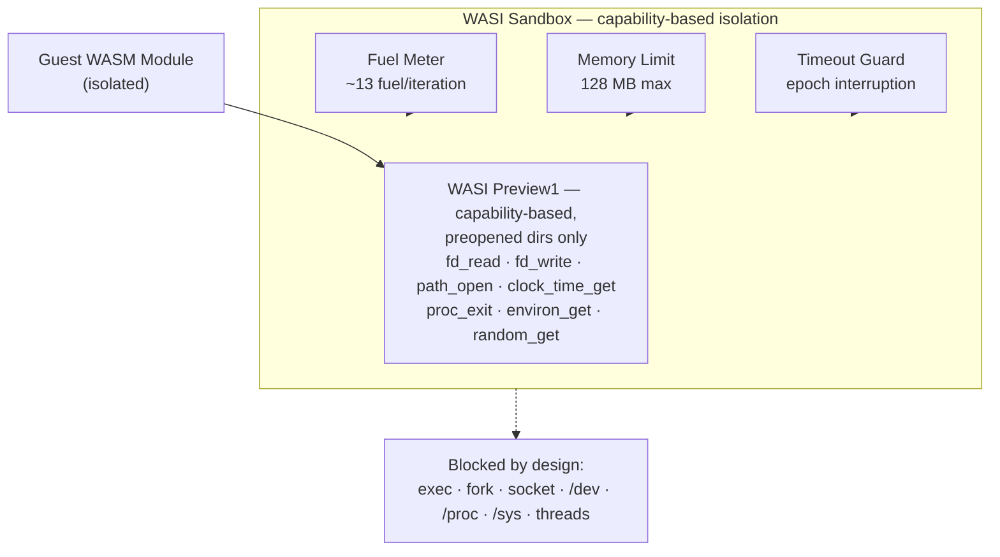

# Security Posture — Detail

Detail page for [README.md](../README.md#security). Policy and reporting: [SECURITY.md](SECURITY.md).

## Security Posture

| Risk | Status | Detail |
|------|--------|--------|
| CPU-DoS | ✅ | Fuel metering per execution (~13 fuel/iteration, **R² = 1.000**) |
| Memory-DoS | ✅ | `Store.set_limits` enforced (default 128MB; `Config.memory_max_bytes` is a no-op in wasmtime-py 47) |
| Preopen-DoS | ✅ | 14 dangerous dirs blocked (`/dev`, `/proc`, `/sys`, etc.) |
| Thread-DoS | ✅ | Single-thread only (`wasm_threads = False`) |
| fsync | ✅ | Blocked at WASI import layer — `fd_psync` → trap |
| I/O-DoS | ⚠️ Path-dependent | Host syscalls bypass fuel metering — guest output capped at 10 KB (ENOSPC); sandbox-dir writes walled by `io_budget_bytes` (both paths); the `io_cpu_seconds` CPU wall is enforced in the **subprocess path only** (default in-process is documented-trusted — see the execution-path matrix in [SECURITY.md](../SECURITY.md)) |
| Network | ✅ | No socket imports available (WASI Preview1, no network) |

## 8/8 attack vectors — verification method

5/8 vectors are executed live through the sandbox run path; 3/8 (exec, fork, socket) are verified by WASI import-surface scan — those APIs do not exist in WASI Preview1, so rejection happens at instantiate. Reproduce:

```bash
python benchmarks/verify_8_vectors.py       # 8/8 BLOCKED (live wasmtime)
python benchmarks/compile_workloads.py      # rebuild workloads/*.wasm from WAT (reproducible)
```

## Hardened-container baseline (2026-09-18)

The same eight intents, expressed as the identical `python3 -c` bodies, run against a
**hardened** `python:3.12-slim` container (`--network none --read-only --cap-drop=ALL
--security-opt no-new-privileges --pids-limit 64 --user 65534:65534`, default seccomp
profile, arm64 image pinned by digest, positive control): **6/8 still allowed** — the
two blocks (fsync, symlink creation) are `--read-only` EROFS effects on the container's
own filesystem, not a guest-facing boundary. Socket creation needs no capability and no
network under these flags; the container's own `/etc/passwd` stays world-readable to the
guest. The hardening flags wall the container *off* from the host; the guest primitives
live inside the container world and remain available. Evidence:
`benchmarks/results/2026-09-18/01_hardened_docker_attack_probe.json` (expectation matrix
with documented same-day correction, positive control, digest) — probe:
`benchmarks/hardened_docker_probe.py`. gVisor is not measurable on this host (Docker
Desktop provides no runsc runtime); it stays an open baseline rather than an estimated
number.

Layer model used in the README table: **Layer 1** = WASI surface (no exec/fork/socket
entry points in Preview 1), **Layer 2** = sandbox policy always on (preopen deny,
dangerous-dir filter, import traps, `wasm_threads=False`, `allow_env`), **Layer 3** =
OS process wall via `run_isolated()`/`--isolated` — the mitigation layer for engine
0-days (see [SECURITY.md](../SECURITY.md), engine advisories).

## arXiv 2509.11242 — Tested Attack Surface

We evaluated 11 exploitation strategies from [arXiv 2509.11242](https://arxiv.org/abs/2509.11242) against the Ephemora Cell sandbox:

| Technique | Result | Detail |
|-----------|--------|--------|
| CPU-DoS (infinite loop) | ⚠️ Within Budget | Fuel metering caps computation; set `max_fuel` conservatively |
| Disk-DoS (large writes) | ⚠️ Bounded | I/O costs minimal fuel (~1.18MB at default 1M fuel) — always capped by the 10 KB output budget (ENOSPC) |
| fsync / fdatasync | ✅ Blocked | Import-layer rejection at WASI layer |
| Inode exhaustion | ✅ Blocked | Preopen-deny + sandbox dir isolation |
| `/dev/random` read | ✅ Blocked | Preopen-deny blocks `/dev` |
| `/dev/ptmx` exhaustion | ✅ Blocked | Preopen-deny blocks `/dev` |
| High-frequency small I/O | ⚠️ Bounded | ~1.18MB theoretical before fuel exhaustion; 10 KB output budget caps capture |
| Network bandwidth | ✅ Blocked | No socket imports in WASI Preview1 |
| Small-packet flood | ✅ Blocked | No socket imports in WASI Preview1 |
| Multi-threading | ✅ Blocked | `wasm_threads = False` enforced |
| Memory exhaustion | ⚠️ Bounded | Linear memory byte-capped (`Store.set_limits`, 128MB default); the WasmGC heap is **not** byte-bounded in wasmtime-py 47 — fuel remains the effective GC bound |

**Summary:** 8 attack techniques fully blocked. 2 bounded by design (Disk-DoS, High-frequency I/O: host I/O bypasses fuel metering, ~1.18 MB theoretical before exhaustion at default fuel — and the 10 KB output budget caps captured output; the I/O budgets add host-work walls on top). 1 permitted within budget (CPU-DoS: the guest must compute).

## Fuel metering boundary (characterized)

| Workload | Fuel per unit | Exhaustion at max_fuel=1,000,000 | Linearity |
|----------|--------------|----------------------------------|-----------|
| CPU (i32.add) | ~13 fuel/iteration | 76,923 iterations | R² = 1.000000 |
| I/O (fd_write 32B, stdout path) | ~27 fuel/write | 36,985 writes (1.18 MB) — then the 10 KB output budget (ENOSPC) caps capture | Host-side syscalls (preopen file writes: ~7.3 fuel, see `benchmarks/io_dos/`) |

**I/O-DoS is a bounded boundary.** I/O system calls execute on the host and consume minimal WASM fuel (~27 fuel/write, measured), so at `max_fuel=1,000,000` a guest could theoretically emit ~1.18 MB. In practice the shared 10 KB output byte-budget (`fd_write` → ENOSPC) caps all captured output far earlier — the guest can never ship more than ~10 KB regardless of fuel. *Note:* the earlier reported "70,258 writes / 2.14 MB / ~0 fuel/call" figure was a measurement artifact — the benchmark's iovec struct overlaid its own data segment at address 0, every `fd_write` returned EFAULT and wrote 0 bytes. Fixed via proper iovec layout in [`benchmarks/fuel_boundary.py`](../benchmarks/fuel_boundary.py).

**Isolation model:** WASM memory bounds + WASI Preview1 capability-based access. See [arXiv 2509.11242](https://arxiv.org/abs/2509.11242) for a comprehensive analysis of WASM resource isolation gaps.

## Related Research

- **[arXiv 2601.01241](https://arxiv.org/abs/2601.01241)** — *MCP-SandboxScan: WASM-based Secure Execution and Runtime Analysis for MCP Tools* (SandScope): executes portable MCP tools under WASI (or drives unmodified MCP servers over stdio), extracts LLM-visible sinks and reports auditable source-to-sink witnesses — WASI as the execution/audit substrate for tool-augmented LLM agents.
- **[arXiv 2604.03081](https://arxiv.org/abs/2604.03081)** — *Supply-Chain Poisoning Attacks Against LLM Coding Agent Skill Ecosystems*: agent skills from open marketplaces run as operational directives with system-level privileges; the DDIPE attack achieves 11.6–33.5% bypass rates and 2.5% evade static analysis + alignment. Execution isolation (as provided by WASI Preview1) limits the blast radius when detection fails.

## 2026 probe classes (2026-09-25)

Three 2026-motivated probe classes run as measured evidence
(`benchmarks/probe_classes_2026.py`, dated JSON with `measured:true`,
pytest counterparts in `tests/test_fs_escape_matrix.py`,
`tests/test_persistence_worm.py`, `tests/test_control_plane_reachability.py`,
`tests/test_tool_signing.py::TestTrustHandoff`):

- **FS escape matrix** — the companion vectors of
  GHSA-vqjp-4c8c-hfgg / CVE-2026-47261 (trailing-slash `path_open`,
  mixed dot-dot + trailing slash, hardlink across the preopen boundary,
  rename across the boundary, TRUNCATE without the write/set-size
  right), each with a granted positive control. Measured on the pinned
  47.0.1 engine: **all vectors denied** (errno 63/44/28 — NOTCAPABLE /
  ENOENT / EINVAL-class refusals), host-side artifacts untouched. The
  pytest markers stay xfail until the M2 engine upgrade re-runs the
  matrix on the patched engine — the advisory remains authoritative.
- **Persistence / worm** — a marker written by run N is invisible to
  run N+1 (fresh scratch per run, same instance or not); the reader
  probe proves detection via a legitimate allow-dir control; named
  state exists only behind the explicit ADR-004 grant.
- **Supervisor/control-plane reachability** — motivated by OX Security
  CVE-2026-82533 (a sandboxed agent disabling its own confinement):
  environment deny-by-default (allowlist positive control shows exactly
  the granted name), guest request-lookalike writes never reach the
  operator-allowlisted requests dir, no policy-writing tool exists on
  the MCP surface, engine knobs are structurally frozen
  (`tests/test_threads_baseline.py`), protocol abuse fails closed
  (`tests/test_transport.py`).

Related literature for these classes (measured:false for Cell —
motivational framing only): [arXiv 2603.22489](https://arxiv.org/abs/2603.22489)
(*Securing the MCP: A Dual-Axis Survey* — tool poisoning, rug-pull,
handoff erosion), OX Security's CVE-2026-82533 advisory
(supervisor control-plane reachability), and the 2026 persistence-worm
research line (self-propagating agent payloads via persistent storage).

## The WASI sandbox surface, visually

The README states the boundary in prose; this is the same statement as
a diagram (the enforced meters wrap the capability-based syscall
surface, and everything outside it is blocked by design):



## How the 8/8 is measured — probe equivalence detail

Measurement environment and the probe-by-probe equivalence between the
Docker probe body and the Cell WASM guest (moved from the README; the
README keeps the measured result table):

- **Environment:** MacBook Pro M5, macOS arm64, wasmtime 47.0.1,
  Docker 28.5.1
- **Docker probes (2026-09-18, `linux/arm64` image pinned by digest):**
  stock via `docker run --rm`, hardened via exactly the declared flag
  set — the measured exit code decides ALLOWED vs BLOCKED, nothing
  hardcoded. Historical stock baseline (2026-09-02, `x86_64` image
  under emulation): `benchmarks/results/2026-09-02/`
- **Cell probe (2026-09-18, same day):** `verify_8_vectors.py` against
  the live runtime — same eight attack intents, expressed natively per
  platform (equivalence table below)
- **Workload:** self-contained payloads, no downloads, no credentials
- **Positive control:** each blocked vector is paired with a
  granted-capability control that **must succeed** on the same sandbox
  config (e.g. the symlink test's real target file must open errno 0)
  — if the control fails, the harness is broken, not the sandbox, and
  the run does not count

| # | Attack intent | Docker probe body (`python3 -c`) | Cell probe guest (WASM) |
|---|---|---|---|
| 1 | shell | `os.system('id …') == 0` | no exec/system entry point in the WASI import surface (live scan) |
| 2 | fork | `os.fork()` | no fork/vfork in the import surface (live scan) |
| 3 | socket | `socket.socket(…)` | no socket/sock_\* in the import surface (live scan) |
| 4 | fsync | open + write + `os.fsync` | module imports `fd_psync` → trapped by the sandbox |
| 5 | host FS | `open('/etc/passwd').read()` | `path_open('/etc/passwd')` with no preopen |
| 6 | symlink escape | `os.symlink` + `realpath` outside | `path_open` through a symlink out of a preopened dir (control: real file opens errno 0) |
| 7 | threading | `threading.Thread(…).start()` | shared-memory module rejected (`wasm_threads=False`) |
| 8 | env | `'PATH' in os.environ` | env count with `allow_env=()` must be 0 |

- **Raw evidence:** `benchmarks/results/2026-09-18/`
  (`01_hardened_docker_attack_probe.json` ·
  `02_docker_attack_probe.json` · `03_cell_8_vector_verify.json`) +
  historical `benchmarks/results/2026-09-02/`
