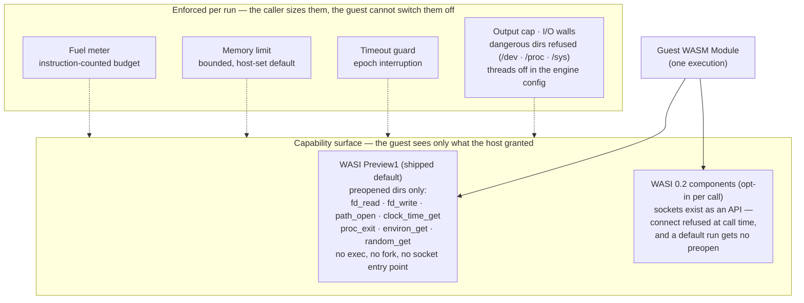

# Security Posture — Detail

Detail page for [README.md](../README.md#security-evidence). Policy and reporting: [SECURITY.md](../SECURITY.md).

## Security Posture

| Risk | Status | Detail |
|------|--------|--------|
| CPU-DoS | ✅ | Fuel metering per execution (~13 fuel/iteration, **R² = 1.000**) |
| Memory-DoS | ✅ | `Store.set_limits` enforced (default 128MB; `Config.memory_max_bytes` is a no-op in wasmtime-py 47) |
| Preopen-DoS | ✅ | 14 dangerous dirs blocked (`/dev`, `/proc`, `/sys`, etc.) |
| Thread-DoS | ✅ | Single-thread only (`wasm_threads = False`) |
| fsync | ✅ | Refused at the **call** — `fd_sync`/`fd_datasync`/`fd_psync` trap unless the caller opts in with `allow_fsync`. Importing them stays legal by design (Zig emits `fd_sync`, CPython emits `fd_datasync` in every binary), so only the call can be refused; **no shipped profile turns it on** — `interpreter` widens module size, memory, fuel, wall-clock and the worker CPU wall, not this rule |
| I/O-DoS | ⚠️ Path-dependent | Host syscalls bypass fuel metering — guest output capped at 10 KB (ENOSPC); sandbox-dir writes walled by `io_budget_bytes` (both paths); the `io_cpu_seconds` CPU wall is enforced in the **subprocess path only** (default in-process is documented-trusted — see the execution-path matrix in [SECURITY.md](../SECURITY.md)) |
| Network | ✅ | No guest connection succeeds by default: WASI Preview1 exposes no socket API, and on the WASI 0.2 component path `wasi:sockets` is linked but `connect` is denied at call time (measured — `benchmarks/mcp_cve_replay.py`, component run) |

## 8/8 attack vectors — verification method

5/8 vectors are executed live through the sandbox run path; 3/8 (exec, fork, socket) are verified by WASI import-surface scan — those APIs do not exist in WASI Preview1, so rejection happens at instantiate. Reproduce:

```bash
python benchmarks/verify_8_vectors.py       # 8/8 BLOCKED (live wasmtime)
python benchmarks/compile_workloads.py      # rebuild workloads/*.wasm from WAT (reproducible)
```

## Hardened-container baseline (2026-09-18)

The same eight intents, expressed as the identical `python3 -c` bodies, run against a
**hardened** `python:3.12-slim` container (`--network none --read-only --cap-drop=ALL
--security-opt no-new-privileges --pids-limit 64 --user 65534:65534`, default seccomp
profile, arm64 image pinned by digest, positive control): **6/8 still allowed** — the
two blocks (fsync, symlink creation) are `--read-only` EROFS effects on the container's
own filesystem, not a guest-facing boundary. Socket creation needs no capability and no
network under these flags; the container's own `/etc/passwd` stays world-readable to the
guest. The hardening flags wall the container *off* from the host; the guest primitives
live inside the container world and remain available. Evidence:
`benchmarks/results/2026-09-18/01_hardened_docker_attack_probe.json` (expectation matrix
with documented same-day correction, positive control, digest) — probe:
`benchmarks/hardened_docker_probe.py`. gVisor was initially not measurable on this host
(Docker Desktop provides no `runsc` runtime) and was recorded as an open baseline; it has
since been measured in CI: the `gvisor-boundary` job installs pinned `runsc` and runs the
same eight intents twice (`benchmarks/gvisor_docker_probe.py`), landing
`benchmarks/results/2026-09-19/08_gvisor_docker_attack_probe.json` — `measured: true`,
`runsc version release-20260914.0`, **8/8 ALLOWED**, expectation matrix matched 8/8.
`ALLOWED` there means the guest primitive remains available *inside* the sandbox (gVisor
implements `execve`/`fork`/`socket` in its userspace kernel), not that anything reached the
host — gVisor's wall is host-facing, and this comparison says nothing about ranking it.

Layer model used in the results table below: **Layer 1** = WASI surface (no
exec/fork/socket entry points in Preview 1), **Layer 2** = sandbox policy that
is always on (preopen default-deny, dangerous-dir filter, sync-call traps,
`wasm_threads=False`, `allow_env` — with `max_wasm_bytes` and `allow_fsync`
the two operator-widenable values, both attested in the signed baseline so an
opened run never reads like a closed one), **Layer 3** = OS process wall via
`run_isolated()`/`--isolated` (rlimits + hard kill) — the mitigation layer for
engine 0-days (see [SECURITY.md](../SECURITY.md), engine advisories).

## The eight intents × three boundaries — measured results

The README carries the summary and the link; this is the results table
itself, with its definition, its provenance and its reproduce commands.

> **What `ALLOWED` means in this table:** the tested guest primitive remains
> available *inside* that sandbox. It does not mean host escape, and the table
> is not a ranking of the boundaries. `BLOCKED` means the intent could not be
> carried out at all from inside the guest.

| Attack class | Docker | Docker (hardened¹) | Ephemora-cell | Layer |
|---|---|---|---|---|
| Shell (`os.system`) / fork | ALLOWED | ALLOWED | **BLOCKED** — APIs don't exist in WASI | 1 |
| Network sockets | ALLOWED | ALLOWED — creation needs no capability | **BLOCKED** — APIs don't exist in WASI | 1 |
| fsync (`os.fsync`) | ALLOWED | **BLOCKED** — EROFS via `--read-only` | **BLOCKED** — `fd_sync`/`fd_datasync`/`fd_psync` refused at the call (`allow_fsync` opts out) | 2 |
| Host filesystem (`/etc/passwd`) | ALLOWED | ALLOWED — the container's own file | **BLOCKED** — preopen default-deny | 2 |
| Symlink escape | ALLOWED | **BLOCKED** — EROFS via `--read-only` | **BLOCKED** — dangerous directory filter | 2 |
| Multi-threading | ALLOWED | ALLOWED | **BLOCKED** — `wasm_threads=False` | 2 |
| Environment access | ALLOWED | ALLOWED | **BLOCKED** — controlled via `allow_env` | 2 |

**Result: 8/8 blocked on Cell** — live-verified, default configuration, WASI
Preview1 path ([`benchmarks/verify_8_vectors.py`](../benchmarks/verify_8_vectors.py));
both Docker baselines are measured live per run, never hardcoded. The guest
receives only the capabilities explicitly made available to it, and the
measurement rule is the same on every side of the table: the exit code decides
(see [How the 8/8 is measured](#how-the-88-is-measured--probe-equivalence-detail)).

A fourth boundary was measured the same way: **gVisor** (`runsc`, pinned
release, run twice in CI for determinism) lands **8/8 ALLOWED** in the sense
defined above — the guest keeps the Linux ABI inside gVisor's userspace
kernel, so the primitives stay available to guest code while the host stays
walled off. Expectation matrix pre-declared in
[`benchmarks/gvisor_docker_probe.py`](../benchmarks/gvisor_docker_probe.py);
raw evidence `benchmarks/results/2026-09-19/08_gvisor_docker_attack_probe.json`,
committed from the `gvisor-boundary` CI job.

¹ Hardened = exactly these flags — tell us which to add: `--network none
--read-only --cap-drop=ALL --security-opt no-new-privileges --pids-limit 64
--user 65534:65534`, image pinned by digest. Docker's default seccomp profile
is active in **both** Docker columns (recorded in the `seccomp` field of both
probe JSONs). Both hardened blocks are `--read-only` file-system effects — the
flags wall the container *off*, not the guest *in*: socket creation, the
container's own `/etc/passwd`, fork, threading and environment stay available
to the guest.

**Two platforms, identical results.** macOS arm64 (2026-09-18,
`benchmarks/results/2026-09-18/`) and DGX Spark GB10 (2026-09-20,
`benchmarks/results/2026-09-20/02_docker_attack_probe-dgx-aarch64.json` ·
`01_hardened_docker_attack_probe-dgx-aarch64.json` ·
`10_cell_8vector_verify-dgx-aarch64.json`): stock 0/8 blocked, hardened 2/8
blocked with the same two intents blocked (`fsync`, symlink creation), Cell
8/8.

**The WASI 0.2 component path is a separate boundary and does not carry the
sync blockade today** — measured, not inferred:
`python benchmarks/component_sync_probe.py` runs a real wasip2 guest whose
`wasi:filesystem/types` sync calls both complete into the host once a
directory is granted, while the default component run gets no preopen at all,
so the surface needs an operator grant first. Detail and code reference:
[SECURITY.md](../SECURITY.md), "Sync refusal (P1 #12)".

Reproduce:

```bash
python assets/demo_attack_probe.py          # stock Docker    ->  0/8 blocked
python benchmarks/hardened_docker_probe.py  # hardened Docker ->  2/8 blocked
python benchmarks/verify_8_vectors.py       # Ephemora-cell   ->  8/8 blocked
```

## arXiv 2509.11242 — Tested Attack Surface

We evaluated 11 exploitation strategies from [arXiv 2509.11242](https://arxiv.org/abs/2509.11242) against the Ephemora Cell sandbox:

| Technique | Result | Detail |
|-----------|--------|--------|
| CPU-DoS (infinite loop) | ⚠️ Within Budget | Fuel metering caps computation; set `max_fuel` conservatively |
| Disk-DoS (large writes) | ⚠️ Bounded | I/O costs minimal fuel (~1.18MB at default 1M fuel) — always capped by the 10 KB output budget (ENOSPC) |
| fsync / fdatasync | ✅ Blocked | Refused at the **call** — `fd_sync`/`fd_datasync`/`fd_psync` trap unless `allow_fsync` opts out; importing them stays legal by design |
| Inode exhaustion | ✅ Blocked | Preopen-deny + sandbox dir isolation |
| `/dev/random` read | ✅ Blocked | Preopen-deny blocks `/dev` |
| `/dev/ptmx` exhaustion | ✅ Blocked | Preopen-deny blocks `/dev` |
| High-frequency small I/O | ⚠️ Bounded | ~1.18MB theoretical before fuel exhaustion; 10 KB output budget caps capture |
| Network bandwidth | ✅ Blocked | No socket imports in WASI Preview1 |
| Small-packet flood | ✅ Blocked | No socket imports in WASI Preview1 |
| Multi-threading | ✅ Blocked | `wasm_threads = False` enforced |
| Memory exhaustion | ⚠️ Bounded | Linear memory byte-capped (`Store.set_limits`, 128MB default); the WasmGC heap is **not** byte-bounded in wasmtime-py 47 — fuel remains the effective GC bound |

**Summary:** 8 attack techniques fully blocked. 2 bounded by design (Disk-DoS, High-frequency I/O: host I/O bypasses fuel metering, ~1.18 MB theoretical before exhaustion at default fuel — and the 10 KB output budget caps captured output; the I/O budgets add host-work walls on top). 1 permitted within budget (CPU-DoS: the guest must compute).

## Fuel metering boundary (characterized)

| Workload | Fuel per unit | Exhaustion at max_fuel=1,000,000 | Linearity |
|----------|--------------|----------------------------------|-----------|
| CPU (i32.add) | ~13 fuel/iteration | 76,923 iterations | R² = 1.000000 |
| I/O (fd_write 32B, stdout path) | ~27 fuel/write | 36,985 writes (1.18 MB) — then the 10 KB output budget (ENOSPC) caps capture | Host-side syscalls (preopen file writes: ~7.3 fuel, see `benchmarks/io_dos/`) |

**I/O-DoS is a bounded boundary.** I/O system calls execute on the host and consume minimal WASM fuel (~27 fuel/write, measured), so at `max_fuel=1,000,000` a guest could theoretically emit ~1.18 MB. In practice the shared 10 KB output byte-budget (`fd_write` → ENOSPC) caps all captured output far earlier — the guest can never ship more than ~10 KB regardless of fuel. *Note:* the earlier reported "70,258 writes / 2.14 MB / ~0 fuel/call" figure was a measurement artifact — the benchmark's iovec struct overlaid its own data segment at address 0, every `fd_write` returned EFAULT and wrote 0 bytes. Fixed via proper iovec layout in [`benchmarks/fuel_boundary.py`](../benchmarks/fuel_boundary.py).

**Isolation model:** WASM memory bounds + WASI Preview1 capability-based access. See [arXiv 2509.11242](https://arxiv.org/abs/2509.11242) for a comprehensive analysis of WASM resource isolation gaps.

## Related Research

- **[arXiv 2601.01241](https://arxiv.org/abs/2601.01241)** — *MCP-SandboxScan: WASM-based Secure Execution and Runtime Analysis for MCP Tools* (SandScope): executes portable MCP tools under WASI (or drives unmodified MCP servers over stdio), extracts LLM-visible sinks and reports auditable source-to-sink witnesses — WASI as the execution/audit substrate for tool-augmented LLM agents.
- **[arXiv 2604.03081](https://arxiv.org/abs/2604.03081)** — *Supply-Chain Poisoning Attacks Against LLM Coding Agent Skill Ecosystems*: agent skills from open marketplaces run as operational directives with system-level privileges; the DDIPE attack achieves 11.6–33.5% bypass rates and 2.5% evade static analysis + alignment. Execution isolation (as provided by WASI Preview1) limits the blast radius when detection fails.

## 2026 probe classes (2026-09-25)

Three 2026-motivated probe classes run as measured evidence
(`benchmarks/probe_classes_2026.py`, dated JSON with `measured:true`,
pytest counterparts in `tests/test_fs_escape_matrix.py`,
`tests/test_persistence_worm.py`, `tests/test_control_plane_reachability.py`,
`tests/test_tool_signing.py::TestTrustHandoff`):

- **FS escape matrix** — the companion vectors of
  GHSA-vqjp-4c8c-hfgg / CVE-2026-47261 (trailing-slash `path_open`,
  mixed dot-dot + trailing slash, hardlink across the preopen boundary,
  rename across the boundary, TRUNCATE without the write/set-size
  right), each with a granted positive control. Measured on the pinned
  47.0.1 engine: **all vectors denied** (errno 63/44/28 — NOTCAPABLE /
  ENOENT / EINVAL-class refusals), host-side artifacts untouched. **Since
  2026-10-04 these five vectors are strict asserts, not xfail markers** — a
  re-opening vector turns CI red (re-measured green on linux/amd64 in addition
  to macOS arm64). The advisory itself remains open upstream and authoritative.
- **Persistence / worm** — a marker written by run N is invisible to
  run N+1 (fresh scratch per run, same instance or not); the reader
  probe proves detection via a legitimate allow-dir control; named
  state exists only behind the explicit ADR-004 grant.
- **Supervisor/control-plane reachability** — motivated by OX Security
  CVE-2026-82533 (a sandboxed agent disabling its own confinement):
  environment deny-by-default (allowlist positive control shows exactly
  the granted name), guest request-lookalike writes never reach the
  operator-allowlisted requests dir, no policy-writing tool exists on
  the MCP surface, engine knobs are structurally frozen
  (`tests/test_threads_baseline.py`), protocol abuse fails closed
  (`tests/test_transport.py`).

Related literature for these classes (measured:false for Cell —
motivational framing only): [arXiv 2603.22489](https://arxiv.org/abs/2603.22489)
(*Securing the MCP: A Dual-Axis Survey* — tool poisoning, rug-pull,
handoff erosion), OX Security's CVE-2026-82533 advisory
(supervisor control-plane reachability), and the 2026 persistence-worm
research line (self-propagating agent payloads via persistent storage).

## The WASI sandbox surface, visually

The enforced meters wrap the capability surface, and what the guest was
never granted is not there to reach. Two rules the picture keeps:

* **No numbers.** The memory and output caps are host-set defaults that the
  profiles widen, and a number drawn in a diagram reads as a ceiling the
  product does not have. The measured values with their conditions are in
  [SECURITY.md](../SECURITY.md) and [performance.md](performance.md).
* **Both shipped ABI paths, stated apart.** Preview1 has no socket entry
  point at all; the WASI 0.2 component path links `wasi:sockets` and refuses
  `connect` at call time. Collapsing those into "no network" would describe
  one of the two paths.


```mermaid
flowchart TB
    guest["Guest WASM Module<br/>(one execution)"]
    subgraph surface["Capability surface — the guest sees only what the host granted"]
        p1["WASI Preview1 (shipped default)<br/>preopened dirs only:<br/>fd_read · fd_write · path_open · clock_time_get<br/>proc_exit · environ_get · random_get<br/>no exec, no fork, no socket entry point"]
        p2["WASI 0.2 components (opt-in per call)<br/>sockets exist as an API —<br/>connect refused at call time,<br/>and a default run gets no preopen"]
    end
    subgraph meters["Enforced per run — the caller sizes them, the guest cannot switch them off"]
        fuel["Fuel meter<br/>instruction-counted budget"]
        mem["Memory limit<br/>bounded, host-set default"]
        timeout["Timeout guard<br/>epoch interruption"]
        walls["Output cap · I/O walls<br/>dangerous dirs refused (/dev · /proc · /sys)<br/>threads off in the engine config"]
    end
    guest --> p1
    guest --> p2
    fuel -.-> surface
    mem -.-> surface
    timeout -.-> surface
    walls -.-> surface
```

## How the 8/8 is measured — probe equivalence detail

Measurement environment and the probe-by-probe equivalence between the
Docker probe body and the Cell WASM guest. The results the method produces are
in [The eight intents × three boundaries](#the-eight-intents--three-boundaries--measured-results):

- **Environment:** MacBook Pro M5, macOS arm64, wasmtime 47.0.1,
  Docker 28.5.1
- **Docker probes (2026-09-18, `linux/arm64` image pinned by digest):**
  stock via `docker run --rm`, hardened via exactly the declared flag
  set — the measured exit code decides ALLOWED vs BLOCKED, nothing
  hardcoded. Historical stock baseline (2026-09-02, `x86_64` image
  under emulation): `benchmarks/results/2026-09-02/`
- **Cell probe (2026-09-18, same day):** `verify_8_vectors.py` against
  the live runtime — same eight attack intents, expressed natively per
  platform (equivalence table below)
- **Workload:** self-contained payloads, no downloads, no credentials
- **Positive control:** each blocked vector is paired with a
  granted-capability control that **must succeed** on the same sandbox
  config (e.g. the symlink test's real target file must open errno 0)
  — if the control fails, the harness is broken, not the sandbox, and
  the run does not count

| # | Attack intent | Docker probe body (`python3 -c`) | Cell probe guest (WASM) |
|---|---|---|---|
| 1 | shell | `os.system('id …') == 0` | no exec/system entry point in the WASI import surface (live scan) |
| 2 | fork | `os.fork()` | no fork/vfork in the import surface (live scan) |
| 3 | socket | `socket.socket(…)` | no socket/sock_\* in the import surface (live scan) |
| 4 | fsync | open + write + `os.fsync` | module calls `fd_sync`/`fd_datasync`/`fd_psync` through a real fd → each traps (importing them is legal by design) |
| 5 | host FS | `open('/etc/passwd').read()` | `path_open('/etc/passwd')` with no preopen |
| 6 | symlink escape | `os.symlink` + `realpath` outside | `path_open` through a symlink out of a preopened dir (control: real file opens errno 0) |
| 7 | threading | `threading.Thread(…).start()` | shared-memory module rejected (`wasm_threads=False`) |
| 8 | env | `'PATH' in os.environ` | env count with `allow_env=()` must be 0 |

- **Raw evidence:** `benchmarks/results/2026-09-18/`
  (`01_hardened_docker_attack_probe.json` ·
  `02_docker_attack_probe.json` · `03_cell_8_vector_verify.json`) +
  historical `benchmarks/results/2026-09-02/`

## Evidence ladder (moved out of the README on 2026-10-05)

The README keeps the summary and the link; the ladder with its reproduce
commands is the reviewer's entry point and lives here. Strongest first — every
row is measured, the raw evidence is committed, and each run is reproducible:

| # | Evidence | What it proves | How it is measured | Reproduce |
|---|---|---|---|---|
| 1 | [MCP CVE replays](../benchmarks/mcp_cve_replay.py) | Real exploit paths of two patched CVEs are denied at the engine level; governed loading fails closed on a tampered payload — also verified on WASI 0.2 components, with a **measured call-time socket denial** | Pinned vulnerable reference server vs Cell, random marker tokens, positive controls on both sides | `python benchmarks/mcp_cve_replay.py` |
| 2 | [SandboxEscapeBench-18 mapping](../benchmarks/sandbox_escape_18.py) | 18 container/K8s escape scenarios mapped to WASM: **8 execution-tested and denied, 10 not expressible** on the WASI surface | Structural mapping + live attempts, granted-preopen positive control | `python benchmarks/sandbox_escape_18.py` |
| 3 | 8 attack intents × 3 boundaries | Same intents, same exit-code rule: stock Docker 0/8 blocked · hardened Docker 2/8 · Cell 8/8 (results table above: [The eight intents × three boundaries](#the-eight-intents--three-boundaries--measured-results)) | Live probes, arm64 image pinned by digest | `python assets/demo_attack_probe.py` · `python benchmarks/hardened_docker_probe.py` · `python benchmarks/verify_8_vectors.py` |
| 4 | [Official WASI conformance](../conformance/README.md) | 72 pass / 1 documented xfail / 0 fail against the pinned upstream suite — re-run weekly in CI (weekly ubuntu runs land 71–72 on varying fs tests; a documented runner quirk, not a Cell defect) | Runtime adapter over the official suite, raw JSON committed | see conformance/ |
| 5 | [2026 probe classes](../benchmarks/probe_classes_2026.py) | The CVE-2026-47261 companion FS vectors (trailing-slash/hardlink/rename/TRUNCATE), persistence-worm and control-plane probes are **all denied** on the pinned engine, with granted positive controls on every class | Real WASI probes + positive controls, dated JSON with `measured:true` | `python benchmarks/probe_classes_2026.py` |
| 6 | [Cross-architecture determinism](comparison-mcp-servers.md) | Fuel deterministic per platform (spread 0), platform-bound values | Same tool call on macOS arm64 / DGX GB10 / x86_64 | `python benchmarks/determinism_probe.py` |

### Where the 18 scenarios come from, and what the mapping does

Not ours: the UK AI Security Institute's *SandboxEscapeBench*
([arXiv 2603.02277](https://arxiv.org/abs/2603.02277), scenarios:
[UKGovernmentBEIS/sandbox_escape_bench](https://github.com/UKGovernmentBEIS/sandbox_escape_bench),
MIT) documents 18 ways code escapes container/Kubernetes sandboxes. This suite
does something narrower: each scenario is mapped to its closest WASM/WASI
equivalent and executed against Cell, no model in the loop. The primitives those
escapes rely on (privileged modes, namespaces, cgroups, raw sockets) do not
exist on the WASI surface; the scenarios with a WASM-expressible equivalent
(filesystem, sockets) are denied by the live boundary. Prompt-injection and
agent-behavior security are a different layer — out of scope for an execution
sandbox by design; the wider agentic escape evaluation is part of the Ephemora
enterprise edition ([enterprise.md](enterprise.md)).

## CVE replay detail (moved out of the README on 2026-10-05)

The official MCP reference servers have real, patched CVEs against this exact
surface. [`benchmarks/mcp_cve_replay.py`](../benchmarks/mcp_cve_replay.py)
replays them as their original exploit paths — pinned vulnerable reference
server vs. Cell, same files, positive controls on both sides (2026-09-17,
`measured:true`):

- **CVE-2025-53109/53110** ("EscapeRoute", symlink escape + prefix traversal):
  the vulnerable reference server **leaked** the protected file in both intents;
  Cell blocked both at the engine level (`EPERM`/`ENOTCAPABLE`) — with the
  granted-capability control reading successfully on both sides.
- **CVE-2025-54136 class** ("MCPoison", payload swap after trust): a signed tool
  is accepted once, then a single tampered wasm byte makes the next governed-load
  request **fail closed** (hash mismatch).
- **Same replays against WASI 0.2 components**
  ([evidence](../benchmarks/results/2026-09-18/mcp_cve_replay_component.json),
  `abi: "component"`): the component path denies the same escape intents
  (symlink escape → `EPERM`, traversal → no preopen base) and the same
  governed-load tamper fails closed. The network vector gets its own intent —
  the WASI 0.2 world *links* `wasi:sockets` (unlike Preview1), so a TCP connect
  is attempted under the sandbox and **refused at call time**, with the
  granted-read control passing in the same run.

## Why now — 2026 literature on container and scanner boundaries

*(Literature, `measured:false` for Cell. These rows never mix with the measured
table above; they are why the measured table is the thing we publish.)*

[SABER — the SandboxEscapeBench program](https://arxiv.org/abs/2603.02277)
(UK AI Security Institute & Oxford, ICML 2026) shows frontier models **reliably
escaping Docker containers** through common misconfigurations. Trail of Bits
researchers (Judson & Hess, 2026) bypassed **five** agent-skill scanners and
sandbox defenses in one study, and the DDIPE skill-poisoning attack
([arXiv 2604.03081](https://arxiv.org/abs/2604.03081)) measures 11.6–33.5%
bypass rates against agent skill ecosystems. The pattern across all three:
scanning and container defaults fail; the boundary that holds is the one
**enforced between the code and the host**.
